class: center, middle
## Please pick up your **name card** from the front
  
## **office hours**: Thursdays, 1:00-2:00 pm 
## Basement, Room 003, **Linguistics Building**

---
## **Homework 3, Part 3**
  

<h3><i>The spy saw the agent with the binoculars on the roof</i>.</h3>

  
- draw syntax trees for the original sentence, NOT the interpretations  
- so the main idea here is to capture different **modification** relation on **the same sentence**, which reflects **structural difference** on the tree
  
---
## **Syntax Rules Across Languages**
 
.pull-left[
speakers of different languages will have different syntax rules
- because they have different mental grammars  

consider these phrases from **different languages**:  
- for each phrase, I've given a simplified version of a phrase structure rule for English  
- how would you modify that rule to account for each phrase?  
- what would you have to change?  
- assume that these languages place each adjective in an AdjP and each noun in an NP, as English does
]
.pull-right[

English Rule: <b>NP → D AdjP N</b>

***Portuguese***
<table style="width:100%; table-layout:auto; border-collapse:collapse;">
  <tr>
    <td style="white-space:nowrap;">-</td>
    <td style="white-space:nowrap;">a</td>
    <td style="white-space:nowrap;">casa</td>
    <td style="white-space:nowrap;">amarela</td>
  </tr>
    <tr>
    <td style="white-space:nowrap;"></td>
    <td style="white-space:nowrap;">the</td>
    <td style="white-space:nowrap;">house</td>
    <td style="white-space:nowrap;">yellow</td>
  </tr>
  <tr>
    <td style="white-space:nowrap;"></td>
    <td colspan="3" style="text-align:left; padding-bottom:20px;">
    '<i>the yellow house</i>'</td>
  </tr>
</table>

English Rule: <b>PP → P NP</b>

***Japanese***
<table style="width:100%; table-layout:auto; border-collapse:collapse;">
  <tr>
    <td style="white-space:nowrap;">-</td>
    <td style="white-space:nowrap;">gakkō</td>
    <td style="white-space:nowrap;">de</td>
  </tr>
    <tr>
    <td style="white-space:nowrap;"></td>
    <td style="white-space:nowrap;">school</td>
    <td style="white-space:nowrap;">at</td>
  </tr>
  <tr>
    <td style="white-space:nowrap;"></td>
    <td colspan="2" style="text-align:left; padding-bottom:20px;">
    '<i>at school</i>'</td>
  </tr>
</table>

English Rule: <b>VP → V NP</b>

***Quechua***
<table style="width:100%; table-layout:auto; border-collapse:collapse;">
  <tr>
    <td style="white-space:nowrap;">-</td>
    <td style="white-space:nowrap;">t'antata</td>
    <td style="white-space:nowrap;">mikhurqani</td>
  </tr>
    <tr>
    <td style="white-space:nowrap;"></td>
    <td style="white-space:nowrap;">bread</td>
    <td style="white-space:nowrap;">I.ate</td>
  </tr>
  <tr>
    <td style="white-space:nowrap;"></td>
    <td colspan="2" style="text-align:left; padding-bottom:20px;">
    '<i>I ate bread</i>.'</td>
  </tr>
</table>
]

---
## **Syntax Rules Across Languages**
 
.pull-left[
speakers of different languages will have different syntax rules
- because they have different mental grammars  

consider these phrases from **different languages**:  
- for each phrase, I've given a simplified version of a phrase structure rule for English  
- how would you modify that rule to account for each phrase?  
- what would you have to change?  
- assume that these languages place each adjective in an AdjP and each noun in an NP, as English does
]
.pull-right[

English Rule: <b>NP → D N AdjP</b>

***Portuguese***
<table style="width:100%; table-layout:auto; border-collapse:collapse;">
  <tr>
    <td style="white-space:nowrap;">-</td>
    <td style="white-space:nowrap;">a</td>
    <td style="white-space:nowrap;">casa</td>
    <td style="white-space:nowrap;">amarela</td>
  </tr>
    <tr>
    <td style="white-space:nowrap;"></td>
    <td style="white-space:nowrap;">the</td>
    <td style="white-space:nowrap;">house</td>
    <td style="white-space:nowrap;">yellow</td>
  </tr>
  <tr>
    <td style="white-space:nowrap;"></td>
    <td colspan="3" style="text-align:left; padding-bottom:20px;">
    '<i>the yellow house</i>'</td>
  </tr>
</table>

English Rule: <b>PP → NP P </b>

***Japanese***
<table style="width:100%; table-layout:auto; border-collapse:collapse;">
  <tr>
    <td style="white-space:nowrap;">-</td>
    <td style="white-space:nowrap;">gakkō</td>
    <td style="white-space:nowrap;">de</td>
  </tr>
    <tr>
    <td style="white-space:nowrap;"></td>
    <td style="white-space:nowrap;">school</td>
    <td style="white-space:nowrap;">at</td>
  </tr>
  <tr>
    <td style="white-space:nowrap;"></td>
    <td colspan="2" style="text-align:left; padding-bottom:20px;">
    '<i>at school</i>'</td>
  </tr>
</table>

English Rule: <b>VP → NP V</b>

***Quechua***
<table style="width:100%; table-layout:auto; border-collapse:collapse;">
  <tr>
    <td style="white-space:nowrap;">-</td>
    <td style="white-space:nowrap;">t'antata</td>
    <td style="white-space:nowrap;">mikhurqani</td>
  </tr>
    <tr>
    <td style="white-space:nowrap;"></td>
    <td style="white-space:nowrap;">bread</td>
    <td style="white-space:nowrap;">I.ate</td>
  </tr>
  <tr>
    <td style="white-space:nowrap;"></td>
    <td colspan="2" style="text-align:left; padding-bottom:20px;">
    '<i>I ate bread</i>.'</td>
  </tr>
</table>
]

---
## **Syntactic Transformations**
 
- once we understand how to draw a syntax tree for a simple sentence, we can use it as a basis for
more complex ideas, such as **syntactic transformations**  
- for example, we can say the following sentence because it follows English rules: TP → NP T VP

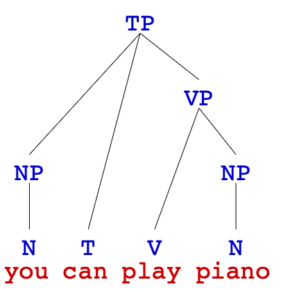
 <i>'You can play piano.'</i>.

 

- but what if we made it a question: ***Can you play piano?***
  
---
## **Syntactic Transformations**
 
- to make questions, we need to apply **transformations**: move constituents about in the tree  
- move <u><i>can</i></u> **up into** another level above TP: now we have a **yes-no question**!
  

<b>→</b>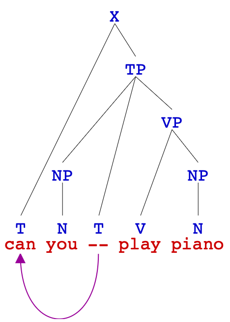

---
## **Syntactic Transformations**
 
.pull-left[
what if we wanted to make a wh- question  
- ***What can you play?***
]
.pull-right[
- what does <u><i>what</i></u> represent?  
- **replace **piano with <u><i>what</i></u> and **move** it one level above <u><i>can</i></u>
]
 

<b>→</b>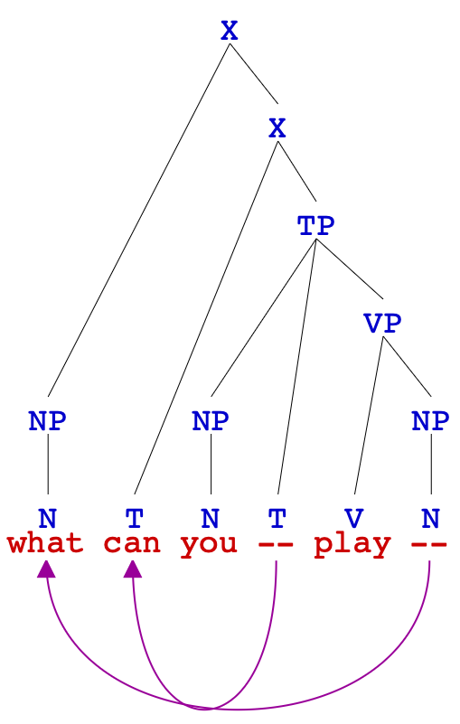

  
---
.pull-left[
## **Mid-course Survey**

   
<h3><a href="https://go.blueja.io/MMdCBFK2jUehD6SKtQp-Uw">mid-course survey link</a></h3>
  
<h3>please take a few minutes to complete the survey</h3>
  
<h3>Please respond to <b>the 8th homework poll</b> as well</h3>

]
.pull-right[
  

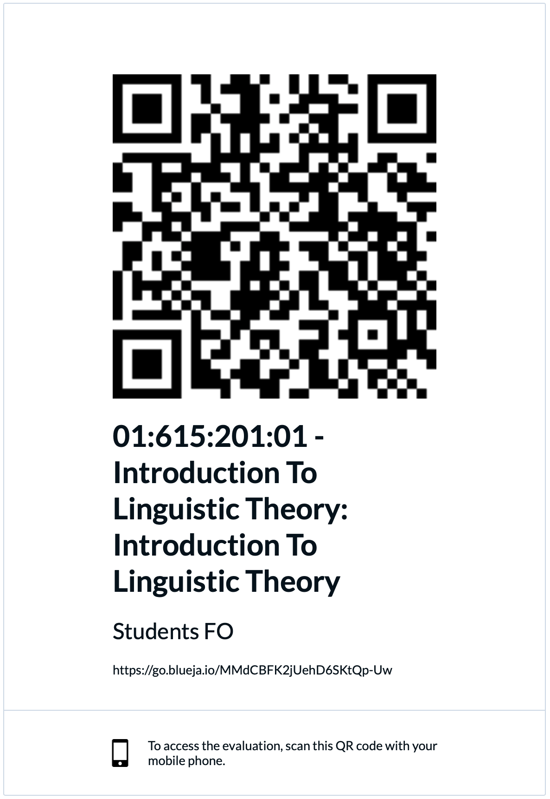

]
  
---
## **How well do you know each of these topics?**
 
.pull-left[
**basic concepts in Linguistics**
- mental grammar/linguistic competence
- descriptivism vs. prescriptivism
- Grammatical vs. ungrammatical language
- standard vs. non-standard language   

**Syntax**
- parts of speech: definitions of nouns, verbs, etc.
- parts of speech: morphological and syntactic distribution of nouns, verbs, etc.
- constituents
- phrase structure rules (PSRs)
- types of phrases: NP, AdjP, AdvP, PP, VP, TP
- complex sentences: main and dependent clauses, complementisers, CP
- sentences and tree structure
]
.pull-right[
**Morphology**
- morphemes
- roots vs. affixes
- roots vs. stems
- types of affixes
- free vs. bound morphemes
- derivational vs. inflectional morphemes
- allomorphs
- monomorphemic and polymorphemic words
- simple and compound words
- morphological processes
  - affixation
  - compounding
  - reduplication
  - alternation
  - suppletion
  - zero-derivation
- order of affixation
]

---
## **How well can you apply  these analytical tools in practice?**
 
.pull-left[
- break down words **into morphemes** and identify the **type** of each morpheme  
- identify specific **morphological processes**  
- analyze the morphological structure of an **unfamiliar language**  
- draw a **morphological tree** to illustrate a word’s structure and **order of affixation**  
- identify a word’s **part of speech**  
- use morphological and syntactic **distribution** to determine a word’s part of speech
]
.pull-right[
- use **constituency tests** to determine if a sequence of words is a constituent  
- identify different **types of phrase**: NP, PP, AdjP, AdvP, VP, TP  
- identify the **head** of a phrase  
- use **phrase structure rules** to combine words into phrases  
- draw **syntax trees** to illustrate a sentence’s internal structure  
]

---
## **Syntax Tree Practice**
 
.pull-left[
Draw syntax trees for the following sentence.   
1. The happy dog caught the frisbee.  
2. The boy with the red hair threw the ball.  
3. Harriet ate a bagel for breakfast.  
4. Frank happily ate a plate of nachos.  
5. The old man rowed his boat gently down the stream.  
6. I bought a beautiful bouquet of flowers for my mom.  
]
.pull-right[
   
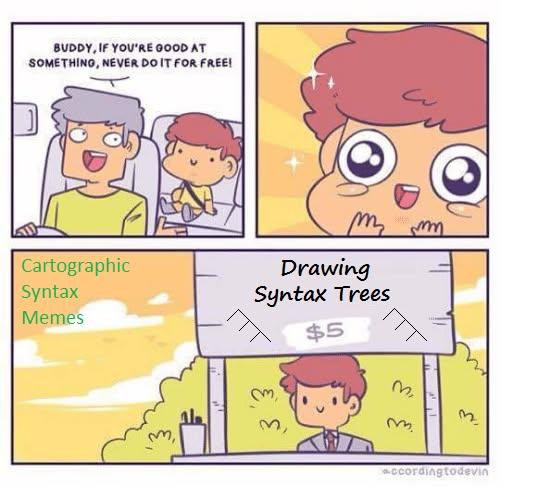
]

---
## **1. The happy dog caught the frisbee.**
    

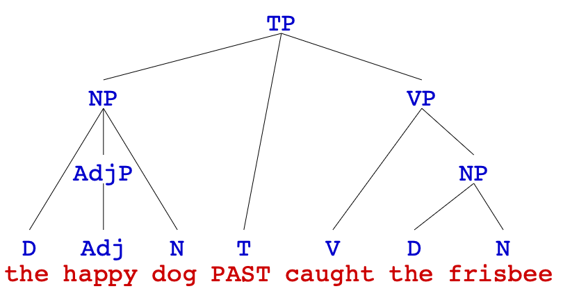

---
## **2. The boy with the red hair threw the ball.**
  

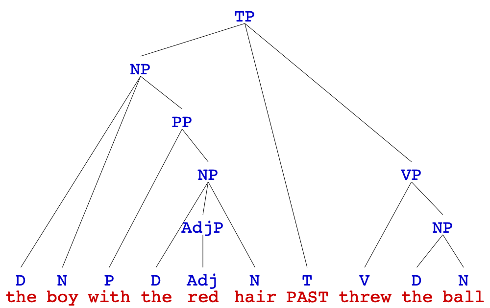

---
## **3. Harriet ate a bagel for breakfast.**
  

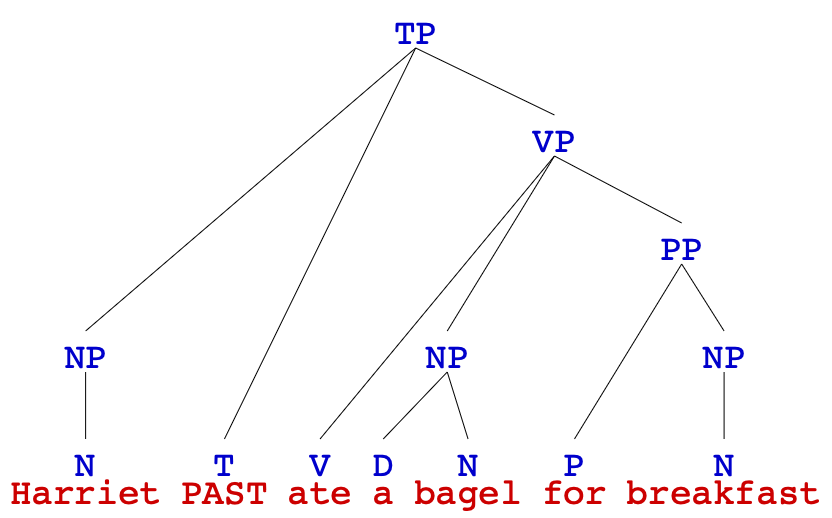

---
## **4. Frank happily ate a plate of nachos.**

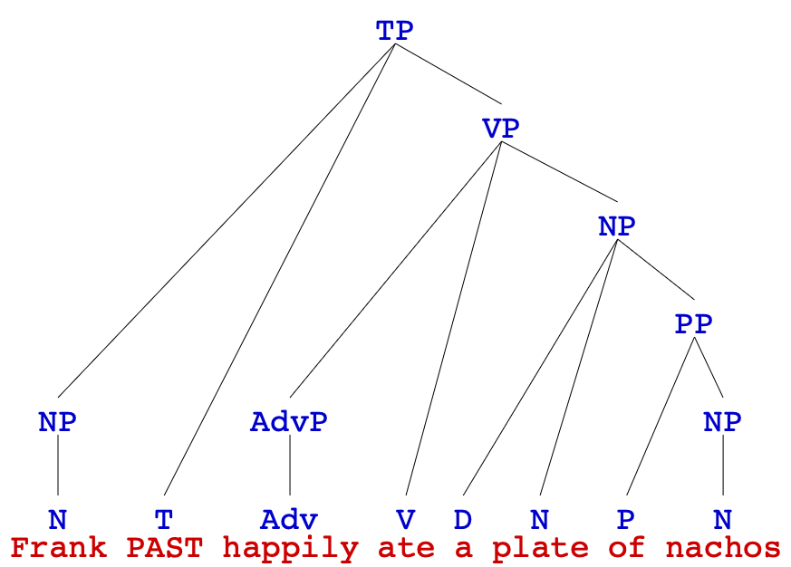

---
## **5. The old man rowed his boat gently down the stream.**
 

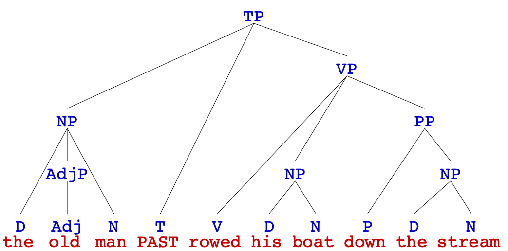

---
## **6. I bought a beautiful bouquet of flowers for my mom.**
 

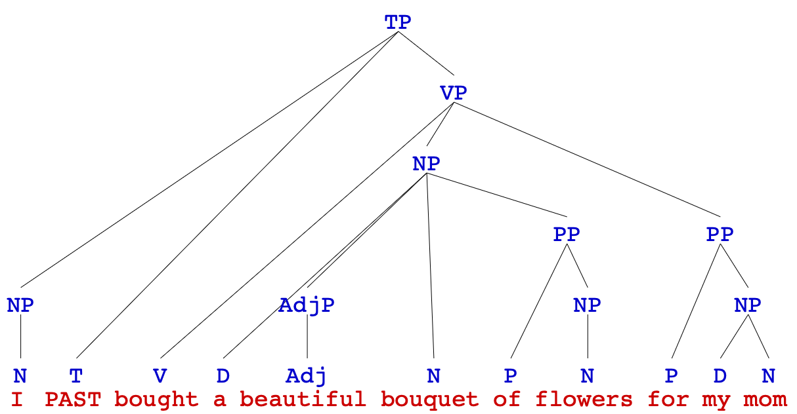

---
class: center, middle
**Homework III** is due tomorrow (**Mar 03**) at **11:59 pm**  
you can finish early for a early feed back if you want  
<b>good luck</b> with the **MIDTERM** (**Mar 05** at class time)  
**SEMANTICS** coming up  
<b>reading</b>: the chapter **Semantics I: Compositionality** from Victoria Fromkin et al.'s <i>An Introduction to Language</i>  

  
Slides created via the R package [**xaringan**](https://github.com/yihui/xaringan).
