class: center, middle
## Please pick up your **name card** from the front

---
class: center, middle
## **Assignment #1** will be published this Wednesday (**Sept 16**)
  
## It is due next Friday (**Sept 25**) at 11:59 pm
  
## You might not be able to solve all problems before the class next Monday (**Sept 21**)

---
class: center, middle
# **morpheme**

## <b>smallest linguistic unit</b> <b>with</b> <b>meaning</b>

---
## **Homophones and Allomorphs**
 
<table style="width:100%; border-collapse:collapse">
  <tr>
    <td style="width:1%; text-align:center;"></td>
    <td style="width:10%; text-align:center; border:3px solid orange; background-color:#FFF176"><h3><b>homophones</b></h3></td>
    <td style="width:1%; text-align:center;">-</td>
    <td style="width:40%; text-align:left; border:3px solid orange">
    <ul>
      <li>
        sound the same, but mean different things  
        <ul>
          <li>
            <i>small-er → -er</i> = 'more'&nbsp&nbsp&nbsp&nbsp&nbsp&nbsp&nbsp&nbsp
            <i>help-er → -er</i> = 'agent'
          </li>
          <li>
            <i>paper-s → -s</i> = PLURAL&nbsp&nbsp&nbsp&nbsp&nbsp&nbsp
            <i>see-s → -s</i> = 3SG PRESENT
          </li>
        </ul>
      </li> 
      <li>
        these are <b>different morphemes</b> that happen to sound the same
      </li> 
      <li>
        <b>homophonous</b>
      </li>
    </ul>
    </td>
  </tr>
  
  <tr>
    <td style="width:1%; text-align:center;"></td>
    <td style="width:10%; text-align:center;">-</td>
    <td style="width:1%; text-align:center;">-</td>
    <td style="width:40%; text-align:center;">-</td>
  </tr>
  
  <tr>
    <td style="width:1%; text-align:center;"></td>
    <td style="width:10%; text-align:center; border:3px solid blue; background-color:#A4C2F4"><h3><b>allomorphs</b></h3></td>
    <td style="width:1%; text-align:center;">-</td>
    <td style="width:40%; text-align:left; border:3px solid blue">
    <ul>
      <li>
      mean the same thing, but are pronounced differently  
        <ul class="two-col-grid">
          <li>
            <i>wug-s</i>,
            <i>peff-s</i>,
            <i>gutch-es</i>&nbsp&nbsp&nbsp&nbsp&nbsp&nbsp&nbsp&nbsp
            <i>talk-ed</i>,
            <i>buzz-ed</i>,
            <i>land-ed</i>
          </li>
          <li>
            <i>magic-al</i>,
            <i>magic-ian</i>&nbsp&nbsp&nbsp&nbsp&nbsp&nbsp&nbsp&nbsp&nbsp&nbsp&nbsp&nbsp&nbsp&nbsp
            <i>clear-ing</i>,
            <i>clar-ify</i>
          </li>
        </ul>
      </li> 
      <li>
        each of these is a <b>separate morpheme</b> with multiple pronunciations and each pronunciation is called an <b>allomorph</b> of that morpheme
      </li>
    </ul>
    </td>
  </tr>
</table>

---
class:middle, center

Types of Morphemes

---
## **Exercise I: Warm-up**
 
compare the following set of words; 
<table style="width:100%; border-collapse:collapse;">
  <tr>
    <td style="width:5%; text-align:left;"></td>
    <td style="width:5%; text-align:left;"><b>(a)</b></td>
    <td style="width:15%; text-align:left;">dog</td>
    <td style="width:15%; text-align:left;">board</td>
    <td style="width:15%; text-align:left;">laugh</td>
    <td style="width:15%; text-align:left;">teach</td>
  </tr>
  
  <tr>
    <td style="width:5%; text-align:left;"></td>
    <td style="width:5%; text-align:left;"><b>(b)</b></td>
    <td style="width:15%; text-align:left;">refute</td>
    <td style="width:15%; text-align:left;">refutable</td>
    <td style="width:15%; text-align:left;">irrefutable</td>
  </tr>
  
  <tr>
    <td style="width:5%; text-align:left;"></td>
    <td style="width:5%; text-align:left;"><b>(c)</b></td>
    <td style="width:15%; text-align:left;">walks</td>
    <td style="width:15%; text-align:left;">walked</td>
    <td style="width:15%; text-align:left;">walking</td>
  </tr>
  
  <tr>
    <td style="width:5%; text-align:left;"></td>
    <td style="width:5%; text-align:left;"><b>(d)</b></td>
    <td style="width:15%; text-align:left;">cranberry</td>
    <td style="width:15%; text-align:left;">raspberry</td>
    <td style="width:15%; text-align:left;">mulberry</td>
  </tr>
  
  <tr>
    <td style="width:5%; text-align:left;"></td>
    <td style="width:5%; text-align:left;"><b>(e)</b></td>
    <td style="width:15%; text-align:left;">blackberry</td>
    <td style="width:15%; text-align:left;">blueberry</td>
    <td style="width:15%; text-align:left;">gooseberry</td>
  </tr>
  
  <tr>
    <td style="width:5%; text-align:left;"></td>
    <td style="width:5%; text-align:left;"><b>(f)</b></td>
    <td style="width:15%; text-align:left;">workshop</td>
    <td style="width:15%; text-align:left;">snowboard</td>
    <td style="width:15%; text-align:left;">snowwhite</td>
  </tr>
</table>
  

1. what is the difference between <b>(a)</b> and other groups?   
2. what is the difference between <b>(b)</b> and <b>(c)</b>?   
3. what is the difference between <b>(b, c)</b> and <b>(e)</b>?   
4. what is the difference between <b>(d)</b> and <b>(e)</b>?   
5. in what sense do you think, <b>(f)</b> is closer to <b>(e)</b> than <b>(d)</b>

---
## **Types of Morphemes I: Free vs. Bound**
 
compare two **lexical entries** we have seen:
  
.pull-left[
<table style="width:100%; border-collapse:collapse;">
  <tr>
    <td style="width:15%; text-align:center; border:1px solid black;">label</td>
    <td style="width:15%; text-align:center; border:1px solid black;">'dog'</td>
    <td style="width:15%; text-align:center; border:1px solid black;">'teach'</td>
  </tr>
  
  <tr>
    <td style="width:15%; text-align:center; border:1px solid black;"><b>phonological representation</b></td>
    <td style="width:15%; text-align:center; border:1px solid black;">/dɑg/</td>
    <td style="width:15%; text-align:center; border:1px solid black;">/tiːtʃ/</td>
  </tr>
  
  <tr>
    <td style="width:15%; text-align:center; border:1px solid black;"><b>semantic representation</b></td>
    <td style="width:15%; text-align:center; border:1px solid black;">{x: x is a <i><b>dog</b></i>}</td>
    <td style="width:15%; text-align:center; border:1px solid black;">{&lt;x, y&gt;: x <i><b>teaches</b></i> y}</td>
  </tr>
</table>
]

.pull-right[
<table style="width:100%; border-collapse:collapse;">
  <tr>
    <td style="width:15%; text-align:center; border:1px solid black;">label</td>
    <td style="width:15%; text-align:center; border:1px solid black;">'-er'</td>
    <td style="width:15%; text-align:center; border:1px solid black;">'-able'</td>
  </tr>
  
  <tr>
    <td style="width:15%; text-align:center; border:1px solid black;"><b>phonological representation</b></td>
    <td style="width:15%; text-align:center; border:1px solid black;">/ər/</td>
    <td style="width:15%; text-align:center; border:1px solid black;">/əbəl/</td>
  </tr>
  
  <tr>
    <td style="width:15%; text-align:center; border:1px solid black;"><b>semantic representation</b></td>
    <td style="width:15%; text-align:center; border:1px solid black;">one who does <i><b>X</b></i> action</td>
    <td style="width:15%; text-align:center; border:1px solid black;">able to be <i><b>X</b></i>-ed</td>
  </tr>
</table>
]
 

--
.pull-left[

  <h2><b>
    free morpheme
  </b></h2>
  can stand alone as a word 
  e.g. <i>dog</i>, <i>cat</i>, <i>house</i>,

]
.pull-right[

  <h2><b>
    bound morpheme
  </b></h2>
  cannot stand alone 
  e.g. <i>-er</i>, <i>-s</i>, <i>cran-</i>

]

--

  <h3><b>
    ro-infix-ot
  </b></h3>

<table style="width:100%; border-collapse:collapse">
  <tr>
    <td style="width:15%; text-align:center;"><h3>prefix-</h3></td>
    <td style="width:15%; text-align:center; border:3px solid blue"><h3>root(s)</h3></td>
    <td style="width:15%; text-align:center;"><h3>-suffix</h3></td>
  </tr>
  
  <tr>
    <td style="width:15%; text-align:center;"><h3>circum-</h3></td>
    <td style="width:15%; text-align:center;"></td>
    <td style="width:15%; text-align:center;"><h3>-fix</h3></td>
  </tr>
</table>

---
## **Types of Morphemes I: Free vs. Bound**
 
.pull-left[

  <h2><b>
    free morpheme
  </b></h2>
  can stand alone as a word 
  e.g. <i>dog</i>, <i>cat</i>, <i>house</i>,

]
.pull-right[

  <h2><b>
    bound morpheme
  </b></h2>
  cannot stand alone 
  e.g. <i>-er</i>, <i>-s</i>, <i>cran-</i>

]

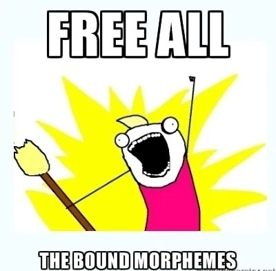

---
## **Exercise II: Bound Morphemes**
 
.pull-left[
how many **bound morphemes** do you spot?
  
.pull-left[
.pull-left[

]
.pull-right[
humorless 
hopeless 
harmlessly 
discernment 
stupidly 
heiress 
encourage 
bathroom
]
]
.pull-right[
.pull-left[
cleverness 
carelessly 
hopefully 
mushroom 
enrage 
lioness 
senseless 
assignment
]
.pull-right[
blamelessly 
classroom 
fearlessness 
rapidly 
joyful 
dumbness 
stewardess 
enjoyment
]
]
]
.pull-right[
 
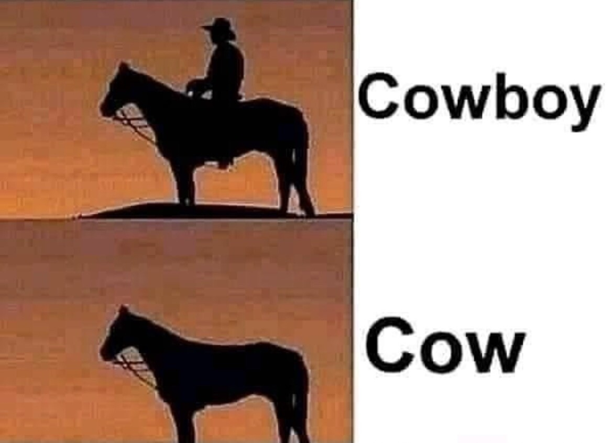
]

---
## **Exercise II: Bound Morphemes**
 
.pull-left[
how many **bound morphemes** do you spot?
  
.pull-left[
.pull-left[

]
.pull-right[
humor**less** 
hope**less** 
harm**less**<b>ly</b> 
discern<b>ment</b> 
stupid**ly** 
heir<b>ess</b> 
<b>en</b>courage 
bathroom
]
]
.pull-right[
.pull-left[
clever<b>ness</b> 
care**less**<b>ly</b> 
hope<b>ful</b><b>ly</b> 
mushroom 
<b>en</b>rage 
lion<b>ess</b> 
sense**less** 
assign<b>ment</b>
]
.pull-right[
blame**less**<b>ly</b> 
classroom 
fear**less**<b>ness</b> 
rapid<b>ly</b> 
joy<b>ful</b> 
dumb**ness** 
steward<b>ess</b> 
enjoy<b>ment</b>
]
]
]
.pull-right[
 

]
  

--

.pull-left[
- **-less**, <b>ly</b>, <b>-ment</b>, -<b>-ess</b>, <b>en-</b>, <b>-ness</b>, <b>ful</b>  
- about dis**cern**, con**cern**, re**cern**
]
.pull-right[
1. why not <b>-lessness</b>?  
2. why not <b>lio</b>-<b>ness</b>?  
3. why not <b>-full</b>?
]

---
## **The Same Morphemes Might Behave Differently in Another Language**
 
- a **single** morpheme in one language can be translated **into more than one** morpheme (or even multiple words) in another language  

- just because a morpheme corresponds to a word in English **does NOT mean** it is necessarily a word in the given language  

.pull-left[
.pull-left[
**Spanish**<b>:</b>
]
.pull-right[
*habl-ar* 
*habl-o* 
*habl-as* 
*habl-ábamo*s 
*habl-aríamo*s 
*habl-a* 
*<i>habl</i>
]
]
.pull-right[
.pull-left[
‘to speak’ (infinitive)  
‘I speak’ 
‘you speak’ 
‘we were speaking’ 
‘If we spoke’ 
‘Speak!’ (imperative) 
???
]
.pull-right[

]
]
 
- we can easily see that the morpheme ***habl*** corresponds to the English word ***speak***, but it does not correspond to a word in Spanish, ***habl*** must always occur with other morphemes, so in Spanish it is a **bound morpheme** 

---
## **Types of Morpheme II: Root vs. Affixes**
 
<table style="width:100%; border-collapse:collapse">
  <tr>
    <td style="width:1%; text-align:center;"></td>
    <td style="width:10%; text-align:center; border:3px solid #CC0033; background-color:#FF8686"><h3><b>root</b></h3></td>
    <td style="width:1%; text-align:center;">-</td>
    <td style="width:40%; text-align:left; border:3px solid #CC0033">
    <ul>
      <li><b>"base"</b> morpheme to which other morphemes are attached</li> 
      <li>contributes the <b>core meaning</b> of the word</li> 
      <li>if a word has a single morpheme, that morpheme is a root</li> 
      <li>examples: <i>danc-ing</i>, <i>dis-appear</i>, <i>help-less-ness</i>, <i>elephant</i></li> 
    </ul>
    </td>
  </tr>
  
  <tr>
    <td style="width:1%; text-align:center;"></td>
    <td style="width:10%; text-align:center;">-</td>
    <td style="width:1%; text-align:center;">-</td>
    <td style="width:40%; text-align:center;">-</td>
  </tr>
  
  <tr>
    <td style="width:1%; text-align:center;"></td>
    <td style="width:10%; text-align:center; border:3px solid green; background-color:#62D095"><h3><b>affix</b></h3></td>
    <td style="width:1%; text-align:center;">-</td>
    <td style="width:40%; text-align:left; border:3px solid green">
    <ul>
      <li>morpheme that is <b>attached to the root</b></li> 
      <li><b>prefixes</b> go before root, <b>suffixes</b> go after root – both are affixest</li> 
      <li>a word can have multiple prefixes or suffixes</li> 
      <li>examples: <i>in-complete</i>, <i>act-ive</i>, <i>un-trust-worthy</i>, <i>will-ing-ly</i></li> 
    </ul>
    </td>
  </tr>
</table>

---
## **Types of Morpheme II: Root vs. Affixes**
   
<table style="width:100%; border-collapse:collapse">
  <tr>
    <td style="width:1%; text-align:center;"></td>
    <td style="width:10%; text-align:center; border:3px solid #CC0033; background-color:#FF8686"><h3><b>root</b></h3></td>
    <td style="width:1%; text-align:center;">-</td>
    <td style="width:40%; text-align:left; border:3px solid #CC0033"> 
    <ul>
      <li>
        a word with <b>more than one root</b> is called a <b>compound</b> word:  
        <ul>
          <li><i>house-cat</i>, <i>ginger-bread</i>, <i>sun-flower</i></li>
        </ul>
      </li>
        
      <li>
        a word with a single <b>one root</b> is called <b>simple</b>, even if it has affixes:  
        <ul>
          <li><i>cat</i>, <i>eat-s</i>, <i>be-friend</i></li>
        </ul>
      </li>
    </ul> 
    </td>
  </tr>
</table>

--
  
### **compound/simple vs. complex/simplex**

---
## **Types of Morpheme II: Root vs. Affixes**
 
<table style="width:100%; border-collapse:collapse">
  <tr>
    <td style="width:1%; text-align:center;"></td>
    <td style="width:10%; text-align:center; border:3px solid green; background-color:#62D095"><h3><b>affix</b></h3></td>
    <td style="width:1%; text-align:center;">-</td>
    <td style="width:40%; text-align:left; border:3px solid green">
    <ul>
      <li>most common affixes are <b>prefixes</b> and <b>suffixes</b></li> 
      <li>
      some languages also exhibits <b>infixes</b>, which go <b>INSIDE</b> the root:  
        <ul>
          <li><b>Tagalog</b>&nbsp&nbsp&nbsp&nbsp&nbsp&nbsp&nbsp&nbsp&nbsp <i>bili</i> 'buy' → <i>b-um-ili</i> 'to buy'</li>
          <li><b>English</b>&nbsp&nbsp&nbsp&nbsp&nbsp&nbsp&nbsp&nbsp&nbsp&nbsp <i>absolutely</i> → <i>abso-****-lutely</i></li>
        </ul>
      </li> 
      <li>
      or <b>circumfixes</b>, which go <b>AROUND</b> the root:  
        <ul>
          <li><b>Indonesian</b>&nbsp&nbsp&nbsp&nbsp <i>ajar</i> 'teach' → <i>pel-ajar-an</i> ''lesson/teaching''</li>
          <li><b>English</b>&nbsp&nbsp&nbsp&nbsp&nbsp&nbsp&nbsp&nbsp&nbsp&nbsp <i>bold</i> → <i>em-bold-en</i> </li>
        </ul>
      </li> 
      <li>
      infixes and circumfixes are a bit rare, so if you think you have found one:  
        <ul>
          <li>for an <b>infix</b>, check if it is really inside the root but not two pre/suffixes</li>
          <li>for a <b>circumfix</b>, chech if it is inseparable and means one thing</li>
        </ul>
      </li>
    </ul>
    </td>
  </tr>
</table>

---
## **Dressing and Naming**

<table style="border-collapse: collapse; border: none; width: auto; text-align:center; vertical-align:middle;">
  <colgroup>
    <col style="width: 15em;">
    <col style="width: 15em;">
    <col style="width: 15em;">
  </colgroup>
  <tr>
    <td>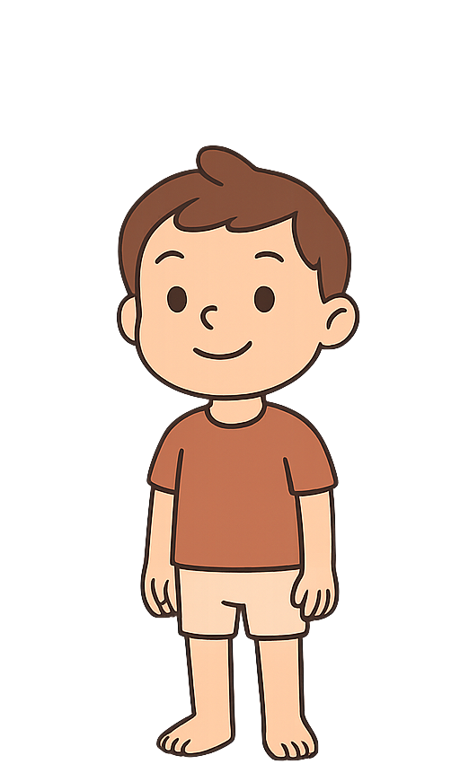</td>
    <td>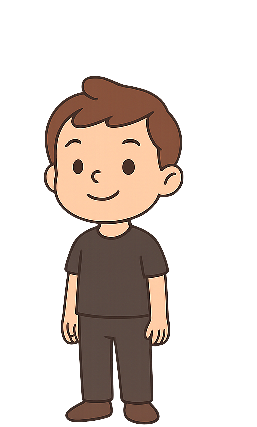</td>
    <td>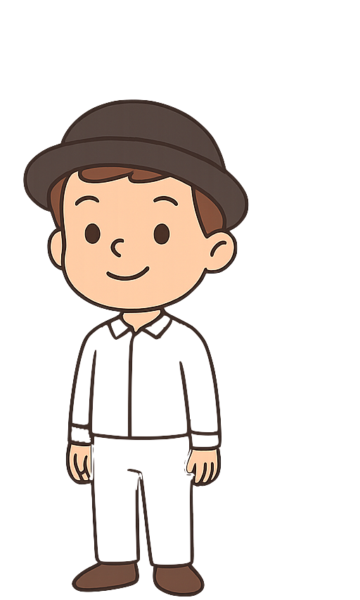</td>
  </tr>
  <tr>
    <td><b>Merlin</b></td>
    <td><b>Merlin-Brown</b></td>
    <td><b>Brown-Merlin-White</b></td>
  </tr>
</table>

---
## **Dressing and Naming**
  
<table style="border-collapse: collapse; border: none; width: auto; text-align:center; vertical-align:middle;">
  <colgroup>
    <col style="width: 15em;">
    <col style="width: 15em;">
    <col style="width: 15em;">
  </colgroup>
  <tr>
    <td>.</td>
    <td>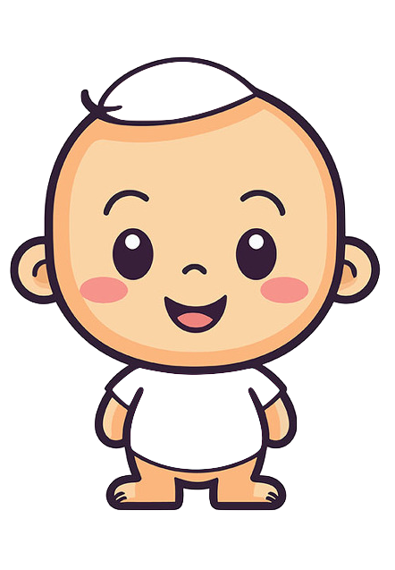</td>
    <td>.</td>
  </tr>
    <tr>
    <td>.</td>
    <td><b>and this is Arthur</b></td>
    <td>.</td>
  </tr>
</table>
---
## **Dressing and Naming**
  
<table style="border-collapse: collapse; border: none; width: auto; text-align:center; vertical-align:middle;">
  <colgroup>
    <col style="width: 15em;">
    <col style="width: 15em;">
    <col style="width: 15em;">
  </colgroup>
  <tr>
    <td>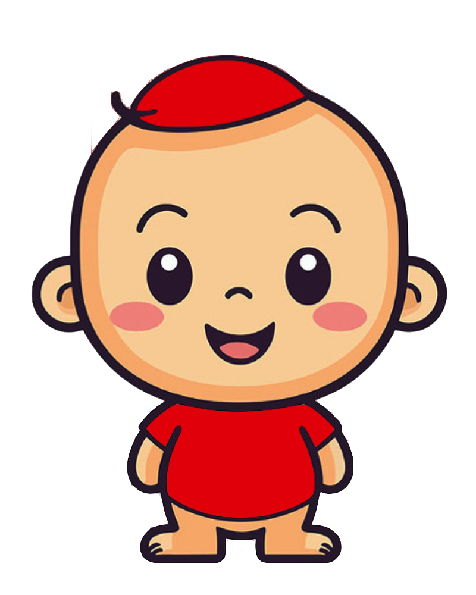</td>
    <td>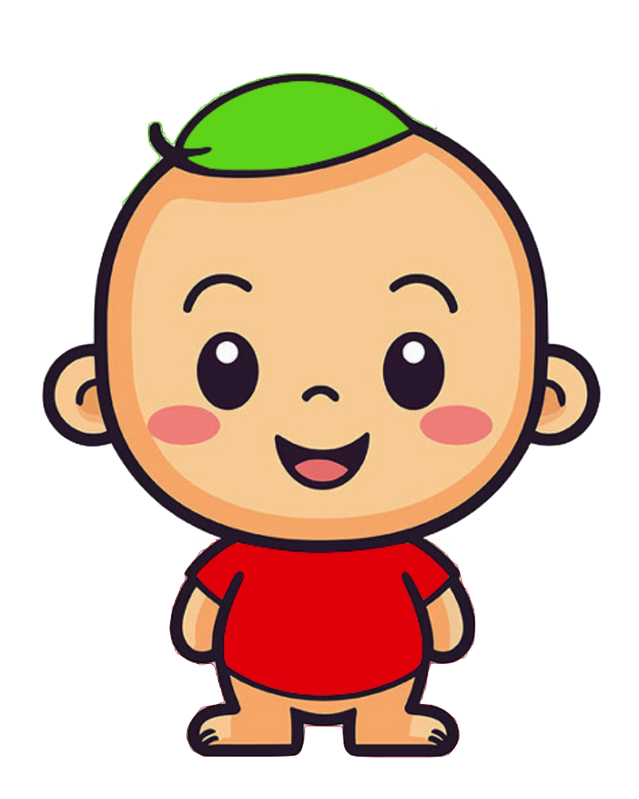</td>
    <td>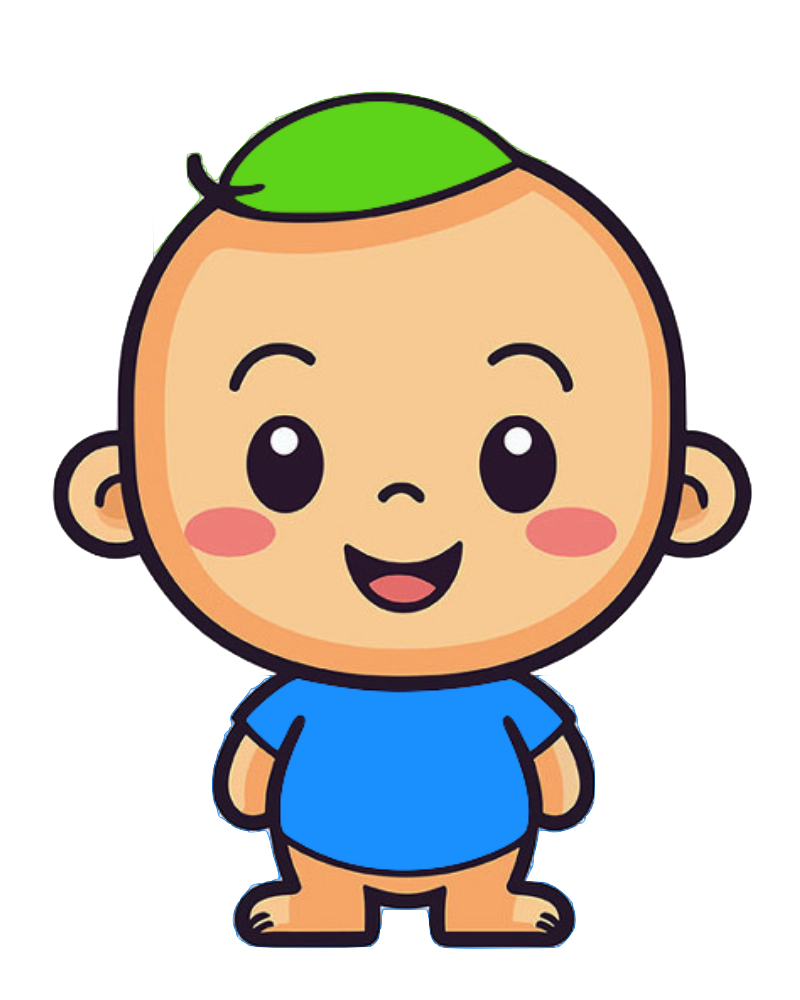</td>
  </tr>
</table>

--
<table style="border-collapse: collapse; border: none; width: auto; text-align:center; vertical-align:middle;">
  <colgroup>
    <col style="width: 15em;">
    <col style="width: 15em;">
    <col style="width: 15em;">
  </colgroup>
  <tr>
    <td><b>Red-Arthur-Red</b></td>
    <td><b>Green-Arthur-Red</b></td>
    <td><b>Green-Arthur-Blue</b></td>
  </tr>
</table>

---
## **Dressing and Naming**
  
<table style="border-collapse: collapse; border: none; width: auto; text-align:center; vertical-align:middle;">
  <colgroup>
    <col style="width: 15em;">
    <col style="width: 15em;">
    <col style="width: 15em;">
  </colgroup>
  <tr>
    <td></td>
    <td>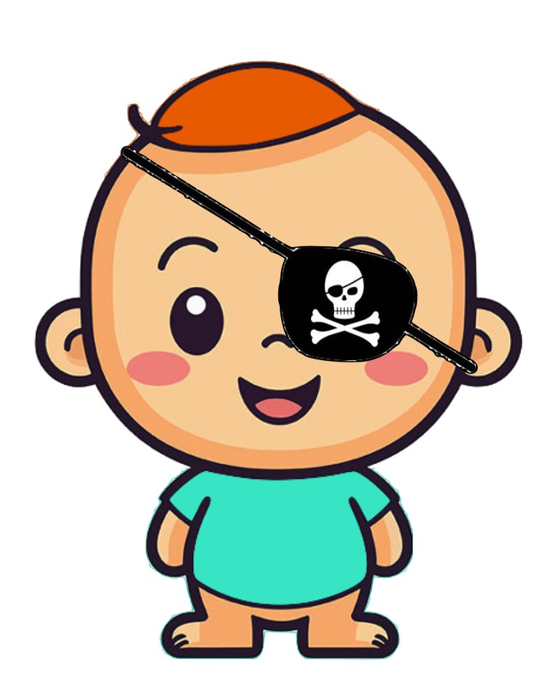</td>
    <td>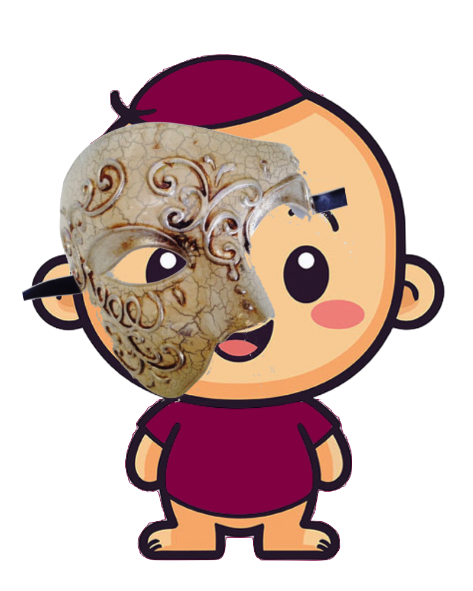</td>
  </tr>
</table>

--
<table style="border-collapse: collapse; border: none; width: auto; text-align:center; vertical-align:middle;">
  <colgroup>
    <col style="width: 16em;">
    <col style="width: 16em;">
    <col style="width: 16em;">
  </colgroup>
  <tr>
    <td><b>Green-BATMAN-Arthur-Blue</b></td>
    <td><b>Orange-PIRATE-Arthur-Teal</b></td>
    <td><b>Claret-PHANTOM-Arthur-Claret</b></td>
  </tr>
</table>

---
## **Dressing and Naming**
  
.pull-left[

]
.pull-right[

]
--
.pull-left[
<b>BLUE-Arthur-HOODY</b>
]
.pull-right[
<b>BLUE-Ar-EARRING-thur-HOODY</b>
]

---
## **Inflectional Morphemes**
 
.pull-left[

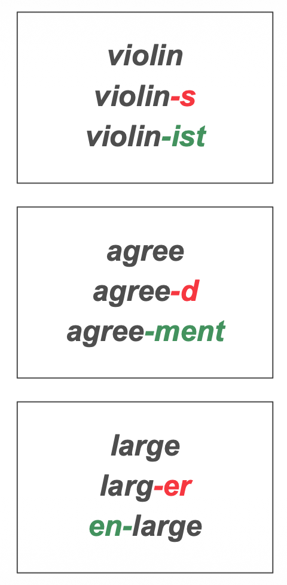

]

--

.pull-right[
consider these words and affixes on the left:   
- the **first** affix in each group (marked <b>red</b>) doesn’t really change the word’s core meaning – instead, it adds grammatical nuance:  
  - *violin-s* = *violin* **+ MORE THAN ONE**
  - *agree-d* = *agree* **+ PAST**
  - *larg-er* = *large* **+ MORE**  
- the process of adding grammatical nuance is called **inflection**, and these affixes are therefore **inflectional morphemes**  
  - inflecting a verb is <b>conjugating</b>
  - inflecting a noun is <b>declining</b>
]

---
## **Derivational Morphemes**
 
.pull-left[

]

--

.pull-right[
consider these words and affixes on the left:   
- the <b>second</b> affix in each group (marked <b>green</b>) changes the word’s meaning substantially, and can even change its <b>part of speech</b> – adding them <b>makes a new word</b>  
  - *violin* (musical instrument, **N**) 
    *violin<b>ist</b>* (a person, <b>N</b>) 
  - *agree* (share opinions, **V**) 
    *agree<b>ment</b>* (contract, <b>N</b>) 
  - *large* (big, **Adj**) 
    *<b>en</b>large* (make big, <b>V</b>)  
- the process of forming new words is called <b>derivation</b>, and these affixes are therefore <b>derivational morphemes</b>
]

---
## **Types of Morphemes III**
### **Inflectional vs. Derivational**
 
<table style="width:100%; border-collapse:collapse">
  <tr>
    <td style="width:1%; text-align:center;"></td>
    <td style="width:10%; text-align:center; border:3px solid green; background-color:#62D095"><h3><b>inflextional</b></h3></td>
    <td style="width:1%; text-align:center;">-</td>
    <td style="width:40%; text-align:left; border:3px solid green">
    <ul>
      <li><b>inflectional morphemes</b> are used to <b>inflect</b> words</li> 
      <li>they add grammatical nuance but do not change the core meaning</li> 
      <li>in English, they’re mostly used to conjugate verbs (<i>jump</i> → <i>jump-ed</i>), pluralize nouns (<i>cat</i> → <i>cat-s</i>), and form the comparative and superlative
of adjectives (<i>bright</i> → <i>bright-er</i> → <i>bright-est</i>)</li>
    </ul>
    </td>
  </tr>
  
  <tr>
    <td style="width:1%; text-align:center;"></td>
    <td style="width:10%; text-align:center;">-</td>
    <td style="width:1%; text-align:center;">-</td>
    <td style="width:40%; text-align:center;">-</td>
  </tr>

  <tr>
    <td style="width:1%; text-align:center;"></td>
    <td style="width:10%; text-align:center; border:3px solid #CC0033; background-color:#FF8686"><h3><b>derivational</b></h3></td>
    <td style="width:1%; text-align:center;">-</td>
    <td style="width:40%; text-align:left; border:3px solid #CC0033">
    <ul>
      <li><b>derivational morphemes</b> are used to derive new words</b></li> 
      <li>they change the core meaning of the word in some way</li> 
      <li>they can, but do not always, change a word's part of speech  
        <ul>
          <li>
            <i>simple</i> → <i>simpl-ify</i>,
            <i>exist</i> → <i>exist-ence</i>,
            <i>pack</i> → <i>un-pack</i>
          </li>
        </ul>
      </li>
    </ul>
    </td>
  </tr>
</table>

---
## **Exercise III: Morphemes Types**
 
.pull-left[
<b>for each word:</b>  
- indicate whether it is **mono-** or **poly**morphemic
- indicate whether it is <b>simple</b> or <b>compound</b>
- divide it into morphemes (use **hyphens**)
  
for each morpheme:
- indicate whether it is a <b>root</b>, <b>prefix</b>, or, <b>suffix</b>
- indicate whether it is a **free** or **bound** morpheme
- if it is an affix, indicate whether it is <b>inflectional</b> or <b>derivational</b>
]

.pull-right[
1. unpacks   
2. railroad   
3. chameleon   
4. backpacker   
5. greater   
6. finger   
7. expectant   
8. unbelievably   
9. uncouth   
10. meaningful
]

---
## **Exercise III: Morphemes Types**
 
.pull-left[
<b>for each word:</b>  
- indicate whether it is **mono-** or **poly**morphemic
- indicate whether it is <b>simple</b> or <b>compound</b>
- divide it into morphemes (use **hyphens**)
  
for each morpheme:
- indicate whether it is a <b>root</b>, <b>prefix</b>, or, <b>suffix</b>
- indicate whether it is a **free** or **bound** morpheme
- if it is an affix, indicate whether it is <b>inflectional</b> or <b>derivational</b>
]

.pull-right[
.pull-left[
1. unpacks   
2. railroad   
3. chameleon   
4. backpacker   
5. greater   
6. finger   
7. expectant   
8. unbelievably   
9. uncouth   
10. meaningful
]
.pull-right[
**un-pack-s**   
<b>rail-road</b>   
**chameleon**   
<b>back-pack-er</b>   
**great-er**   
<b>finger</b>   
**expect-ant**   
<b>un-believ-ab-ly</b>   
**un-couth**   
<b>mean-ing-ful</b>
]
]

---
##**Summary for Different Morphemes**
  
.pull-left[
- <b>root</b> (base; **build**, **flower**)  
- <b>affix</b> (morpheme that attaches to the base)  
  - <b>prefix</b> (**un**-do)  
  - <b>suffix</b> (walk-**ed**)  
  - <b>infix</b> (rare in English)  
  - <b>circumfix</b> (**em**-bold-**en**)  
- <b>free vs. bound morpheme</b>
  - can appear as an independent word?
  - **blue**berry vs. **cran**berry  
]
.pull-right[
- <b>derivational morpheme</b> (piano --> pian-**ist**) 
  - change core meaning even part of speech  
- <b>inflectional morpheme</b> (jump --> jump-**ed**) 
  - add some grammatical nuance  
- <b>homophone</b> (fast-**er**, teach-**er**)
  - same sound, different meanings  
- <b>allomorph</b> (**magic**, **magic**-ian)
  - same meaning, different sounds  
- <b>simple word vs. compound word</b>
  - one root = simple (inter-**nation**-al)
  - more than one = compound (**sawhorse**)
]

---
class:middle, center

Morphological Analysis

---
## **Morphological Analysis**
  
- **morphological analysis** is a technique for figuring out how the morphology of a language works.  
- you can use it to learn how the morphology of an unfamiliar language works – as long as you have a set of words with different morphemes and their translations (**glosses**) into English.   
- **steps**:
  1. identify any **repeated** sequences of sounds in the dataset – they may be a morpheme  
  2. identify any **repeated** meanings in the English glosses  
  3. try to match each meaning from <u>step 2</i> with a potential morpheme from <u>step 1</u> 

---
## **Notes for Moprhological Analysis**
  
.pull-left[
1. try to find two words that differ by just one meaning or morpheme)  
2. look out for any potential **homophones** or **allomorphs**  
3. don’t be afraid to **revise your hypotheses** if the data suggests you’re on the wrong track  
4. **order** of morphemes matters  
5. **affixes are picky**
]
.pull-right[
 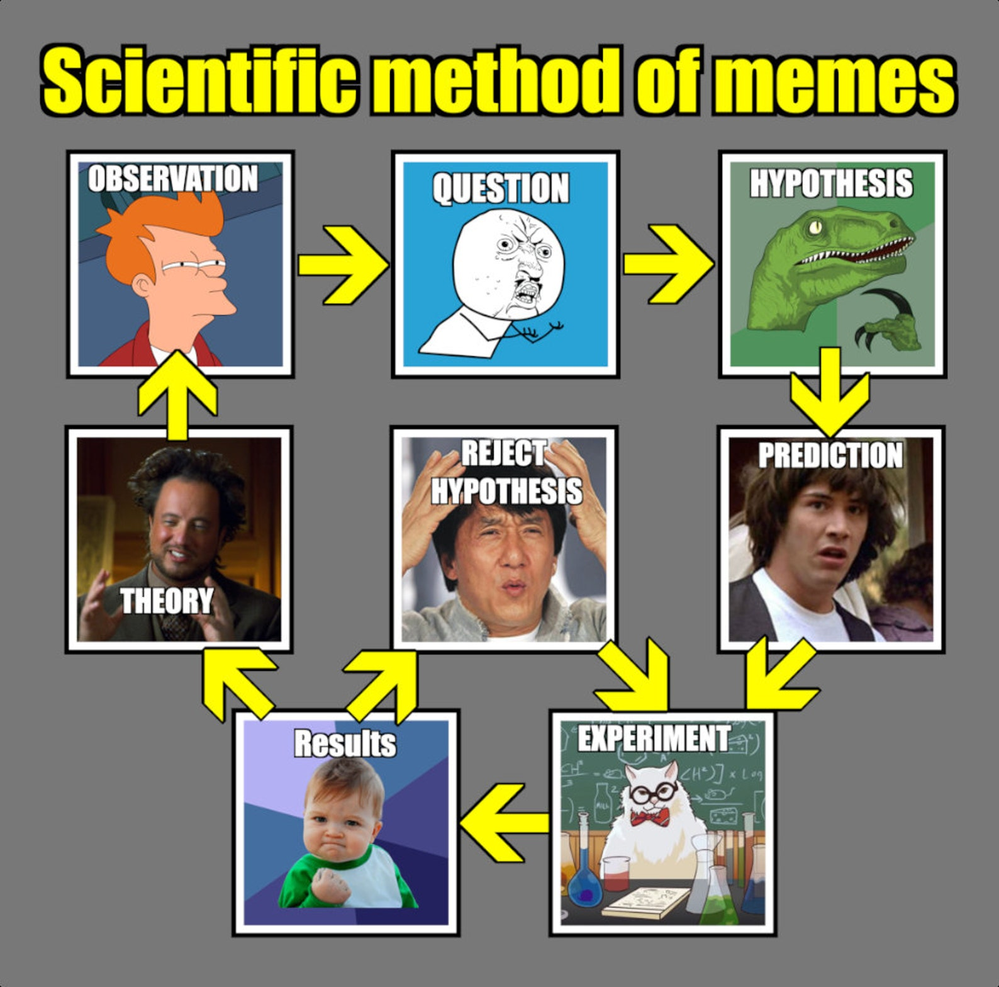
]

---
## **Excercise V: Morphological Analysis**
### Isthmus Zapotec, Oto-Manguean
 
<table style="border-collapse: collapse; border: none; width: auto;">
  <colgroup>
    <col style="width: 2em;">
    <col style="width: 6em;">
    <col style="width: 10em;">
    <col style="width: 2em;">
    <col style="width: 2em;">
    <col style="width: 6em;">
    <col style="width: 10em;">
    <col style="width: 2em;">
    <col style="width: 2em;">
    <col style="width: 6em;">
    <col style="width: 10em;">
  </colgroup>
  <tr>
    <td>01.</td>
    <td>palu</td>
    <td>'stick'</td>
    <td></td>
    <td>06.</td>
    <td>spalube</td>
    <td>'his stick'</td>
    <td></td>
    <td>11.</td>
    <td>spalulu</td>
    <td>'your stick'</td>
  </tr>

  <tr>
    <td>02.</td>
    <td>kuba</td>
    <td>'dough'</td>
    <td></td>
    <td>07.</td>
    <td>skubabe</td>
    <td>'his dough'</td>
    <td></td>
    <td>12.</td>
    <td>skubalu</td>
    <td>'your dough'</td>
  </tr>

  <tr>
    <td>03.</td>
    <td>geta</td>
    <td>'tortilla'</td>
    <td></td>
    <td>08.</td>
    <td>sketabe</td>
    <td>'his tortilla'</td>
    <td></td>
    <td>13.</td>
    <td>sketalu</td>
    <td>'your tortilla'</td>
  </tr>

  <tr>
    <td>04.</td>
    <td>bere</td>
    <td>'chicken'</td>
    <td></td>
    <td>09.</td>
    <td>sperebe</td>
    <td>'his chicken'</td>
    <td></td>
    <td>14.</td>
    <td>sperelu</td>
    <td>'your chicken'</td>
  </tr>
  
  <tr>
    <td>05.</td>
    <td>dolo</td>
    <td>'rope'</td>
    <td></td>
    <td>10.</td>
    <td>stoʔobe</td>
    <td>'his rope'</td>
    <td></td>
    <td>15.</td>
    <td>stoʔolu</td>
    <td>'your rope'</td>
  </tr>
</table>
  

--
- what morphemes does Isthmus Zapotec use to indicate the following concepts?
  - stick, dough, tortilla, chicken, rope
  - third person singular (s/he)
  - second person plural (plural 'you')
  - possession ('s in English)
  
- the word for 'four' is *tapa*, then how would we say 'his four' and 'your four'?

---
## **Excercise V: Morphological Analysis**
### Isthmus Zapotec, Oto-Manguean
 
<table style="border-collapse: collapse; border: none; width: auto;">
  <colgroup>
    <col style="width: 2em;">
    <col style="width: 6em;">
    <col style="width: 10em;">
    <col style="width: 2em;">
    <col style="width: 2em;">
    <col style="width: 6em;">
    <col style="width: 10em;">
    <col style="width: 2em;">
    <col style="width: 2em;">
    <col style="width: 6em;">
    <col style="width: 10em;">
  </colgroup>
  <tr>
    <td>01.</td>
    <td>palu</td>
    <td>'stick'</td>
    <td></td>
    <td>06.</td>
    <td>s<b>palu</b>be</td>
    <td>'his stick'</td>
    <td></td>
    <td>11.</td>
    <td>s<b>palu</b>lu</td>
    <td>'your stick'</td>
  </tr>

  <tr>
    <td>02.</td>
    <td>kuba</td>
    <td>'dough'</td>
    <td></td>
    <td>07.</td>
    <td>s<b>kuba</b>be</td>
    <td>'his dough'</td>
    <td></td>
    <td>12.</td>
    <td>s<b>kuba</b>lu</td>
    <td>'your dough'</td>
  </tr>

  <tr>
    <td>03.</td>
    <td>geta</td>
    <td>'tortilla'</td>
    <td></td>
    <td>08.</td>
    <td>s<b>keta</b>be</td>
    <td>'his tortilla'</td>
    <td></td>
    <td>13.</td>
    <td>s<b>keta</b>lu</td>
    <td>'your tortilla'</td>
  </tr>

  <tr>
    <td>04.</td>
    <td>bere</td>
    <td>'chicken'</td>
    <td></td>
    <td>09.</td>
    <td>s<b>pere</b>be</td>
    <td>'his chicken'</td>
    <td></td>
    <td>14.</td>
    <td>s<b>pere</b>lu</td>
    <td>'your chicken'</td>
  </tr>
  
  <tr>
    <td>05.</td>
    <td>dolo</td>
    <td>'rope'</td>
    <td></td>
    <td>10.</td>
    <td>s<b>toʔo</b>be</td>
    <td>'his rope'</td>
    <td></td>
    <td>15.</td>
    <td>s<b>toʔo</b>lu</td>
    <td>'your rope'</td>
  </tr>
</table>
    

--
<table style="border-collapse: collapse; border: none; width: auto;">
  <colgroup>
    <col style="width: 2em;">
    <col style="width: 6em;">
    <col style="width: 10em;">
    <col style="width: 2em;">
    <col style="width: 2em;">
    <col style="width: 6em;">
    <col style="width: 10em;">
    <col style="width: 2em;">
    <col style="width: 2em;">
    <col style="width: 6em;">
    <col style="width: 10em;">
  </colgroup>
  <tr>
    <td>01.</td>
    <td>palu</td>
    <td>'stick'</td>
    <td></td>
    <td>06.</td>
    <td><b>s</b>palu<b>be</b></td>
    <td>'his stick'</td>
    <td></td>
    <td>11.</td>
    <td><b>s</b>palu<b>lu</b></td>
    <td>'your stick'</td>
  </tr>

  <tr>
    <td>02.</td>
    <td>kuba</td>
    <td>'dough'</td>
    <td></td>
    <td>07.</td>
    <td><b>s</b>kuba<b>be</b></td>
    <td>'his dough'</td>
    <td></td>
    <td>12.</td>
    <td><b>s</b>kuba<b>lu</b></td>
    <td>'your dough'</td>
  </tr>

  <tr>
    <td>03.</td>
    <td>geta</td>
    <td>'tortilla'</td>
    <td></td>
    <td>08.</td>
    <td><b>s</b>keta<b>be</b></td>
    <td>'his tortilla'</td>
    <td></td>
    <td>13.</td>
    <td><b>s</b>keta<b>lu</b></td>
    <td>'your tortilla'</td>
  </tr>

  <tr>
    <td>04.</td>
    <td>bere</td>
    <td>'chicken'</td>
    <td></td>
    <td>09.</td>
    <td><b>s</b>pere<b>be</b></td>
    <td>'his chicken'</td>
    <td></td>
    <td>14.</td>
    <td><b>s</b>pere<b>lu</b></td>
    <td>'your chicken'</td>
  </tr>
  
  <tr>
    <td>05.</td>
    <td>dolo</td>
    <td>'rope'</td>
    <td></td>
    <td>10.</td>
    <td><b>s</b>toʔo<b>be</b></td>
    <td>'his rope'</td>
    <td></td>
    <td>15.</td>
    <td><b>s</b>toʔo<b>lu</b></td>
    <td>'your rope'</td>
  </tr>
</table>

---
class: center, middle
# **BONUS QUESTION**
  
### if **s**palu**be** is grammatical
### but neither \* ** s**palu nor \* palu**be** is grammatical
### what does this tell us about morpheme *s-* and *-be*?
  
(This might not be the actual case and it is only an assumption)

---
## **Excercise VI: Morphological Analysis**
### Luiseño, Uto-Aztecan
 

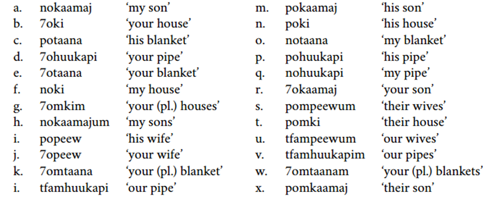
 
give the luiseño morpheme that corresponds to each English translation  
<table style="border-collapse: collapse; border: none; width: auto;">
  <colgroup>
    <col style="width: 2em;">
    <col style="width: 8em;">
    <col style="width: 8em;">
    <col style="width: 2em;">
    <col style="width: 2em;">
    <col style="width: 8em;">
    <col style="width: 8em;">
    <col style="width: 2em;">
    <col style="width: 2em;">
    <col style="width: 8em;">
    <col style="width: 8em;">
  </colgroup>
  <tr>
    <td>a.</td>
    <td>'son'</td>
    <td><b>kaamaj</b</td>
    <td></td>
    <td>e.</td>
    <td>'my'</td>
    <td><b>no-</b</td>
    <td></td>
    <td>i.</td>
    <td>'their'</td>
    <td><b>pom-</b</td>
  </tr>
  <tr>
    <td>b.</td>
    <td>'house'</td>
    <td><b>ki</b</td>
    <td></td>
    <td>f.</td>
    <td>'his'</td>
    <td><b>po-</b</td>
    <td></td>
    <td>j.</td>
    <td>(plural marker)</td>
    <td><b>-um</b / <b>-m</b</td>
  </tr>
  <tr>
    <td>c.</td>
    <td>'blanket'</td>
    <td><b>taana</b</td>
    <td></td>
    <td>g.</td>
    <td>'your (sg.)'</td>
    <td><b>7o-</b</td>
    <td></td>
    <td>k.</td>
    <td>'pipe'</td>
    <td><b>huukapi</b</td>
  </tr>
  <tr>
    <td>d.</td>
    <td>'wife'</td>
    <td><b>peew</b</td>
    <td></td>
    <td>h.</td>
    <td>'your (pl.)'</td>
    <td><b>7om-</b</td>
    <td></td>
    <td>l.</td>
    <td>'our'</td>
    <td><b>tfam-</b</td>
  </tr>
</table>

---
## **Excercise VI: Morphological Analysis**
### Luiseño, Uto-Aztecan
 

  
.pull-left[
<table style="border-collapse: collapse; border: none; width: auto;">
  <colgroup>
    <col style="width: 2em;">
    <col style="width: 10em;">
    <col style="width: 10em;">
  </colgroup>
  <tr>
    <td>a.</td><td>no<b>kaamaj</b></td><td>'my son'</td>
  </tr>
  <tr>
    <td>h.</td><td>no<b>kaamaj</b>um</td><td>'my sons'</td>
  </tr>
  <tr>
    <td>m.</td><td>po<b>kaamaj</b></td><td>'his son'</td>
  </tr>
  <tr>
    <td>r.</td><td>7o<b>kaamaj</b></td><td>'your son'</td>
  </tr>
  <tr>
    <td>x.</td><td>po<b>kaamaj</b></td><td>'their son'</td>
  </tr>
</table>
]
.pull-right[
<table style="border-collapse: collapse; border: none; width: auto;">
  <colgroup>
    <col style="width: 2em;">
    <col style="width: 10em;">
    <col style="width: 10em;">
  </colgroup>
  <tr>
    <td>b.</td><td><b>7o</b>ki</td><td>'your house'</td>
  </tr>
  <tr>
    <td>d.</td><td><b>7o</b>huukapi</td><td>'your pipe'</td>
  </tr>
  <tr>
    <td>e.</td><td><b>7o</b>taana</td><td>'your blanket'</td>
  </tr>
  <tr>
    <td>j.</td><td><b>7o</b>peew</td><td>'your wife'</td>
  </tr>
  <tr>
    <td>r.</td><td><b>7o</b>kaamaj</td><td>'your son'</td>
  </tr>
</table>
]
   

---
## **Excercise VI: Morphological Analysis**
### Luiseño, Uto-Aztecan
 
.pull-left[
<table style="border-collapse: collapse; border: none; width: auto;">
  <colgroup>
    <col style="width: 2em;">
    <col style="width: 10em;">
    <col style="width: 10em;">
  </colgroup>
  <tr>
    <td>a.</td><td>no<b>kaamaj</b></td><td>'my son'</td>
  </tr>
  <tr>
    <td>h.</td><td>no<b>kaamaj</b>um</td><td>'my sons'</td>
  </tr>
  <tr>
    <td>m.</td><td>po<b>kaamaj</b></td><td>'his son'</td>
  </tr>
  <tr>
    <td>r.</td><td>7o<b>kaamaj</b></td><td>'your son'</td>
  </tr>
  <tr>
    <td>x.</td><td>po<b>kaamaj</b></td><td>'their son'</td>
  </tr>
</table>
]
.pull-right[
<table style="border-collapse: collapse; border: none; width: auto;">
  <colgroup>
    <col style="width: 2em;">
    <col style="width: 10em;">
    <col style="width: 10em;">
  </colgroup>
  <tr>
    <td>b.</td><td><b>7o</b>ki</td><td>'your house'</td>
  </tr>
  <tr>
    <td>d.</td><td><b>7o</b>huukapi</td><td>'your pipe'</td>
  </tr>
  <tr>
    <td>e.</td><td><b>7o</b>taana</td><td>'your blanket'</td>
  </tr>
  <tr>
    <td>j.</td><td><b>7o</b>peew</td><td>'your wife'</td>
  </tr>
  <tr>
    <td>r.</td><td><b>7o</b>kaamaj</td><td>'your son'</td>
  </tr>
</table>
]
   

--
give the luiseño morpheme that corresponds to each English translation  
<table style="border-collapse: collapse; border: none; width: auto;">
  <colgroup>
    <col style="width: 2em;">
    <col style="width: 8em;">
    <col style="width: 8em;">
    <col style="width: 2em;">
    <col style="width: 2em;">
    <col style="width: 8em;">
    <col style="width: 8em;">
    <col style="width: 2em;">
    <col style="width: 2em;">
    <col style="width: 8em;">
    <col style="width: 8em;">
  </colgroup>
  <tr>
    <td>a.</td>
    <td>'son'</td>
    <td><b>kaamaj</b</td>
    <td></td>
    <td>e.</td>
    <td>'my'</td>
    <td><b>no-</b</td>
    <td></td>
    <td>i.</td>
    <td>'their'</td>
    <td><b>pom-</b</td>
  </tr>
  <tr>
    <td>b.</td>
    <td>'house'</td>
    <td><b>ki</b</td>
    <td></td>
    <td>f.</td>
    <td>'his'</td>
    <td><b>po-</b</td>
    <td></td>
    <td>j.</td>
    <td>(plural marker)</td>
    <td><b>-um</b / <b>-m</b</td>
  </tr>
  <tr>
    <td>c.</td>
    <td>'blanket'</td>
    <td><b>taana</b</td>
    <td></td>
    <td>g.</td>
    <td>'your (sg.)'</td>
    <td><b>7o-</b</td>
    <td></td>
    <td>k.</td>
    <td>'pipe'</td>
    <td><b>huukapi</b</td>
  </tr>
  <tr>
    <td>d.</td>
    <td>'wife'</td>
    <td><b>peew</b</td>
    <td></td>
    <td>h.</td>
    <td>'your (pl.)'</td>
    <td><b>7om-</b</td>
    <td></td>
    <td>l.</td>
    <td>'our'</td>
    <td><b>tfam-</b</td>
  </tr>
</table>

---
class: center, middle
**no homework** is due this week  
<b>readings</b> Sections 4.3, 4.4 and 4.5 of Chapter 4: Morphology from <i>Language Files</i>  

  
Slides created via the R package [**xaringan**](https://github.com/yihui/xaringan).
