class: center, middle
## Please pick up your **name card** from the front

---
## **Homophones and Allomorphs**
 
<table style="width:100%; border-collapse:collapse">
  <tr>
    <td style="width:1%; text-align:center;"></td>
    <td style="width:10%; text-align:center; border:3px solid orange; background-color:#FFF176"><h3><b>homophones</b></h3></td>
    <td style="width:1%; text-align:center;">-</td>
    <td style="width:40%; text-align:left; border:3px solid orange">
    <ul>
      <li>
        sound the same, but mean different things  
        <ul>
          <li>
            <i>small-er → -er</i> = 'more'&nbsp&nbsp&nbsp&nbsp&nbsp&nbsp&nbsp&nbsp
            <i>help-er → -er</i> = 'agent'
          </li>
          <li>
            <i>paper-s → -s</i> = PLURAL&nbsp&nbsp&nbsp&nbsp&nbsp&nbsp
            <i>see-s → -s</i> = 3SG PRESENT
          </li>
        </ul>
      </li> 
      <li>
        these are <b>different morphemes</b> that happen to sound the same
      </li> 
      <li>
        <b>homophonous</b> not <b>homophobous</b>
      </li>
    </ul>
    </td>
  </tr>
  
  <tr>
    <td style="width:1%; text-align:center;"></td>
    <td style="width:10%; text-align:center;">-</td>
    <td style="width:1%; text-align:center;">-</td>
    <td style="width:40%; text-align:center;">-</td>
  </tr>
  
  <tr>
    <td style="width:1%; text-align:center;"></td>
    <td style="width:10%; text-align:center; border:3px solid blue; background-color:#A4C2F4"><h3><b>allomorphs</b></h3></td>
    <td style="width:1%; text-align:center;">-</td>
    <td style="width:40%; text-align:left; border:3px solid blue">
    <ul>
      <li>
      mean the same thing, but are pronounced differently  
        <ul class="two-col-grid">
          <li>
            <i>wug-s</i>,
            <i>peff-s</i>,
            <i>gutch-es</i>&nbsp&nbsp&nbsp&nbsp&nbsp&nbsp&nbsp&nbsp
            <i>talk-ed</i>,
            <i>buzz-ed</i>,
            <i>land-ed</i>
          </li>
          <li>
            <i>magic-al</i>,
            <i>magic-ian</i>&nbsp&nbsp&nbsp&nbsp&nbsp&nbsp&nbsp&nbsp&nbsp&nbsp&nbsp&nbsp&nbsp&nbsp
            <i>clear-ing</i>,
            <i>clar-ify</i>
          </li>
        </ul>
      </li> 
      <li>
        each of these is a <b>separate morpheme</b> with multiple pronunciations and each pronunciation is called an <b>allomorph</b> of that morpheme
      </li>
    </ul>
    </td>
  </tr>
</table>

---
## **Types of Morphemes I: Free vs. Bound**
 
compare two **lexical entries** we have seen:
  
.pull-left[
<table style="width:100%; border-collapse:collapse;">
  <tr>
    <td style="width:15%; text-align:center; border:1px solid black;">label</td>
    <td style="width:15%; text-align:center; border:1px solid black;">'dog'</td>
    <td style="width:15%; text-align:center; border:1px solid black;">'teach'</td>
  </tr>
  
  <tr>
    <td style="width:15%; text-align:center; border:1px solid black;"><b>phonological representation</b></td>
    <td style="width:15%; text-align:center; border:1px solid black;">/dɑg/</td>
    <td style="width:15%; text-align:center; border:1px solid black;">/tiːtʃ/</td>
  </tr>
  
  <tr>
    <td style="width:15%; text-align:center; border:1px solid black;"><b>semantic representation</b></td>
    <td style="width:15%; text-align:center; border:1px solid black;">{x: x is a <i><b>dog</b></i>}</td>
    <td style="width:15%; text-align:center; border:1px solid black;">{&lt;x, y&gt;: x <i><b>teaches</b></i> y}</td>
  </tr>
</table>
]

.pull-right[
<table style="width:100%; border-collapse:collapse;">
  <tr>
    <td style="width:15%; text-align:center; border:1px solid black;">label</td>
    <td style="width:15%; text-align:center; border:1px solid black;">'-er'</td>
    <td style="width:15%; text-align:center; border:1px solid black;">'-able'</td>
  </tr>
  
  <tr>
    <td style="width:15%; text-align:center; border:1px solid black;"><b>phonological representation</b></td>
    <td style="width:15%; text-align:center; border:1px solid black;">/ər/</td>
    <td style="width:15%; text-align:center; border:1px solid black;">/əbəl/</td>
  </tr>
  
  <tr>
    <td style="width:15%; text-align:center; border:1px solid black;"><b>semantic representation</b></td>
    <td style="width:15%; text-align:center; border:1px solid black;">one who does <i><b>X</b></i> action</td>
    <td style="width:15%; text-align:center; border:1px solid black;">able to be <i><b>X</b></i>-ed</td>
  </tr>
</table>
]
 

.pull-left[

  <h2><b>
    free morpheme
  </b></h2>
  can stand alone as a word 
  e.g. <i>dog</i>, <i>cat</i>, <i>house</i>,

]
.pull-right[

  <h2><b>
    bound morpheme
  </b></h2>
  cannot stand alone 
  e.g. <i>-er</i>, <i>-s</i>, <i>cran-</i>

]

  <h3><b>
    -infix-
  </b></h3>

<table style="width:100%; border-collapse:collapse">
  <tr>
    <td style="width:15%; text-align:center;"><h3>prefix-</h3></td>
    <td style="width:15%; text-align:center; border:3px solid blue"><h3>root(s)</h3></td>
    <td style="width:15%; text-align:center;"><h3>-suffix</h3></td>
  </tr>
  
  <tr>
    <td style="width:15%; text-align:center;"><h3>circum-</h3></td>
    <td style="width:15%; text-align:center;"></td>
    <td style="width:15%; text-align:center;"><h3>-fix</h3></td>
  </tr>
</table>

---
## **Types of Morpheme II: Root vs. Affixes**
 
<table style="width:100%; border-collapse:collapse">
  <tr>
    <td style="width:1%; text-align:center;"></td>
    <td style="width:10%; text-align:center; border:3px solid #CC0033; background-color:#FF8686"><h3><b>root</b></h3></td>
    <td style="width:1%; text-align:center;">-</td>
    <td style="width:40%; text-align:left; border:3px solid #CC0033">
    <ul>
      <li><b>"base"</b> morpheme to which other morphemes are attached</li> 
      <li>contributes the <b>core meaning</b> of the word</li> 
      <li>if a word has a single morpheme, that morpheme is a root</li> 
      <li>examples: <i>danc-ing</i>, <i>dis-appear</i>, <i>help-less-ness</i>, <i>elephant</i></li> 
    </ul>
    </td>
  </tr>
  
  <tr>
    <td style="width:1%; text-align:center;"></td>
    <td style="width:10%; text-align:center;">-</td>
    <td style="width:1%; text-align:center;">-</td>
    <td style="width:40%; text-align:center;">-</td>
  </tr>
  
  <tr>
    <td style="width:1%; text-align:center;"></td>
    <td style="width:10%; text-align:center; border:3px solid green; background-color:#62D095"><h3><b>affix</b></h3></td>
    <td style="width:1%; text-align:center;">-</td>
    <td style="width:40%; text-align:left; border:3px solid green">
    <ul>
      <li>morpheme that is <b>attached to the root</b></li> 
      <li><b>prefixes</b> go before root, <b>suffixes</b> go after root – both are affixest</li> 
      <li>a word can have multiple prefixes or suffixes</li> 
      <li>Examples: <i>in-complete</i>, <i>act-ive</i>, <i>un-trust-worthy</i>, <i>will-ing-ly</i></li> 
    </ul>
    </td>
  </tr>
</table>

---
## **Types of Morphemes III**
### **Inflectional vs. Derivational**
 
<table style="width:100%; border-collapse:collapse">
  <tr>
    <td style="width:1%; text-align:center;"></td>
    <td style="width:10%; text-align:center; border:3px solid green; background-color:#62D095"><h3><b>inflextional</b></h3></td>
    <td style="width:1%; text-align:center;">-</td>
    <td style="width:40%; text-align:left; border:3px solid green">
    <ul>
      <li><b>inflectional morphemes</b> are used to <b>inflect</b> words</li> 
      <li>they add grammatical nuance but do not change the core meaning</li> 
      <li>in English, they’re mostly used to conjugate verbs (<i>jump</i> → <i>jump-ed</i>), pluralize nouns (<i>cat</i> → <i>cat-s</i>), and form the comparative and superlative
of adjectives (<i>bright</i> → <i>bright-er</i> → <i>bright-est</i>)</li>
    </ul>
    </td>
  </tr>
  
  <tr>
    <td style="width:1%; text-align:center;"></td>
    <td style="width:10%; text-align:center;">-</td>
    <td style="width:1%; text-align:center;">-</td>
    <td style="width:40%; text-align:center;">-</td>
  </tr>

  <tr>
    <td style="width:1%; text-align:center;"></td>
    <td style="width:10%; text-align:center; border:3px solid #CC0033; background-color:#FF8686"><h3><b>derivational</b></h3></td>
    <td style="width:1%; text-align:center;">-</td>
    <td style="width:40%; text-align:left; border:3px solid #CC0033">
    <ul>
      <li><b>derivational morphemes</b> are used to derive new words</b></li> 
      <li>they change the core meaning of the word in some way</li> 
      <li>they can, but do not always, change a word's part of speech  
        <ul>
          <li>
            <i>simple</i> → <i>simpl-ify</i>,
            <i>exist</i> → <i>exist-ence</i>,
            <i>pack</i> → <i>un-pack</i>
          </li>
        </ul>
      </li>
    </ul>
    </td>
  </tr>
</table>

---
## **Exercise I: Morphemes Types**
 
.pull-left[
<b>for each word:</b>  
- indicate whether it is **mono-** or **poly**morphemic
- indicate whether it is <b>simple</b> or <b>compound</b>
- divide it into morphemes (use **hyphens**)
  
for each morpheme:
- indicate whether it is a <b>root</b>, <b>prefix</b>, or, <b>suffix</b>
- indicate whether it is a **free** or **bound** morpheme
- if it is an affix, indicate whether it is <b>inflectional</b> or <b>derivational</b>
]

.pull-right[
1. unpacks   
2. railroad   
3. chameleon   
4. backpacker   
5. greater   
6. finger   
7. expectant   
8. unbelievably   
9. uncouth   
10. meaningful
]

---
## **Exercise I: Morphemes Types**
 
.pull-left[
<b>for each word:</b>  
- indicate whether it is **mono-** or **poly**morphemic
- indicate whether it is <b>simple</b> or <b>compound</b>
- divide it into morphemes (use **hyphens**)
  
for each morpheme:
- indicate whether it is a <b>root</b>, <b>prefix</b>, or, <b>suffix</b>
- indicate whether it is a **free** or **bound** morpheme
- if it is an affix, indicate whether it is <b>inflectional</b> or <b>derivational</b>
]

.pull-right[
.pull-left[
1. unpacks   
2. railroad   
3. chameleon   
4. backpacker   
5. greater   
6. finger   
7. expectant   
8. unbelievably   
9. uncouth   
10. meaningful
]
.pull-right[
**un-pack-s**   
<b>rail-road</b>   
**chameleon**   
<b>back-pack-er</b>   
**great-er**   
<b>finger</b>   
**expect-ant**   
<b>un-believ-ab-ly</b>   
**un-couth**   
<b>mean-ing-ful</b>
]
]

---
class:middle, center

Structures in Words

---
## **Why Order Matters**
 
.pull-left[
consider words below **morphemes** make them up
  - unusable
  - unlockable
]

--

.pull-right[
 
  - **un-**<b>us(e)-able</b>
  - **un-**<b>lock-able</b>
]  

--
<h3><b>what are possible meanings of these two adjectives?</b></h3>

 
.pull-left[
- **un-**<b>us-able</b> has <b>only one meaning</b>
  - not able to be used
- **un-**<b>lock-able</b> is on the other hand, <b>ambiguous</b>
  - not able to be locked
  - able to be unlocked
]

.pull-right[
### Semantic Gap
]
 

--

### **why are they different though both are formed by attaching the same morphemes to the root?**

---
## **Affixes are 'Picky'**
 
.pull-left[ 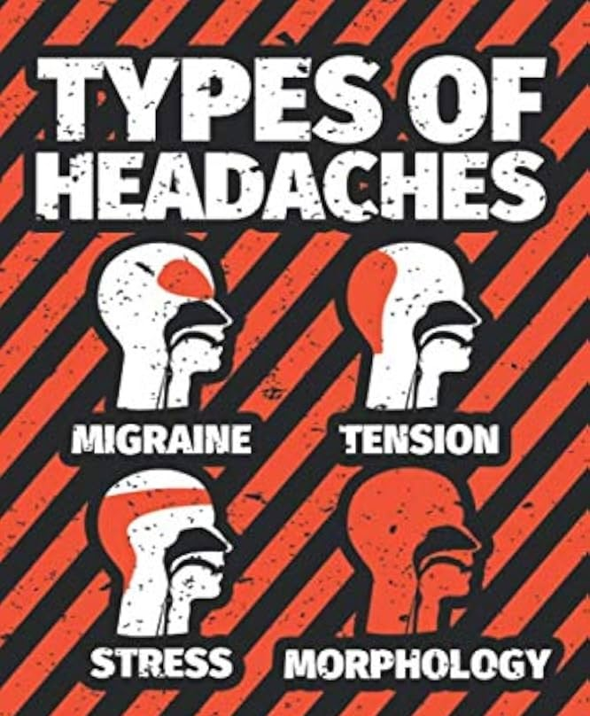]
.pull-right[
affixes have **selectional requirements**, meaning that they can only attach to
stems of **a particular category**:  
- **inflectional** affix:  
  - comparative ***–er*** attaches only to adjectives 
  *tall-<b>er</b>*, \* *cat-<b>er*</b> 
  - plural ***–s*** attaches only to nouns 
  *cat-<b>s</b>*, \* *tall-<b>s</b>*  
- **derivational** affix:  
  - ***re-*** attaches only to verbs 
  *<b>re</b>-do*, *<b>re</b>-visit*, \* *<b>re</b>-red*, \* *<b>re</b>-pencil*
]

---
## **Affixes are 'Picky'**
 
.pull-left[ ]
.pull-right[
- in addition to being picky about their base, **derivational** affixes also **determine**
the category of the resulting word:  
  - derivational ***-ness*** attaches to adjectives to create nouns 
  *loneli-<b>ness</b>*, *happi-<b>ness</b>*, *concrete-<b>ness</b>*  
  - derivational ***-able*** attaches to verbs to create adjectives 
  *search-<b>able</b>*, *plan-<b>able</b>*, *do-<b>able</b>*  
- affixes can be even pickier, only attaching to certain types of nouns  
  - the derivational affix ***-ion*** attaches to verbs of only **Latin** origin to
create nouns 
  - *convers-<b>ion</b>*
]

---
## **Exercise IV: Adapted from <i>Language Files</i>**
 
from the examples given for each of the following **suffixes**, determine:  
  1. the lexical category (i.e. parts of speech) of the **root**
  2. the lexical category (i.e. parts of speech) of the word resulting from the addition of the **suffix**
    

.pull-left[
a. -ive: <u>*repressive*, *active*, *disruptive*, *explosive*</u>  
b. -ion: <u>*invention*, *narration*, *expression*, *pollution*</u>  
c. re-: <u>*reelect*, *resubmit*, *restart*, *recap*, *reactivate*</u>
]
.pull-right[
**-ive** takes <u>verb</u>, yields <u>noun</u>  
**-ion** takes <u>verb</u>, yields <u>noun</u>  
**re-** takes <u>verb</u>, yields <u>noun</u>  
]

---
## **Exercise IV: Adapted from <i>Language Files</i>**
 
from the examples given for each of the following **suffixes**, determine:  
  1. the lexical category (i.e. parts of speech) of the **root**
  2. the lexical category (i.e. parts of speech) of the word resulting from the addition of the **suffix**
    

.pull-left[
a. -ive: <u>*repressive*, *active*, *disruptive*, *explosive*</u>  
b. -ion: <u>*invention*, *narration*, *expression*, *pollution*</u>  
c. re-: <u>*reelect*, *resubmit*, *restart*, *recap*, *reactivate*</u>
]
.pull-right[
**-ive** takes <u>verb</u>, yields <u>adjective</u>  
**-ion** takes <u>verb</u>, yields <u>noun</u>  
**re-** takes <u>verb</u>, yields <u>verb</u>  
]

---
## **Back to Order of Affixation**
 
.pull-left[
the **selectional restrictions** of affixes often help us **determine** the order in which
they were attached  
- consider the following polymorphemic word  
  - <i>**re**-<b>play-able</b></i>  
- which affix was attached **first** to the root *<b>play</b>*?
]
.pull-right[]    

--

- ***re-*** has to be attached first, since it cannot attach to adjectives   
  - *<b>play</b>* → <i>**re**-<b>play</b></i> → <i>**re**-<b>play-able</b></i>

---
## **Morphological Structure**
 
.pull-left[

<h3> 
<b>happy</b> + <b>-ly</b> = <b>happily</b> 
<b>crazy</b> + <b>-ly</b> = <b>crazily</b> 
<b>bright</b> + <b>-ly</b> = <b>brightly</b>
</h3>

]
.pull-right[

<h3> 
<b>un-</b> + <b>do</b> = <b>undo</b> 
<b>un-</b> + <b>real</b> = <b>unreal</b> 
<b>un- +</b><b> real =</b> <b>= undo</b>
</h3>

]
  

--

.pull-left[

<h3> 
 
adjective + <b>-ly</b> = adverb 
</h3>

]
.pull-right[

<h3> 
<b>un-</b> + verb = verb  
<b>un-</b> + adjective = adjective 
</h3>

]
   

--

.pull-left[

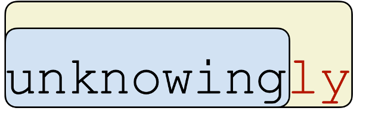

]
.pull-right[

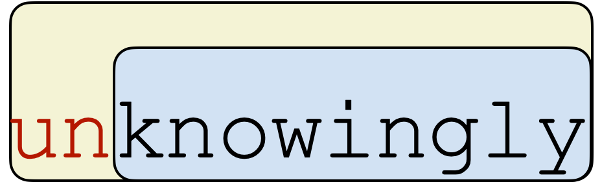

]

---
## **Morphological Structure**
 
.pull-left[

<h3> 
 
adjective + <b>-ly</b> = adverb 
</h3>

]
.pull-right[

<h3> 
<b>un-</b> + verb = verb  
<b>un-</b> + adjective = adjective 
</h3>

]
  

.pull-left[

<h3> 
<b>unknowing</b> = ?  
<b>unknowingly</b> = ?  
<b>YES</b>
</h3>

]
.pull-right[

<h3> 
<b>knowingly</b> = ?  
<b>unknowingly</b> = ?  
<b>NO, wrong transformation</b>
</h3>

]
 

.pull-left[

]
.pull-right[

]

---
## **Morphological Structure**
 
.pull-left[

<h3> 
 
adjective + <b>-ly</b> = adverb 
</h3>

]
.pull-right[

<h3> 
<b>un-</b> + verb = verb  
<b>un-</b> + adjective = adjective 
</h3>

]
  

.pull-left[

<h3> 
<b>unknowing</b> = adjective  
<b>unknowingly</b> = adverb  
<b>YES</b>
</h3>

]
.pull-right[

<h3> 
<b>knowingly</b> = adverb  
<b>unknowingly</b> = adjective  
<b>NO, wrong transformation</b>
</h3>

]
 

.pull-left[

]
.pull-right[

]

---
## **Morphological Structure**
 
### **decomposing** *unknowingly*
  

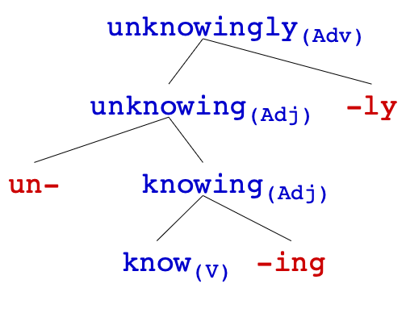

---
## **Morphological Structure**
 
.pull-left[  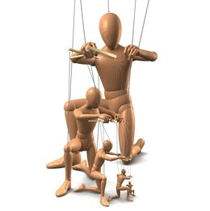]
.pull-right[
- as we said, **order of affixation** affects the **meaning** of a word  
- the fact that we can't add affixes in any order suggests that words have a **hierarchical structure**  
- we can visualize this structure with a **tree diagram** as above  
- or an alternative is **labeled bracketing**, which is more compact but perhaps less intuitive:
  
[Adj un- [Adj [V lock ] -able ] ]
  
[Adj [V un- [V lock ] ] -able ]

]
---
## **Morphological Tree Drawing**
### **de-humid-ify-er**
 
1. identify the word's morphemes and write them out separately in one row
2. identify the root (or roots) and label its **part of speech**
3. look at the morphemes immediately before and after the root 
  check **which one is added first**, draw lines upward connecting them,  
  and **label** the new words's part of speech
4. this new word becomes the base you'll keep building off of 
  **repeat step 3** using this new base  

--

--

--
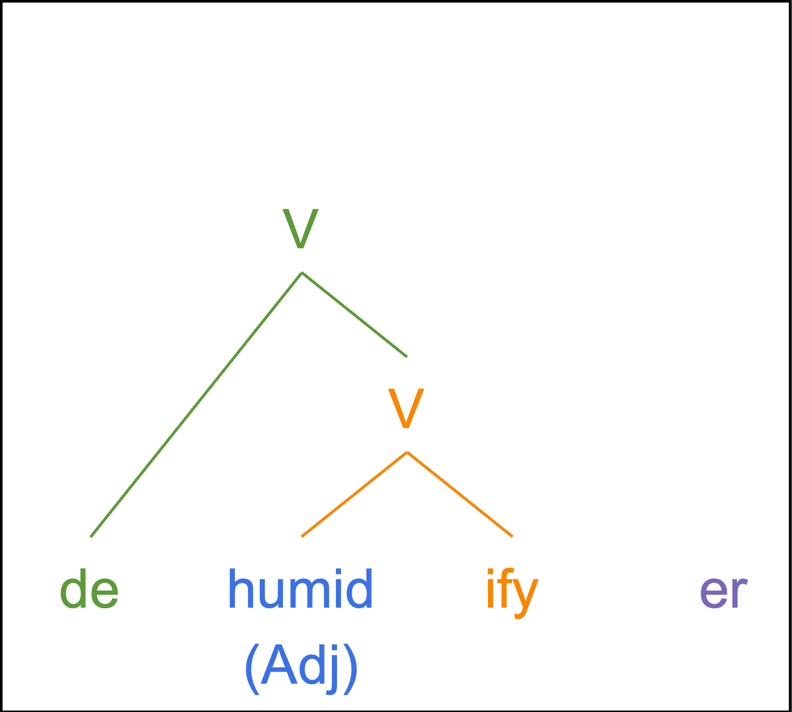

--

---
## **Exercise II: Morphological Structure**
 
.pull-left[
draw a **tree** or give **bracket labeling** for the following words:   
1. disappearance   
2. silliness   
3. unthinkable   
4. overgeneralisation   
5. internationalism
]

.pull-right[
**HINTS**  
- find the root and move outward/upward   
- mark the part of speech at **every** step   
- if adding an affix makes a **non-word**, take one step back and try another affix instead   
- if adding an affix makes it seemingly **unrelated to the overall word's meaning**, take one step back and try another affix instead
]

---
## **Morphological Structure: Ambiguity**
 
.pull-left[

<h3> 
 
verb + <b>-able</b> = adjective 
</h3>

]
.pull-right[

<h3> 
<b>un-</b> + verb = verb  
<b>un-</b> + adjective = adjective 
</h3>

]
  

.pull-left[

<h3> 
<b>unlock</b> = ?  
<b>unlockable</b> = ?  
<b>YES</b>
</h3>

]
.pull-right[

<h3> 
<b>lockable</b> = ?  
<b>unlockable</b> = ?  
<b>YES</b>
</h3>

]
 

.pull-left[

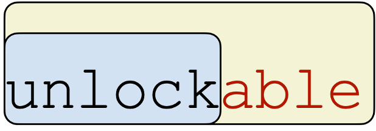

]
.pull-right[

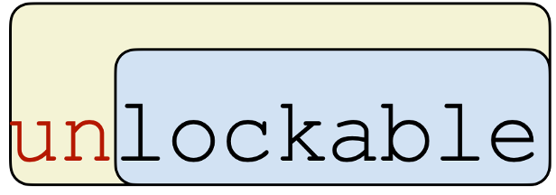

]

---
## **Morphological Structure: Ambiguity**
 
.pull-left[

<h3> 
 
verb + <b>-able</b> = adjective 
</h3>

]
.pull-right[

<h3> 
<b>un-</b> + verb = verb  
<b>un-</b> + adjective = adjective 
</h3>

]
  

.pull-left[

<h3> 
<b>unlock</b> = verb  
<b>unlockable</b> = adjective  
<b>YES</b>
</h3>

]
.pull-right[

<h3> 
<b>lockable</b> = verb  
<b>unlockable</b> = adjective  
<b>YES</b>
</h3>

]
 

.pull-left[

]
.pull-right[

]

---
## **Morphological Structure: Ambiguity**
  
tree representations can capture **different** hierarchical structures  

.pull-left[
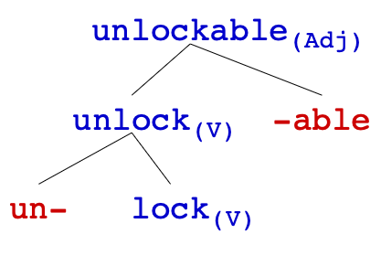
]
.pull-right[
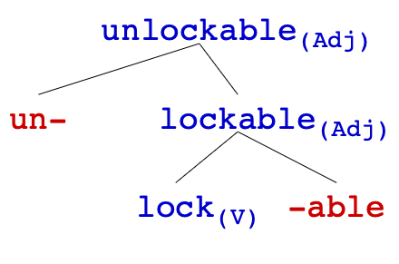
]
 

.pull-left[

]
.pull-right[

]

---
## **Morphological Structure: Ambiguity**
  
.pull-left[
   
.pull-left[
*un* + *able*  
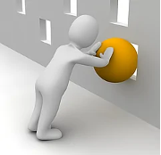
]
.pull-right[
*undo* + *able*  

]
]
.pull-right[
- the case of **unlockable** is an example of a word with an **ambiguous structure**  
- depending on the structure you assign it, it has a **different meaning**  
- both meanings are acceptable   
- which means the **meaning** of words is directly affected by their morphological structure  
- that's why **structure** is important, without knowing the structure, we would not be able to be **compositional** properly
]

---
## **Exercise III: Structural Ambiguity**
 
.pull-left[
are following words ambiguous?
- if yes, provide **labeled bracketings** and **meanings** for both readings
- if no, explain why not  

1. <b>im</b>measur<b>able</b>   
2. <b>un</b>wrapp<b>able</b>   
3. <b>un</b>bear<b>able</b> 
]
.pull-right[
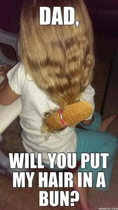
]

---
## **Note 1: Linear Order ≠ Hierarchical Order**
  
.pull-left[

<u><h3><b>re-category-ise</b></h3></u>
  
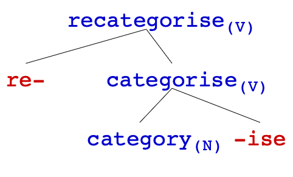

]
.pull-right[

<u><h3><b>hope-ful-ness</b></h3></u>
  
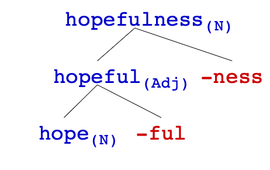

]

---
## **Note 2: Ungrammaticality**
  
### <b>sometimes neither order works: \* *enjoyful*</b>
 
- **-ful**: N → Adj
- **en-**: N → V
   

<h3><b>enjoy + ful</b> ❌</h3> 
<h3><b>en +joyful</b> ❌<h3>

---
## **Note 3: Comparing Analysis**
  
### <b>sometimes both orders seem working — but not really</b>
 
- **-able**: V → Adj: wash-able, do-able
- **re-**: V → V, but NOT V → Adj: \* re-big, \* re-sad
  

<h3><b>re-wash-able</b>

.pull-left[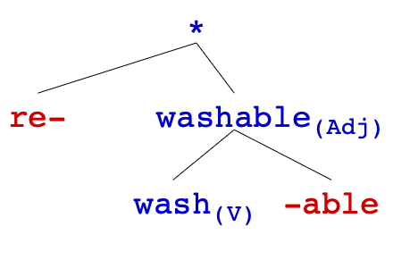]
.pull-right[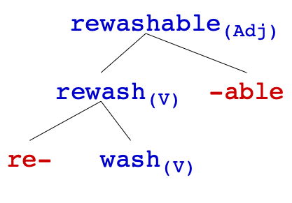]

---
class: center, middle
**Homework I** will be published this today, and it is due next Friday (**Sept 25**)  
<b> continue reading</b> Sections 4.3, 4.4 and 4.5 of Chapter 4: Morphology from <i>Language Files</i>  
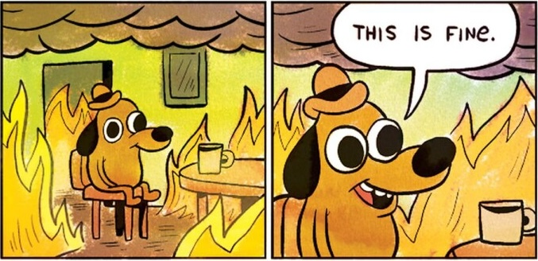
  
Slides created via the R package [**xaringan**](https://github.com/yihui/xaringan).
