class: center, middle
## Please pick up your **name card** from the front

---
## **Selectional Restrictions and Order**
 
.pull-left[
the **selectional restrictions** of affixes often help us **determine** the order in which
they were attached  
- consider the following polymorphemic word  
  - <i>**re**-<b>play-able</b></i>  
- which affix was attached **first** to the root *<b>play</b>*?
]
.pull-right[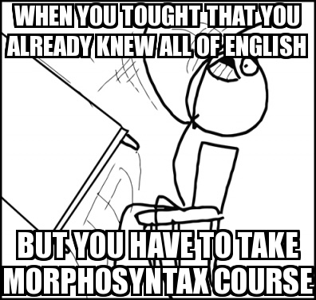]    

--

- ***re-*** has to be attached first, since it cannot attach to adjectives   
  - *<b>play</b>* → <i>**re**-<b>play</b></i> → <i>**re**-<b>play-able</b></i>

---
## **Morphological Tree Drawing**
### **De-humid-ify-er**
 
1. identify the word's morphemes and write them out separately in one row
2. identify the root (or roots) and label its **part of speech**
3. look at the morphemes immediately before and after the root 
  check **which one is added first**, draw lines upward connecting them,  
  and **label** the new words's part of speech
4. this new word becomes the base you'll keep building off of 
  **repeat step 3** using this new base  

--
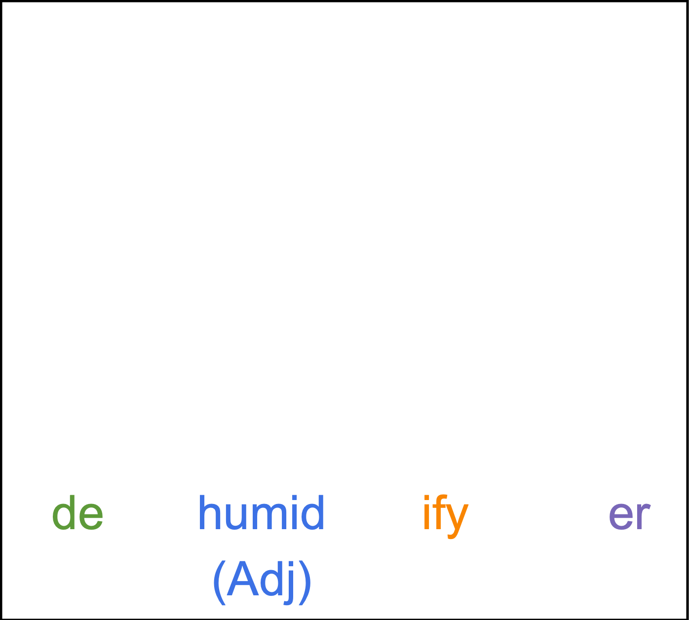

--
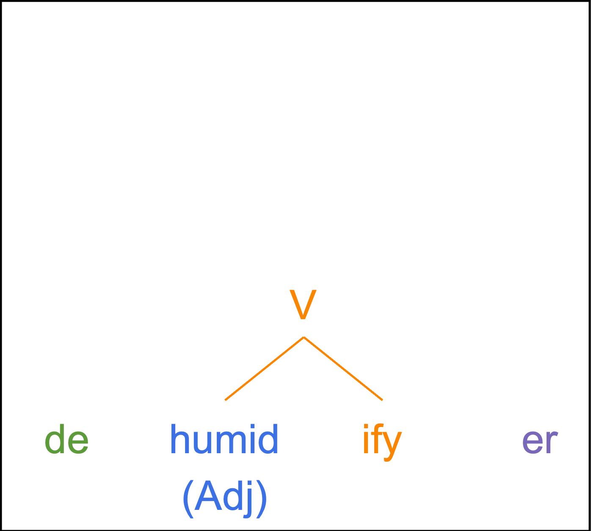

--

--
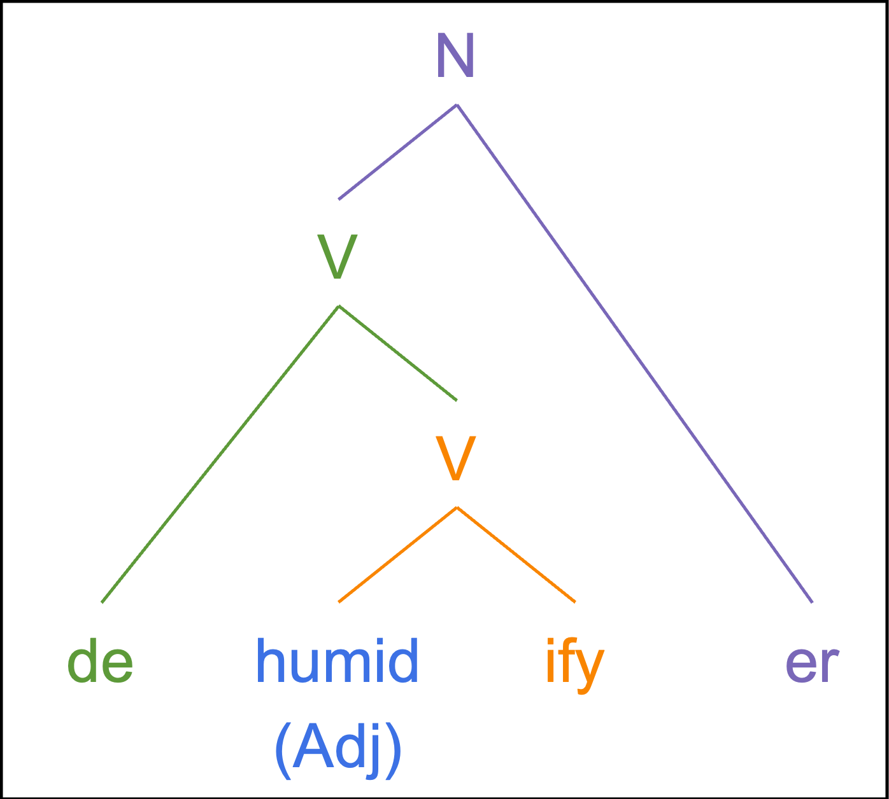

---
## **Morphological Structure: Ambiguity**
  
.pull-left[
   
.pull-left[
*un* + *able*  

]
.pull-right[
*undo* + *able*  

]
]
.pull-right[
- the case of **unlockable** is an example of a word with an **ambiguous structure**  
- depending on the structure you assign it, it has a **different meaning**  
- both meanings are acceptable   
- which means the **meaning** of words is directly affected by their morphological structure  
- that's why **structure** is important, without knowing the structure, we would not be able to be **compositional** properly
]

---
class:middle, center

Morphological Processes

---
## **Morphological Process I: Affixation**
 
.pull-left[
- **affixation**: adding an affix (a prefix, suffix, infix, or circumfix)  
  - depending on the type of affix, also called <b>prefixation</b>, <b>suffixation</b>, **infixation**, <b>circumfixation</b>  
  - <b>prefixation</b> 
  *<b>re-</b> + visit → revisit* 
  - <b>suffixation</b> 
  *modern + <b>-ize</b>* → *modernize* 
  - **infixation** 
  (Tagalog) *bili* 'buy' → *b**-um-**ili* 'to buy' 
  - <b>circumfixation</b> 
  (Indonesian) *ajar* 'teach' → *<b>pel</b>-ajar-<b>an</b>* 'subject'
]
.pull-right[
  
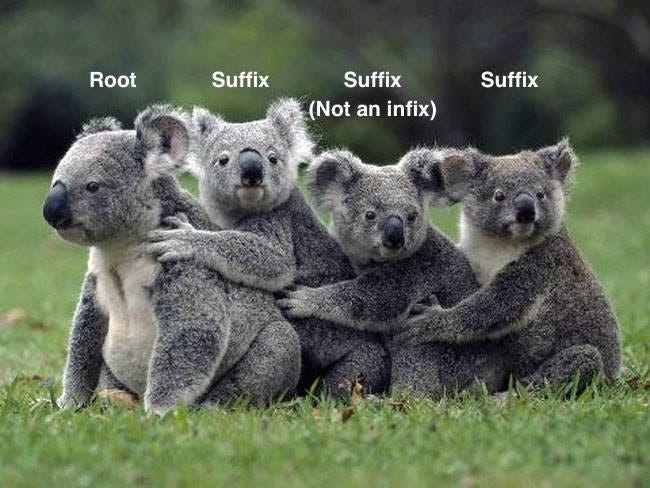]

---
## **Morphological Process II: Compounding**
 
.pull-left[
- **compounding**: combining **two or more roots** into a single word  
  - *tree + house → treehouse*
  - *blue + bird → bluebird*
  - *snow + white → Snowwhite*  
- compound words usually contains more specific meaning than two separate words  
- compound words often sound different from the words used separately – <u>one of the roots will be pronounced with **less stress**</u> than if it had been a separate word:  
  - *Abraham Lincoln was born in a log cabin – a <b>tree house</b>*.
  - *The child played in a <b>treehouse</b>*.
]
.pull-right[

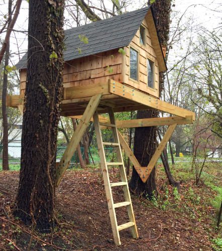  

]

---
## **Morphological Process II: Compounding**
 
.pull-left[
- **compounding**: combining **two or more roots** into a single word  
- different languages have different rules for compounding  
- **Germanic languages** are well-known for <u>permitting lots of compounding</u>  

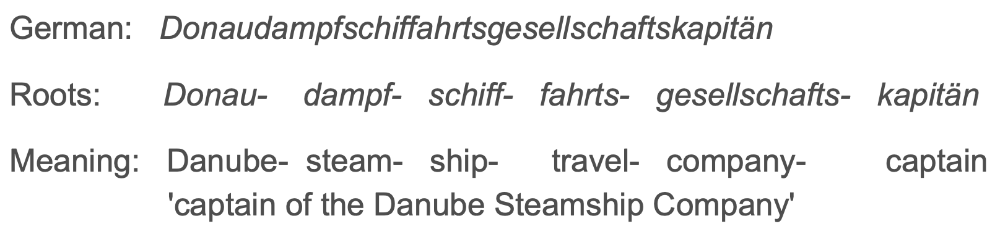

 
- **English** is also a Germanic language and allows this kind of compounding  
- the meaning of compounds is usually **non-compositional**
]
.pull-right[
  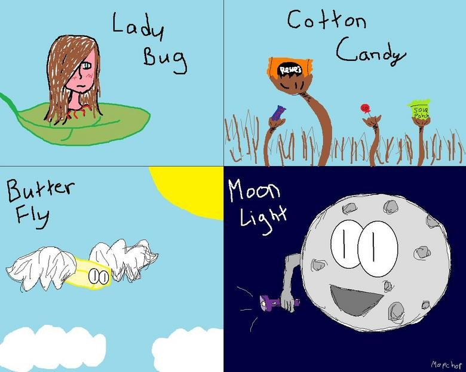
]

---
## **broken vs. broken-broken**
 
.pull-left[
listen to this anecdote about a train breaking down
  
1. what does the speaker mean when he says the train was **broken vs. broken-broken**?  
2. what's the **difference**?   
[video](https://www.youtube.com/watch?v=Xi-xmOhd2vo&t=250)
]
.pull-right[
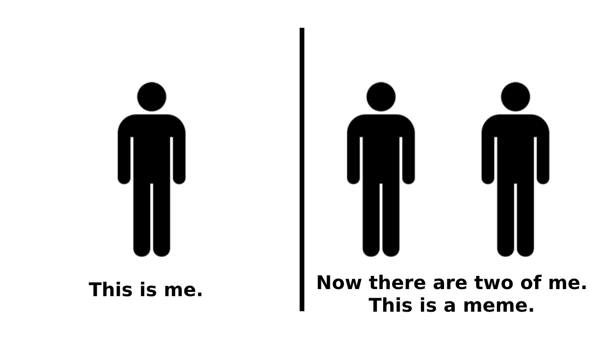
]
   

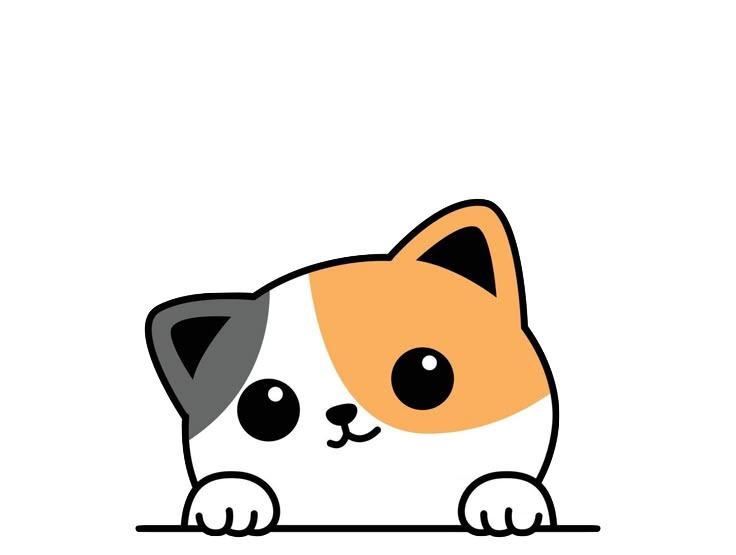

---
## **Morphological Process III: Reduplication**
 
.pull-left[
- **reduplication**: repeating all or part of a morpheme  
- <b>English</b> examples:  
  - *Do you just like him as a friend, or do you <b>like-like</b> him*?  
  - *Yesterday, we just went out for coffee, but this weekend we're going on a <b>date-date</b>*.  
  - *Whenever we go to a <b>fancy-shmancy</b> restaurant, we feel like James Bond*.  
  - *He's just a baby! <b>Baby-shmaby</b>, he's five years old*!
]
.pull-right[
  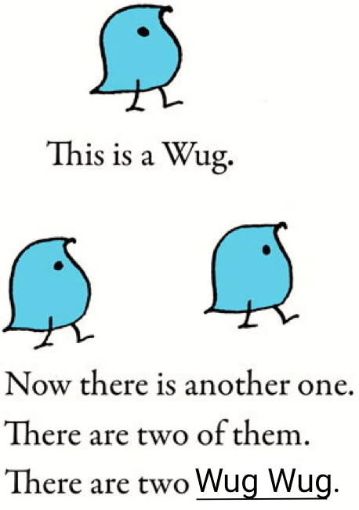
]

---
## **Morphological Process III: Reduplication**
 
.pull-left[
 
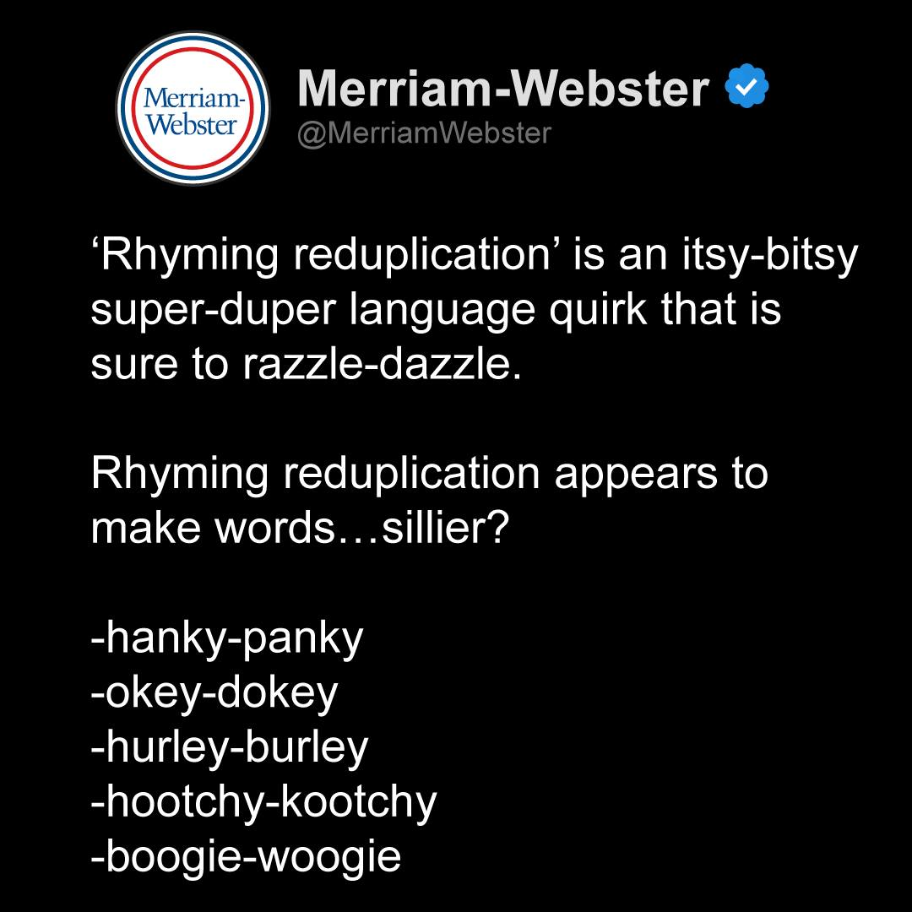
]
.pull-right[
- **reduplication** is more productive in some other languages, serves an explicit **grammatical** purpose:  

**full reduplication**: repeat **ALL** of a morpheme
- <b>Indonesian</b> plural
  - *orang* 'person' $\rightarrow$ *orang*-*orang* 'people'
- <b>Chinese</b> intensified adjective:
  - <em>kʰai55ʂin55</em> 'happy' $\rightarrow$ <em>kʰai55kʰai55 ʂin55ʂin55</em> 'very happy'
  

**partial reduplication**: repeat **PART** of a morpheme
- <b>Tagalog</b> future
  - *bili* 'buy' $\rightarrow$ *<b>bi</b>-bili* 'will buy'
- <b>Kazakh</b> intensified adjective:
  - *tætti* 'sweet' $\rightarrow$ *<b>tæp</b>-tætti* 'very sweet'
]

---
## **Morphological Process IV: Alternation**
 
.pull-left[
- **alternation**: changing one or more sounds within the morpheme  
- usually <u>most of the sounds stay the same</u>, but one or a few are changed
- alternation can result in *irregular* nouns, verbs, etc. 
- what is the difference in **sound** in these words and what is the difference in **meaning**? (inflection or derivation?)  
  - <i>goose</i>, <i>g**ee**se</i>
  - <i>r**i**ng</i>, <i>r**a**ng</i>, <i>r**u**ng</i>
  - <i>Does the baby have tee**th** yet? No, she hasn't yet started to tee**the**</i>.
  - this tool has no u**se**. What are you talking about – I u**se** it every day</i>.
]
.pull-right[  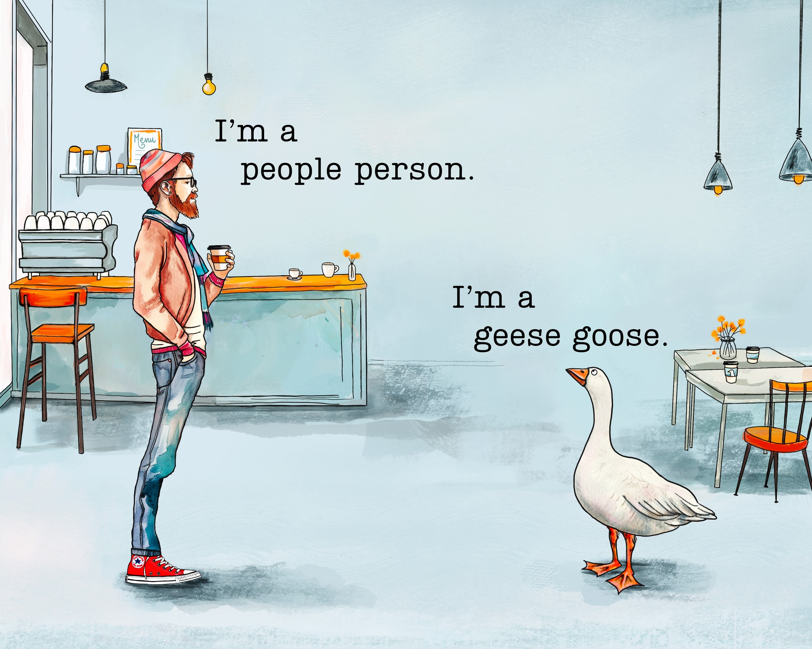]

---
## **Morphological Process V: Suppletion**
 
.pull-left[ 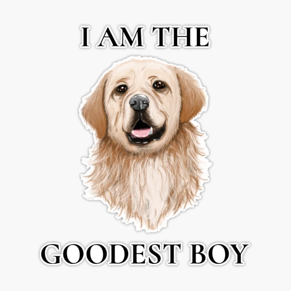]
.pull-right[
- **suppletion**: when an inflected form is **phonetically very different** from other forms of the same word (the result is even more highly irregular)  
- **English** examples:  

PAST TENSE

  - **regular**: *walk → walked*, *jump → jumped* 
  - <b>suppletive</b>: *is → was*, *go → went*  

COMPARATIVE / SUPERLATIVE

  - **regular**: *nice → nicer → nicest* 
  <b>regular</b>: *big → bigger → biggest* 
  - <b>suppletive</b>: *good → better → best* 
  <b>suppletive</b>: *bad → worse → worst*
]

---
class:middle, center
## **Multiple Processes**
   
### some words exhibit **multiple morphological processes**
  
### *break* → *broke* (alternation) 
### *break* → *brok(e)-en* (alternation + suffixing)

---
## **Morphological Process VI: Zero Derivation**
 
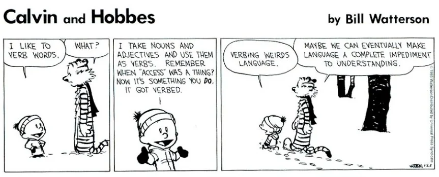
  
how is Calvin (the child) using language in a creative or unusual way? 
is Hobbes (the tiger) correct that Calvin's phrasing is a "complete impediment to understanding"?

---
## **Morphological Process VI: Zero Derivation**
 
.pull-left[
  
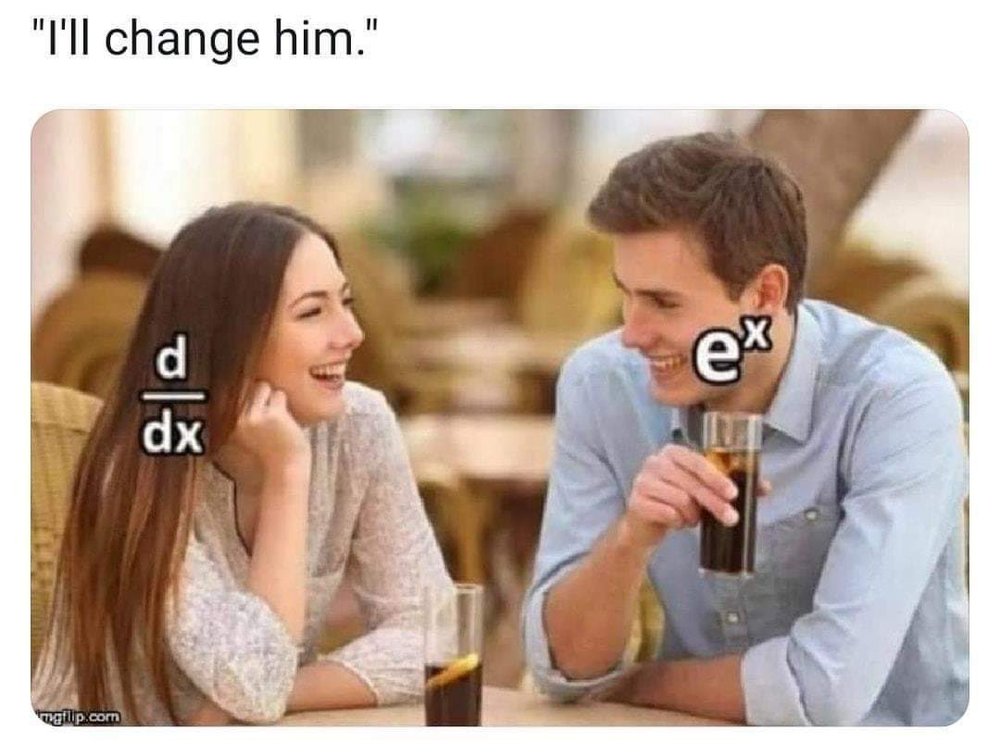
]
.pull-right[
- we know that **derivational** morphemes can change a word's part of speech:
  - *magnet* (N) → *magnet-ize* (V)
  - *atom* (N) → *atom-ic* (Adj)  
- English can sometimes change a word's **part of speech** without adding anything
  - *I'm going to <b>jump</b> (V) over that railing*.
  - *That was a nice <b>jump</b> (N)*!  
  - *Please send me an <b>email</b> (N) about that*.
  - *OK, I <b>emailed</b> (V) you*!  
- **zero-derivation**: deriving a new word with a **different part of speech** by adding nothing   
- not all languages can do this! how about yours?
]

---
## **Exercise: Morphological Processes**
 
identify the **morphological processes** involved in each of the following words.
  
<b>affixation</b> (prefixation, suffixation), <b>compounding</b>, <b>reduplication</b>, <b>alternation</b>, <b>suppletion</b>
  
.pull-left[
- feed → fed   
- leaf → leaves   
- peace → peaceful   
- foot, ball → football   
- good → best   
]
.pull-right[
- chair, woman → chairwomen   
- back, pack → backpacks   
- date → date-dated   
- go → underwent   
- ox → oxen
] 

---
class:middle, center

Morphological Types of Languages

---
## **Morphological Types of Languages**
 
languages can be classified according to the way they **use** or **don’t use** <u>morphological processes</u>  

--

.pull-left[
**analytic/isolating language**  
- made up of sequences of **free morphemes**
- NO <b>affixes</b> are used to compose words
- <b>Mandarin Chinese</b>
  - the past tense is expressed with a functional free morpheme (tones omitted):

 

<table style="width:100%; border-collapse:collapse;">
  <tr>
    <td style="text-align:left;">(a)</td>
    <td style="text-align:left;">[wɔ214</td>
    <td style="text-align:left;">mə35n</td>
    <td style="text-align:left;">tæ35n</td>
    <td style="text-align:left;">tɕi35n]</td>
    <td style="text-align:left; color:white">lə</td>
  </tr>
  <tr>
    <td style="text-align:left;color:white">(a)</td>
    <td style="text-align:left;"><i>I</i></td>
    <td style="text-align:left;"><i>plural</i></td>
    <td style="text-align:left;"><i>play</i></td>
    <td style="text-align:left;"><i>piano</i></td>
    <td style="text-align:left; color:white">lə</td>
    <td></td>
  </tr>
  <tr>
    <td style="text-align:left;color:white">(a)</td>
    <td colspan="5" style="text-align:left; padding-bottom:20px;">
    'We are playing the piano.'
    </td>
  </tr>
  <tr>
    <td style="text-align:left;">(b)</td>
    <td style="text-align:left;">[wɔ214</td>
    <td style="text-align:left;">mə35n</td>
    <td style="text-align:left;">tæ35n</td>
    <td style="text-align:left;">tɕi35n]</td>
    <td style="text-align:left;">lə</td>
  </tr>
  <tr>
    <td style="text-align:left;color:white">(b)</td>
    <td style="text-align:left;"><i>I</i></td>
    <td style="text-align:left;"><i>plural</i></td>
    <td style="text-align:left;"><i>play</i></td>
    <td style="text-align:left;"><i>piano</i></td>
    <td style="text-align:left;">lə</td>
    <td></td>
  </tr>
  <tr>
    <td style="text-align:left;color:white">(b)</td>
    <td colspan="5" style="text-align:left;">
    'We played/have played the piano.'
    </td>
  </tr>
</table>

]
.pull-right[
 
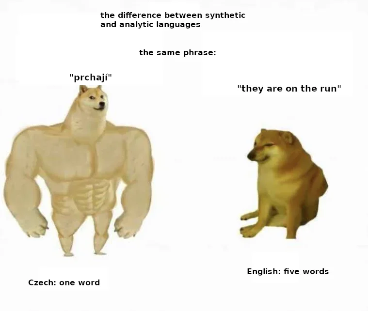
]

---
## **Morphological Types of Languages**
 
languages can be classified according to the way they **use** or **don’t use** <u>morphological processes</u>  

--
**synthetic language**  
- **bound morphemes** can be attached to other morphemes
- so a word can be made of <b>several types</b> of meaningful elements 
- yet there are different ways to put together morphemes, resulting in different types of synthetic languages:
___

--

.pull-left[
A. **agglutinating**: the morphemes are joined together loosely, it is easy to determine the boundaries between morphemes
  - one morpheme has **only one** meaning 
  - <b>Japanese</b>, Turkish, etc.
  
<table style="width:100%; border-collapse:collapse;">
  <tr>
    <td style="text-align:left;">piano</td>
    <td style="text-align:left;">o</td>
    <td style="text-align:left;">hiki</td>
    <td style="text-align:left;">-ma</td>
    <td style="text-align:left;">-shi</td>
    <td style="text-align:left;">-ta</td>
  </tr>
  <tr>
    <td style="text-align:left;">piano</td>
    <td style="text-align:left;">ACC</td>
    <td style="text-align:left;">play</td>
    <td style="text-align:left;">POL</td>
    <td style="text-align:left;">POL</td>
    <td style="text-align:left;">PST</td>
    <td></td>
  </tr>
  <tr>
    <td colspan="6" style="text-align:left; padding-bottom:20px;">
    'We played the piano.'
    </td>
  </tr>
</table>
]

--

.pull-right[
B. **fusional**: morphemes are “fused” with
the stem and can be hard to tell where the boundary is
  - a single affix can convey **several** meanings simultaneously and there can be **alternations** to
the forms of both the stems and affixes
  - <b>Greek</b>, Spanish, etc.
  
<table style="width:100%; border-collapse:collapse;">
  <tr>
    <td style="text-align:left;">pez</td>
    <td style="text-align:left;">-a</td>
    <td style="text-align:left;">-me</td>
    <td style="text-align:left;">to</td>
    <td style="text-align:left;">piano</td>
  </tr>
  <tr>
    <td style="text-align:left;">play</td>
    <td style="text-align:left;">TH</td>
    <td style="text-align:left;">1PL.PST</td>
    <td style="text-align:left;">the</td>
    <td style="text-align:left;">piano</td>
    <td></td>
  </tr>
  <tr>
    <td colspan="5" style="text-align:left; padding-bottom:20px;">
    'We were playing the piano.'
    </td>
  </tr>
</table>
]

---
class: center, middle
## **DISCUSSION**
  
### Is English **analytic** or **synthetic**, and it if it is synthetic, is it <b>agglutinating</b> or <b>fusional</b>?

---
class: center, middle
**Homework I** is due this Friday (**Sept 25**)  
**Homework II** will be published before this Wednesday (**Sept 23**), and it is due next Friday (**Oct 02**)  
<b>reading</b> Chapter 2: Part of Speech from <i>Andrew Carnie's Syntax textbook</i>  

  
Slides created via the R package [**xaringan**](https://github.com/yihui/xaringan).
