class: center, middle
## Please pick up your **name card** from the front

---
## **Extra Credit**
 
- up to **2%** of extra credit can be earned by participating in **research studies** conducted by members of the Linguistics Department  

- these studies usually consist of experiments that take 25–45 minutes  

- experiments are offered through the Linguistics department experiment management system (SONA)  

**SONA MUST KNOWS**
- your SONA account will be created for you **automatically** and you **should not** have to create or request your own account
- your login information will be sent to the email address listed on the roster from the registrar
- you are responsible for ensuring the accuracy of your course assignments in SONA
- you are able to fix your own course assignments in the [SONA system](http://rutgerslinguistics.sona-systems.com/)
- you are responsible for making sure your credit assignments are allocated to the right courses
- you can check out the SONA **tutorial** at this link, under “Labs”, click on “Experiment System Tutorial”
  - [https://ling.rutgers.edu/research-mainmenu/research-labs-mainmenu-145](https://ling.rutgers.edu/research-mainmenu/research-labs-mainmenu-145)

---
class:middle, center

Introduction to Syntax

---
class: center, middle

### What is the **basic** unit in Morphology?   

--
### <b>MORPHEME</b>  

--
### What happens if **larger** units were built?  

--
### <b>SYNTAX</b>  

--
**Morphology** cares about word <u><b>structure</b></u>  
**Syntax** cares about sentence <u><b>structure</b></u>

---
## **Moving onto More Ambiguous Cases**
   
### **un**-lockable vs. unlock-**able**
   
### <b>green tea cup</b>

---
## **Moving onto More Ambiguous Cases**
 
.pull-left[

<h3><b>green tea</b> <b>cup</b></h3>
 
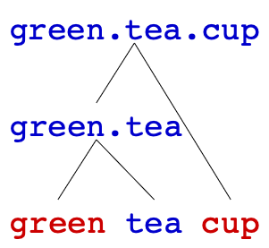
  

]
.pull-right[

<h3><b>green</b> <b>tea cup</b></h3>
 
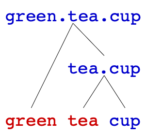
  
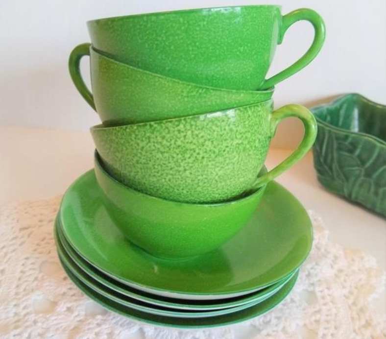

]

---
## **Exercise I: Structural Ambiguity**
 
.pull-left[

<h3><b>German history</b> <b>professor</b></h3>

]
.pull-right[

<h3><b>German</b> <b>history professor</b></h3>

]

--

  
.pull-left[

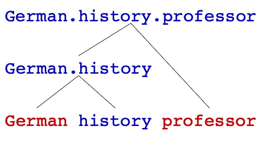

]
.pull-right[

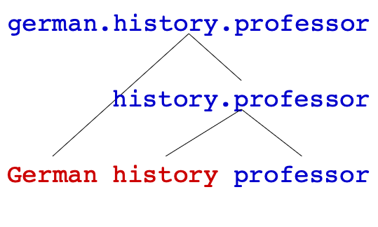

]

---
## **Exercise I: Structural Ambiguity**
 
.pull-left[

<h3><b>robot repair</b> <b>technician</b></h3>

]
.pull-right[

<h3><b>robot</b> <b>repair technician</b></h3>

]

--

  
.pull-left[

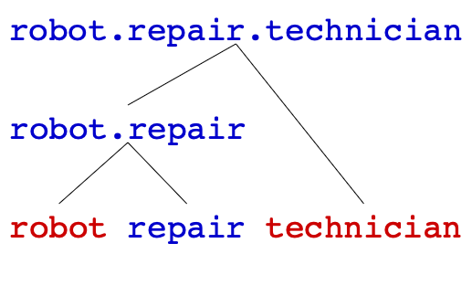

]
.pull-right[

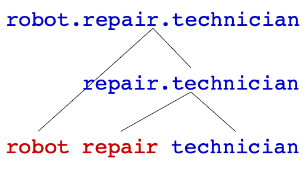

]

---
## **Lexical Ambiguity**
 
.pull-left[
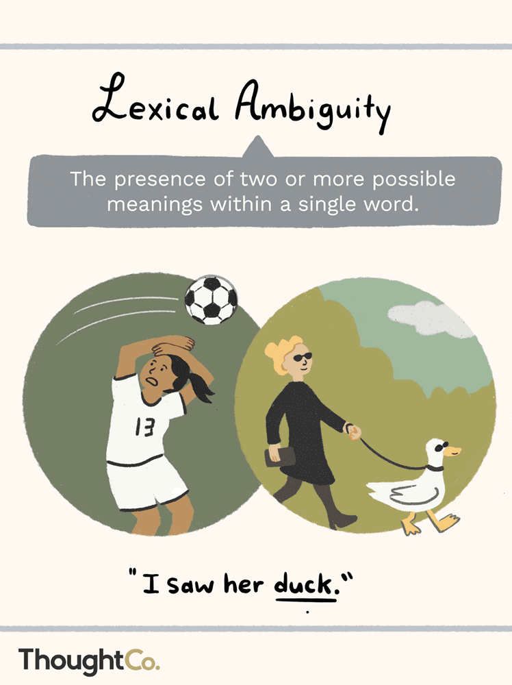
]
.pull-right[
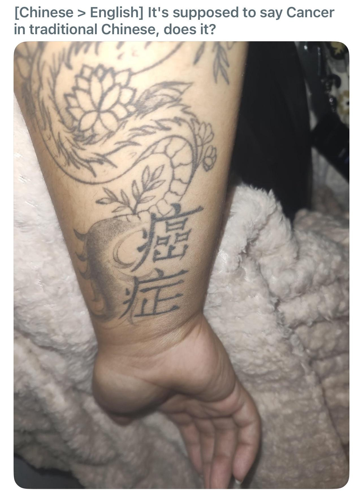
]

---
## **Structural Ambiguity**
 
words (or phrases and sentences) are structured **hierarchically**, not linearly  
- within a word, the same **morpheme order** can sometimes have **different** word meanings
  - <i>**un**-lockable</i> vs. <i>unlock-**able**</i>  
- within a phrase or a sentence, the same **word order** can sometimes have different meanings depending on the different structures

.pull-left[

<i>[green [tea cup]]</i>  

]
.pull-right[

<i>[[green tea] cup]</i>  

]

---
## **Structural Ambiguity for Sentences**
 
sentences sometimes can be **ambiguous** depending on different hierarchical structures even when each word in the sentence has exactly **the same meaning** and they are put in **the same order**
  

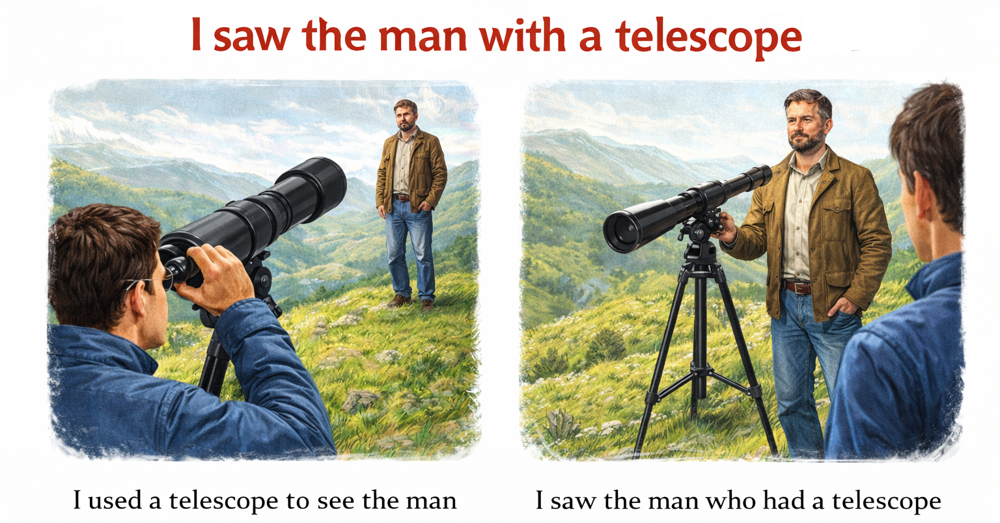

---
## **Structural Ambiguity for Sentences**
 
sentences sometimes can be **ambiguous** depending on different hierarchical structures even when each word in the sentence has exactly **the same meaning** and they are put in **the same order**
   

--

<h3>(1) <i>Arthur read the book on the desk.</i></h3>

 

--

.pull-left[

<i>Arthur read the book on the desk</i>

]
.pull-right[

<i>Arthur read the book on the desk</i>

]

  

--

<h3>(2) <i>They helped the student with homework.</i></h3>

 

--

.pull-left[

<i>They helped the student with homework</i>

]
.pull-right[

<i>They helped the student with homework</i>

]

---
## **Structural Ambiguity for Sentences**
 

<h3> <i>Arthur read the book on the desk.</i></h3>

 

.pull-left[

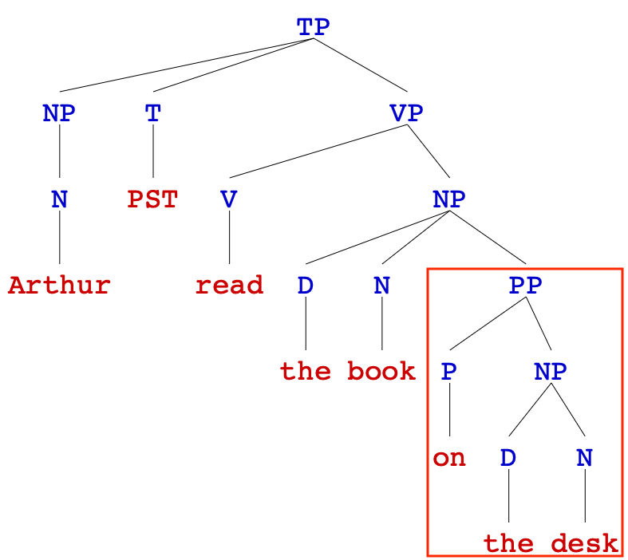

]
.pull-right[

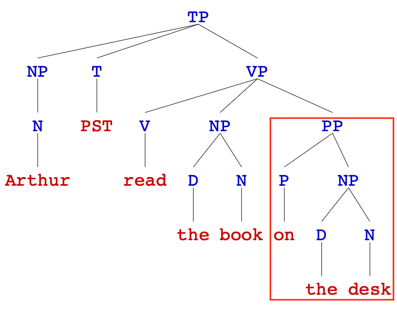

]
  
do not worry about the **trees** for now, just check what ***on the desk*** is attaching to
  
**Syntax** is the aspect of our competence that deals with **phrase and sentence structure**.

---
## **Word Order: Variation**
 
<h3><b>English</b>: <b>SVO</b></h3> 
.pull-left[
<table style="width:100%; border-collapse:collapse; text-align:center;">
  <tr>
    <td><b>Mary</b></td>
    <td><b>loves</b></td>
    <td><b>the cat</b></td>
  </tr>
  <tr>
    <td><b>S</b></td>
    <td><b>V</b></td>
    <td><b>O</b></td>
  </tr>
</table>
]

.pull-right[
`*` *loves Mary the cat.*
]
 

--

<h3><b>Irish</b>: <b>VSO</b></h3> 
.pull-left[
<table style="width:100%; border-collapse:collapse; text-align:center;">
  <tr>
    <td><b>bhuail</b></td>
    <td><b>sé</b></td>
    <td><b>mé</b></td>
  </tr>
  <tr>
    <td>hit</td>
    <td>he</td>
    <td>me</td>
  </tr>
  <tr>
    <td><b>V</b></td>
    <td><b>S</b></td>
    <td><b>O</b></td>
  </tr>
</table>
]
.pull-right['He hit me.'] 

--

<h3><b>Hindi</b>: <b>SOV</b></h3>
 
.pull-left[
<table style="width:100%; border-collapse:collapse; text-align:center;">
  <tr>
    <td><b>mujhe  </b></td>
    <td><b>ek seb</b></td>
    <td><b>chaahiye</b></td>
  </tr>
  <tr>
    <td>I</td>
    <td>an apple</td>
    <td>want</td>
  </tr>
  <tr>
    <td><b>S</b></td>
    <td><b>O</b></td>
    <td><b>V</b></td>
  </tr>
</table>
]
.pull-right['I want an apple.']

---
## **Structure**
 
.pull-left[
  
- **word order** is one relevant aspect of how sentences are put together  
- but that’s **NOT** enough:  
  - <i>Arthur read the book on the table.</i>
  - <i>Arthur read the book on the table.</i>  
- the same string of words has two different meanings  
- **hierarchical structure** is also relevant for putting words together
]
.pull-right[

]

---
class:middle, center

Part of Speech

---
class:middle, center
## **From the Ground Up**
    
### <b>large phrases and sentences</b>
### ⬆️
### <b>phrases</b>
### ⬆️
### <b>words</b>
### ⬆️
### <b>morphemes</b>

---
## **From the Ground Up**
 
<h3><b>large phrases and sentences</b></h3>
.pull-left[

<h3>⬆️  
<b>phrases</b>  
⬆️  
<b>words</b>  
⬆️  
<b>morphemes</b></h3>

]
.pull-right[
- like morphology, we’ll build our theory of syntax **ground-up**  
- instead of starting with morphemes, we will start with **words**  
- <u><b>first task</b></u>: figure out what **part of speech** (a.k.a syntactic category, word class) a word has  
- once we have got that down, we’ll see how they **combine** to form phrases  
- notice the parallels with Morphology, we start from each **morpheme**, then we **combine**
]

---
## **Parts of Speech**
 
- parts of speech (aka lexical classes) are categories we use to **classify words**:  
  - nouns, verbs, adjectives, adverbs...  
- they're important for **Morphology**:  
  - <b>derivation</b> can change a word's part of speech 
  *courage* (**N**) → *en-courage* (**V**) → *en-courage-ment* (**N**)  
  - <b>inflection</b> is specific to a part of speech: nouns, verbs, and adjectives all inflect differently 
  *walk* → *walk-ed* (-ed for **V** only)   
- they'll also be important for **Syntax**:  
  - sentences are made of words, and a word's part of speech determines its **role** in the sentence:
  - for instance, the subject of a sentence is always a noun 
  for instance, every sentence needs a main verb...

---
## **Parts of Speech**
  
- for following words, it is easy to define what they are in terms of **part of speech**
  
.pull-left[
**noun** 
<b>verb</b> 
<b>adjective</b>
]
.pull-right[
denotes a person, place, thing 
denotes actions 
adds a description to a noun
]
  

--

- so we can provide definitions of these categories, because we know the **meaning** of the word
  - table is a noun because we know it names a thing  
- can we figure out a word's part of speech without knowing what it means – just by seeing how it's used in a sentence?
  - the answer is **YES**
  - but the part of speech of a word, is determined by its **distribution**, NOT by its meaning  
- **syntactic distribution**: different categories of words appears in different positions in a sentence
- **morphological distribution**: different categories of words takes different affixes

---
.pull-left[
## **Jabberwocky**
 
- the words are nonsense, but the **syntax** is recognizably English 
- **meaning** does not tell us anything now, we have to rely on how they're being used  
- **step 1**: on the form, take your best guess at the part of speech of each **coloured** word (noun, verb, adj)  
- **step 2**: compare your answers with that of a neighbor
  - did you get the same answers?
  - what made you choose the answer you did?
]
.pull-right[
  

Twas brillig, and the <b>slithy</b> <b>toves</b>   
Did <b>gyre</b> and gimble in the <b>wabe</b>;   
All mimsy were the <b>borogroves</b>,   
And the mome <b>raths</b> <b>outgrabe</b>   

&nbsp;&nbsp;&nbsp;&nbsp;&nbsp;&nbsp;&nbsp;&nbsp;&nbsp;&nbsp;&nbsp;&nbsp;&nbsp;&nbsp;&nbsp;&nbsp;&nbsp;&nbsp;&nbsp;&nbsp;&nbsp;&nbsp;&nbsp;&nbsp;Lewis Carroll, <i>Jabberwocky</i> (1871)
  
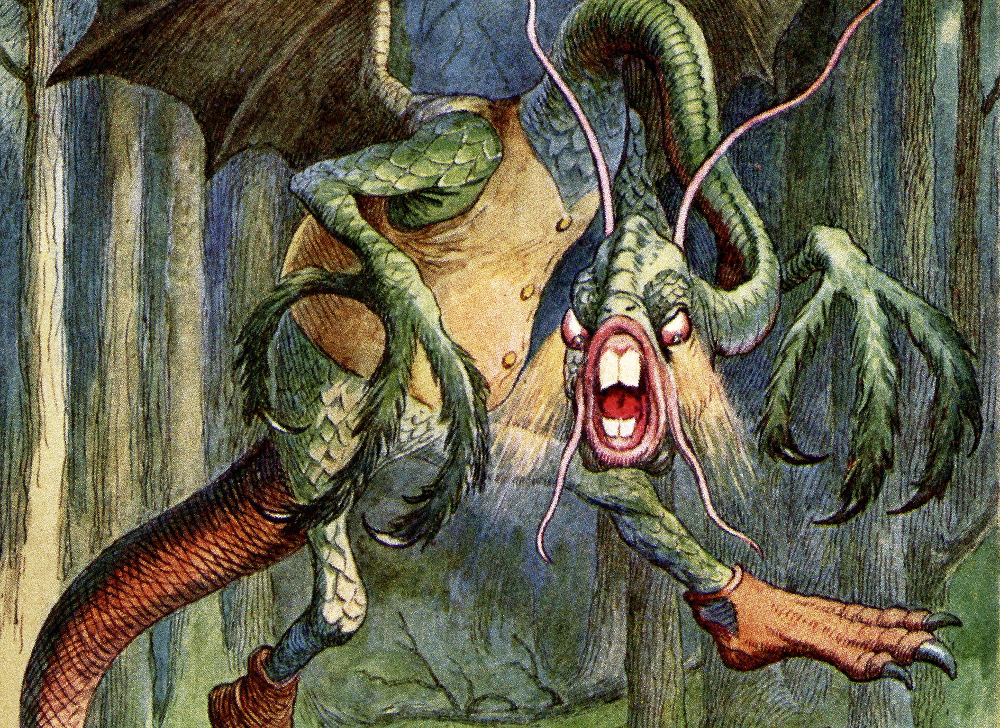

]

---
.pull-left[
## **Morphological Distribution**
 
for **morphological distribution**, we check:  
  - what morphemes does it have? 
  - are they associated with a specific part of speech?  

- consider the word <b>borogroves</b>:  
  - it seems to end in the plural suffix **-s**
  - what other words use plural -s?  

- we conclude <b>borogroves</b> is a noun (**N**)
  - because it fits the **morphological distribution** of nouns
  - it uses morphemes associated with nouns
]
.pull-right[
  

Twas brillig, and the <b>slithy</b> <b>toves</b>   
Did <b>gyre</b> and gimble in the <b>wabe</b>;   
All mimsy were the <b>borogroves</b>,   
And the mome <b>raths</b> <b>outgrabe</b>   

&nbsp;&nbsp;&nbsp;&nbsp;&nbsp;&nbsp;&nbsp;&nbsp;&nbsp;&nbsp;&nbsp;&nbsp;&nbsp;&nbsp;&nbsp;&nbsp;&nbsp;&nbsp;&nbsp;&nbsp;&nbsp;&nbsp;&nbsp;&nbsp;Lewis Carroll, <i>Jabberwocky</i> (1871)
  

]

---
.pull-left[
## **Syntactic Distribution**
 
for **syntactic distribution**, we check:  
  - where does the word appear in the sentence?
  - what other words appear around it?  
  
- consider the word <b>borogroves</b> once more:  
  - it comes after ***the*** → *the borogoves*
  - what other words can follow ***the***?  
  
- we still conclude that <b>borogroves</b> is a noun (**N**)  
  - because it fits the **syntactic distribution** of nouns
  - it goes where nouns go in the sentence
]
.pull-right[
  

Twas brillig, and the <b>slithy</b> <b>toves</b>   
Did <b>gyre</b> and gimble in the <b>wabe</b>;   
All mimsy were the <b>borogroves</b>,   
And the mome <b>raths</b> <b>outgrabe</b>   

&nbsp;&nbsp;&nbsp;&nbsp;&nbsp;&nbsp;&nbsp;&nbsp;&nbsp;&nbsp;&nbsp;&nbsp;&nbsp;&nbsp;&nbsp;&nbsp;&nbsp;&nbsp;&nbsp;&nbsp;&nbsp;&nbsp;&nbsp;&nbsp;Lewis Carroll, <i>Jabberwocky</i> (1871)
  

]

---
## **Part of Speech**
 
.pull-left[
**parts of speech** aren't just random categories you have to memorize in English class  
- words of a particular part of speech tend to behave in **similar** ways:  
  - they have a similar **morphological distribution** (similar morphemes)
  - and a similar **syntactic distribution** (similar role in sentences)
]
.pull-right[

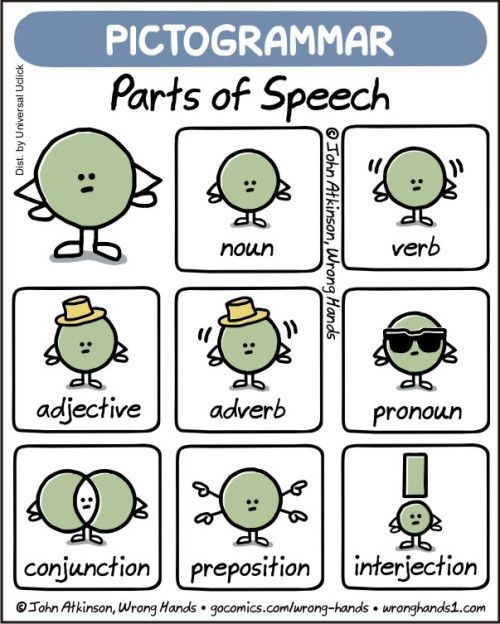

]
 
___

- that is, they follow a <b>pattern</b>
  - a <b>pattern</b> that forms part of our **mental grammar**
  - we pick up these <b>patterns</b> when acquiring our native language
  - a small child might not know what a <b>noun</b> is, but they might know 
  *take ball*, *take toy*... but not `*` *take eat*
  - we make use of such categories like <b>noun</b> and <b>verb</b> before we actually know what they are
  
---
## **Parts of Speech: Replacement Test**
 
since these categories are part of our **mental grammar**, they give us intuitions about how a word **can** or **cannot** be used in a sentence  
- we can use these intuitions in a **replacement test** to figure out a word's part of speech:  
- let's say for the following sentence, we do not know the part of speech of **delicious**:  
  - <i>John ate a **delicious** sandwich</i>.  
- but we know the part of speech of **eat** (V) and **good** (Adj)
- we replace **delicious** with either *eat* or *good*  
   - `*` <i>John ate a(n) **eat** sandwich</i>.
   - <i>John ate a **good** sandwich</i>.  
- if the sentence after replacing is still **well-formed**, *delicious* probably has the same part of speech with the replaced word

---
## **Parts of Speech: Replacement Test**
 
.pull-left[
note here it might NOT **always** work!  
let's say we know the part of speech of the word **friendly** (Adj) and **good** (Adj)  
  - (a) ? <i>John ate a **friendly** sandwich</i>.
  - (b) `*` <i>John ate a(n) **eat** sandwich</i>.
  - (c) <i>John ate a **good** sandwich</i>.  

comparing the first two sentences, we know that  
  - **(a)** is syntactically well-formed, but not meaningwise proper (**semantic anomaly**)
  - but **(b)** is syntactically ill-formed (**syntactic ungrammaticality**)  
  
a famous example on the **right**
]
.pull-right[
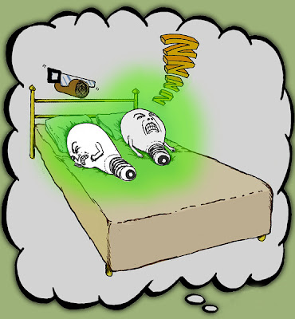
  
<i>Colorless green ideas sleep furiously.</i>
]

---
class: middle, center
## we will introduce following parts of speech and their **morphological** and **syntactic distributions**
  
**noun** (N): *dog*, *cat*, *teacher* 
**verb** (V): *eat*, *do*, *think* 
**adjective** (Adj): *easy*, *happy*, *wonderful* 
**adverb** (adv): *easily*, *happily*, *wonderfully* 
**determiner** (D): *the*, *my*, *a* 
**preposition** (P): *in*, *with*, ***to1*** 
**conjunction** (Conj): *and*, *or*, *because* 
**complementiser** (C): *that*, *whether* 
**tense** (T): *be*, *will*, **to2** 

---
## **Nouns**
 
### **nouns** denote someone or something
  
.pull-left[
- **nouns** denote a person, place, or thing...  
-  also abstract entities, concepts, even actions
]
.pull-right[
*student*, *school*, *desk*  
*hope*, *idea*, *year*, *math fishing*
]
   

<b>nouns</b> can be further divided into  

.pull-left[
- **common nouns**  
- **proper nouns** (names)
]
.pull-right[
*girl*, *river*, *college*  
*Mary*, *Raritan*, *Rutgers*
]

---
## **Nouns**
 
**morphological distribution**: what affixes can a **noun** have in English?  

.pull-left[
- nouns can take plural <b>-s</b> or possessive <b>'s</b>  
- derivational morphemes that form nouns: <b>-tion/sion</b>, <b>-ness</b>, <b>-ity</b>...
]
.pull-right[
cat<b>s</b>, dog<b>s</b>, Merlin<b>'s</b>, students<b>'</b>  
happi<b>ness</b>, read<b>ing</b>, encourage<b>ment</b>
]  

--

<b>syntactic distribution</b>: where do <b>nouns</b> appear in sentences in English?  

.pull-left[
- nouns can follow <b>determiners</b> like *a*, *the*, *my*  
- nouns can follow <b>adjectives</b>  
- nouns can follow <b>prepositions</b>  
- nouns can be <b>subjects</b> of sentences  
- nouns can be <b>objects</b> of sentences  
]
.pull-right[
<b>a</b> dog, <b>the</b> cat, <b>my</b> friend  
<b>friendly</b> dog, <b>angry</b> cat, <b>best</b> friend  
<b>at</b> school, <b>in</b> line, <b>on</b> demand  
<b>Dogs</b> are humans' best friend.  
I saw <b>dogs</b>.
]

---
## **Pronouns**
 
.pull-left[
- **pronoun** takes the place of a noun
]
.pull-right[
`*` Mary had a little lamb = <b>She</b> had it.
]
  

- some linguists consider pronouns a **subcategory** of nouns, because they behave like nouns in many ways: 

.pull-left[

they can be <b>subjects</b>:   
they can be <b>objects</b>:

]
.pull-right[
Merlin sings = <b>He</b> sings.  
Did you help your mom? = Did you help <b>her</b>?
]
  

- some linguists consider pronouns a **separate** part of speech, because in some ways they behave differently:  

.pull-left[

they (usually) aren't modified by 
<b>the</b> or an <b>adjective</b> 
  
although: lucky <b>you</b>! (idiomatic use)

]
.pull-right[
the happy student  
`*` the <b>them</b> 

`*` happy <b>them</b>  
]
 
- in this class, we'll consider them a **subcategory** of nouns, but also acknowledge their differences

---
## **Verbs**
 
### **verbs** can denote
 
.pull-left[
.pull-left[
- <b>actions</b>   
- <b>states</b>  
- or <b>processes</b>  
]
.pull-right[
sit, jump, fly  
be, have, know, want  
dream, feel, rest  
]
]
.pull-right[
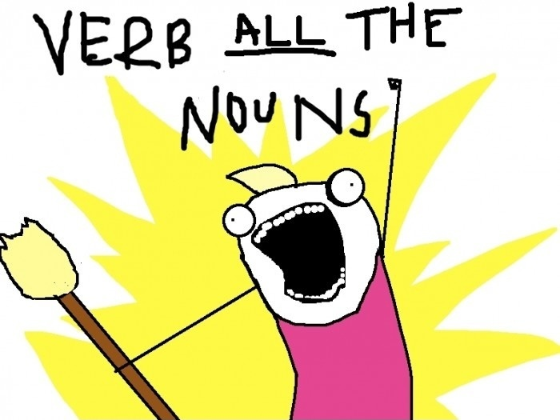
]
---
## **Verbs**
 
**morphological distribution**: what kind of morphemes can <b>English</b> **verbs** have?  
.pull-left[
- verbs can be conjugated for <b>tense</b> & <b>subject</b>  
- derivational morphemes can make verbs 
<b>-ise</b>, <b>-ify</b>, <b>-ate</b>, <b>-en</b>...
]
.pull-right[
I break, she break<b>s</b>, we <b>broke</b>, we have brok<b>en</b>  
modern<b>ise</b>, elect<b>ify</b>, valid<b>ate</b>, length<b>en</b>
]  

--

<b>syntactic distribution</b>: where do <b>verbs</b> go in <b>English</b> sentences?  

.pull-left[
- verbs go <b>after</b> the subject and <b>before</b> object(s)  
- all sentences have at least <b>one verb</b>  
- some sentences have <b>auxiliary</b> verbs in addition to the <b>main</b> verb  
- <b>modal</b> verbs are a type of auxiliary verb that express obligation, possibility, etc. 
]
.pull-right[
She <b>knows</b> me, I <b>did</b> it.  
I <b>like</b> pizza. `*` I an ice cream.  
I <b>am</b> singing. I <b>have</b> finished.   
can, could, may, might, shall, should, would, must, outght to
]

---
## **Adjectives and Adverbs**
 
### **adjectives** and **adverbs** modify other words 
### providing additional description
 
.pull-left[
- **adjectives** modify <b>nouns</b>  
- **adverbs** modify <b>verbs</b> 
  <b>adjectives</b> and 
  other <b>adverbs</b>
]
.pull-right[
<b>ferocious</b> chihuahua  
The chihuahua barked <b>angrily</b>. 
It was <b>extremely</b> aggressive. 
It ran <b>very</b>quickly.
]
  

<b>syntactic distribution</b>
  
.pull-left[
- both go <b>before</b> the word they modify:  
- but **adverbs** can go <b>before</b> or <b>after</b> verbs
]
.pull-right[
<b>playful</b> labrador, <b>very</b> friendly  
I <b>quickly</b> stopped. / I stopped <b>quickly</b>.
]

---
## **Adjectives and Adverbs**
 
### **adjectives** and **adverbs** modify other words 
### providing additional description
 
**morphological distribution**
  
.pull-left[
- many English adjectives can inflect for **comparative** and **superlative** with *-er*, *-est*  
- <b>derivational</b> morphemes for adjectives 
*-ish*, *-al*, *-ic*...  
- <b>derivational</b> morpheme for adverbs: *-ly*  
  - though not all adverbs end in *-ly*
  - and some adjectives end in *-ly*, too
]
.pull-right[
nic**er**, nic**est** 
`*` perfect**er**, `*` perfect**est**  
book<b>ish</b>, person<b>al</b>, horrif<b>ic</b>   
happi<b>ly</b>, slow<b>slowlve</b>  
My dog runs <b>quickly</b> 
the friend<b>ly</b> cat, the kind<b>ly</b> man
]

---
## **Determiners**
### **determiners** help to specify a word's reference
 
**determiners** gather together many words you may have learned as separate categories:  
.pull-left[
- articles  
- possessive pronouns  
- demonstratives  
- interrogative determiners  
- quantifiers
]
.pull-right[
*the*, *a*  
*my*, *our*, *your*, *his*, *her*, *their*, *its*  
**this** apple, **that** barn  
**which** computer, **what** floor  
*all*, *some*, *many*
]
  
**determiners** help to specify a word's reference, what **actual** thing in the world a word refers to  
  - dog vs. **my** dog

---
## **Determiners**
 
**morphological distribution**  
- English determiners don't have any specific morphemes that are typical of them 
- in fact, they tend to be **monomorphemic**  

**syntactic distribution**  
.pull-left[
- determiners can go <b>before</b> a noun  
- or <b>before</b> an adjective, <b>then</b> a noun  
- English usually doesn't allow <b>two</b> determiners in a row
]
.pull-right[
<b>the</b> apple, <b>my</b> friend  
<b>the</b> red apple, <b>my</b> good firend  
`*` <b>the my</b> friend
]

---
## **Prepositions**
### **prepositions** indicate some relationship between a **noun**  and the **other words** in a sentence
 
  - **prepositions** can indicate:  
.pull-left[
- <b>spatial</b> relationship  
- <b>grammatical</b> relationships  
- <b>conceptual</b> relationships
]
.pull-right[
<b>on</b> the table  
belong <b>to</b> me  
<b>in</b> the morning
]  

**morphological distribution**: no specific affixes and are often **monomorphemic** 

**syntactic distribution**  
.pull-left[
- prepositions go **before** nouns in English 
(pre-position)
]
.pull-right[
**on** topic, **in** time, **with** cheese
]

---
## **Conjunctions and Complementisers**
###**conjunctions** join together two words, phrases, or clauses
 
  - *and*, *or*, *but*, *because*, *if*, *since*  

- <b>coordinating conjunctions</b> join two words/phrases of the **same type**
  - *and*, *or*, *but*
  - <i>cats <b>and</b> dogs</i>, <i>coffee <b>or</b> tea</i>
  - **syntactic distribution**: between the two elements being joined  

- <b>subordinating conjunctions</b> are used to insert one sentence (subordinate clause) into another sentence (main clause) and they are also called <b>complementisers</b>
  - *because*, *that*, *if*, *since*, *whether* 
  - <i>I went to bed <b>because</b> I was tired</i>. / <i><b>If</b> you study, you will succeed</i>.
  - **syntactic distribution**: before the subordinate clause being inserted

---
## **Tense and Aspect**
 
### **tense** refers to when an action occurs  whether it happens in the <b>past</b>, <b>present</b> or <b>future</b>
.pull-left[
- tells **WHEN** the action occurs
- <b>past</b> tense: *She walk<b>ed</b> to school*.
- <b>present</b> tense: *She walk<b>s</b> to school*
- <b>future</b> tense: *She <b>will</b> walk to school.*
]
.pull-right[

 
<b>PST</b> 
<b>PRES</b> 
<b>FUT</b>

]
  
<h3><b>aspect</b> refers to the state of the action  whether it is <b>ongoing</b>, <b>completed</b> or <b>habitual</b></h3>
.pull-left[
- tells **HOW** the action unfolds
- <b>progressive</b> aspect: *She <b>is</b> walk<b>ing</b> to school.*
- <b>perfective</b> aspect: *She <b>has</b> walked to school.*
- <b>habitual</b> aspect: *She walk<b>s</b> <b>every day</b>.*
]
.pull-right[

 
<b>PROG</b> 
<b>PERF</b> 
<b>HAB</b>

]

---
## **Tense and Aspect**
 
### **tense** refers to when an action occurs  whether it happens in the <b>past</b>, <b>present</b> or <b>future</b>
.pull-left[
- tells **WHEN** the action occurs
- <b>past</b> tense: *She walk<b>ed</b> to school*.
- <b>present</b> tense: *She walk<b>s</b> to school*
- <b>future</b> tense: *She <b>will</b> walk to school.*
]
.pull-right[

 
<b>PST</b> 
<b>PRES</b> 
<b>FUT</b>

]
    
.pull-left[
<b>auxiliaries</b>  
<b>modals</b>   
<b>non-finite tense marker</b>
]
.pull-right[
*has/have/had*, *am/is/are/was/were*, *do/does/did*  
*will*, *would*, *shall*, *should*, 
*can*, *could*, *may*, *might*, *must*  
*to*
]

---
class: center, middle
# **negation (Neg)**: not
  
---
## **Example from another Language**
### Nootka, Wakashan 
 
.pull-left[
<table style="width:100%; border-collapse:collapse; text-align:left;">
  <tr>
    <td>(a)</td>
    <td>mamu:k-ma</td>
    <td>qu:ʔas-ʔi</td>
  </tr>
  <tr>
    <td></td>
    <td>working-PRES</td>
    <td>man-DEF</td>
  </tr>
  <tr>
    <td></td>
    <td>'The man is working.'</td>
    <td></td>
  </tr>
  
  <tr><td>-</td></tr>
  
  <tr>
    <td>(b)</td>
    <td>qu:ʔas-ma</td>
    <td>mamu:k-ʔi</td>
  </tr>
  <tr>
    <td></td>
    <td>man-PRES</td>
    <td>walking-DEF</td>
  </tr>
  <tr>
    <td></td>
    <td>'The working one is a man.'</td>
    <td></td>
  </tr>
</table>
]
.pull-right[
- <b>PRES</b> = present tense 
- <b>DEF</b> = definite  

1. What’s the **noun** in (a)? What’s the <b>verb</b>?  
2. What’s the **noun** in (b)? What’s the <b>verb</b>?
]
 
--

<h3>in both sentences:</h3>
 
- the first part is the <b>verb</b> 
  - indicated by the presence of the <b>present tense</b> morpheme -ma  

-  the second part is the **noun** 
  - indicated by the <b>definite</b> morpheme -ʔi

---
## **Open and Closed Classes**
 
- parts of speech can be divided into **open** and **closed classes**  
- **open class**: words have more of a **lexical** meaning  
  - typical dictionary definition
  - it's fairly easy to *borrow* or *coin* new words in these categories
  - nouns, verbs, adjectives, and adverbs  
- **closed class**: words have more of a **grammatical** meaning  
  - it's less common, but not impossible, to borrow or coin new words in these categories
  - determiners, prepositions, conjunctions, complementisers, tense

---
## **Exercise II: Parts of Speech**
 
.pull-left[

]
.pull-right[
for every word in the sentences below, identify its **parts of speech** (lexical category)  
1. Mary will come tomorrow.   
2. John went to New York yesterday.   
3. A cat is under the table.   
4. Her dad was fixing a car.
]

---
## **Summary**
 
- **parts of speech** are categories of words that tend to behave in similar ways:  
  - noun, verb, adjective, adverb, determiner, preposition, conjunction, complementiser, tense  
- we often learn them in school by definition  
- but we figure them out here based on **context**, by considering their:  
  - **morphological distribution** – what kinds of morphemes they have.
  - **syntactic distribution** – where they tend to appear in the sentence  
- by examining their **distribution**, we can notice patterns in the way certain types of words behave  
- and this will be fundamental to our understanding of **syntax**, as we start putting words together to form **sentences**

---
class: center, middle
**Homework I** is due this Friday (**Sept 25**)  
**Homework II** will be published before next Wednesday (**Sept 30**), and it is due Friday after next week (**Oct 09**)  
<b>continue reading</b> Chapter 2: Part of Speech from <i>Andrew Carnie's Syntax textbook</i>  

  
Slides created via the R package [**xaringan**](https://github.com/yihui/xaringan).
