class: center, middle
## Please pick up your **name card** from the front

---
## **Words and Phrases**
 
.pull-left[
- **parts of speech** are the basic building blocks of **phrases**  
- a sentence is a also kind of phrase (**tense phrase**, TP)  
- sentence may contain a noun and a verb:

<table style="width:40%; border-collapse:collapse; text-align:center;">
  <tr>
    <td><i>Merlin</i></td>
    <td><i>ran</i>.</td>
  </tr>
  <tr>
    <td>N</td>
    <td>V</td>
  </tr>
</table>  

- however, there are also other things that can go in the same spot as this **N**:
<table style="width:60%; border-collapse:collapse; text-align:center;">
  <tr>
    <td><i>The</i></td>
    <td><i>thief</i></td>
    <td><i>ran</i>.</td>
  </tr>
  <tr>
    <td>D</td>
    <td>N</td>
    <td>V</td>
  </tr>
</table>
 
<table style="width:80%; border-collapse:collapse; text-align:center;">
  <tr>
    <td><i>The</i></td>
    <td><i>teacher</i></td>
    <td><i>from</i></td>
    <td><i>chicago</i></td>
    <td><i>ran</i>.</td>
  </tr>
  <tr>
    <td>D</td>
    <td>N</td>
    <td>P</td>
    <td>N</td>
    <td>V</td>
  </tr>
</table>

]

.pull-right[
  
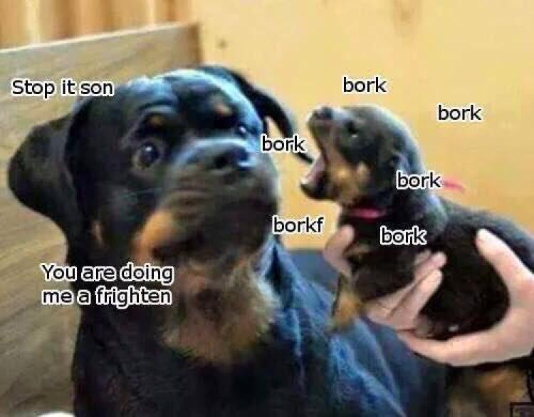
]

---
## **Distribution**
  
.pull-left[
  
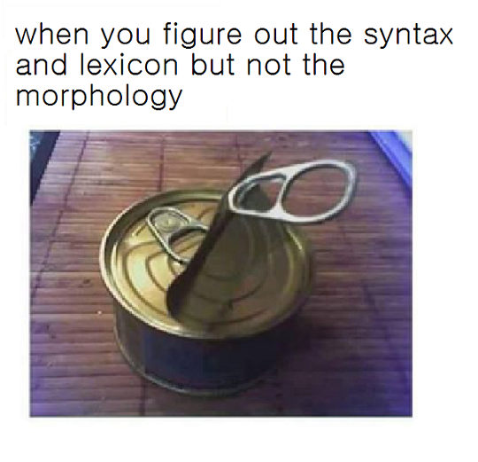
]
.pull-right[
- these ‘chunks’ also have other similar **distributional** properties:
  - they only appear in certain context or environment  
- in other words, they appear in **the same place** and they accomplish **a similar purpose**  
<table style="width:95%; border-collapse:collapse; text-align:left;">
  <tr>
    <td></td>
    <td>*Roger*.</td>
  </tr>
  <tr style="width:40%">
    <td><b>who</b> ran?</td>
    <td>*The thief*.</td>
  </tr>
  <tr>
    <td></td>
    <td>*The teacher from Chicago*.</td>
  </tr>
</table>
  
*It is <u>Roger</u> who ran*. 
*It is <u>the thief</u> who ran*. 
*It is <u>the teacher from Chicago</u> who ran*.
]

---
## **Constituents: Intuition**
.pull-left[
 
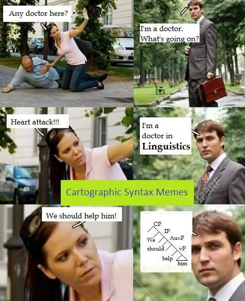
]
.pull-right[
- imagine that you want to embed a [weblink](merlinudinov.github.io/spring2026ling201) in the following sentence:
  
  - <i>The cat loves <b>his toy</b></i>.
  - <i>The cat <b>loves his toy</b></i>.
  - <i><b>The cat</b> loves his toy</i>.
  - <i>The <b>cat loves</b> his toy</i>.  
- which of these options above would be **natural** choices?
- do any of them strike you as **unnatural** or **unlikely** choices?  
- although a sentence is composed of separate words, it is **NOT** constructed like a **parachute**, where each word independently attaches to the sentence as a whole
- instead, words first group into component parts that function **together as units**, and these units then combine to form the sentence
]

---
.pull-left[
## **Constituents**
 
**constituent**: a group of words that <b>acts together</b> as a **unit**   
- consider the following sentences and find out the **subject** for each sentence?  
1. *Francisco <b>studies linguistics</b>.*
2. *The tall boy <b>studies linguistics</b>.*
3. *The tall boy from New Jersey <b>studies linguistics</b>.*
4. *The tall boy named Francisco <b>studies linguistics</b>.*
5. *The tall boy that I met last week <b>studies linguistics</b>.*  
]

.pull-right[
 

<h3><b>large phrases and sentences</b></h3>
<h3>⬆️  
<b>phrases</b>  
⬆️  
<b>words</b>  
⬆️  
<b>morphemes</b></h3>
 
<a href="https://www.youtube.com/watch?v=Ia7d4slVL6s">(<i>a video on constituent</i>)</a>

]

---
.pull-left[
## **Constituents**
 
**constituent**: a group of words that <b>acts together</b> as a **unit**   
- consider the following sentences and find out the **subject** for each sentence?  
1. *<u>Francisco</u> <b>studies linguistics</b>.*
2. *<u>The tall boy</u> <b>studies linguistics</b>.*
3. *<u>The tall boy from New Jersey</u> <b>studies linguistics</b>.*
4. *<u>The tall boy named Francisco</u> <b>studies linguistics</b>.*
5. *<u>The tall boy that I met last week</u> <b>studies linguistics</b>.*   

- SUBJECT can be **one** or **many** words, but they all <b>act together</b> to describe a single concept
]
.pull-right[
    

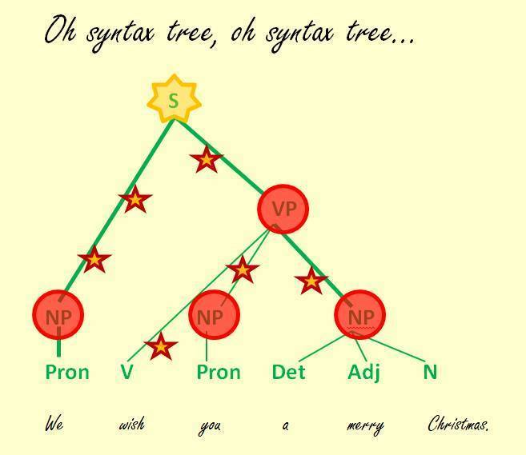   
<a href="https://www.youtube.com/watch?v=Ia7d4slVL6s">(<i>a video on constituent</i>)</a>

]

---
## **Back to the Ambiguity Case AGAIN**
 
.pull-left[

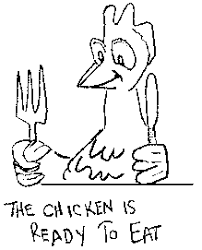

]
.pull-right[
- remember the case of structural ambiguity:  

<i>Arthur read the book on the desk</i>.

 
- this type of ambiguity actually reveals that there is more than one **constituent organisation** for this sentence:  
  - <i>Arthur read [the book] [on the desk]</i>.
  - the green part is linked to the verb '*read*' directly, meaning 'read on the desk'  
  - <i>Arthur read [the book [on the desk]]</i>.
  - the green part is linked to the noun '*book*' directly, meaning 'book on the desk'  
]

- speakers are aware of this fact
- our knowledge of **sentences** must encompass a knowledge of **constituent structure**

---
## **Phrases**: Types of Constituents
 
.pull-left[
- each phrase has a main word aka **head**  

- phrases are named after the **head** word's **part of speech**:  
  - <b>noun phrase</b> (<b>NP</b>): *<u>man</u>, the <u>man</u>, the happy <u>man</u>, the <u>man</u> with the hat*  
  - <b>prepositional phrase</b> (<b>PP</b>): *<u>into</u> the forest, <u>by</u> the author, <u>for</u> good luck*  
  - <b>verb phrase</b> (<b>VP</b>): *<u>eats</u>, <u>eats</u> pizza, <u>eats</u> quickly, <u>eats</u> pizza quickly at noon*  
  - <b>adjective phrase</b> (<b>AdjP</b>): *<u>happy</u>, <u>ugly</u>*  
  - <b>adverb phrase</b> (<b>AdvP</b>): *<u>quickly</u>, <u>happily</u>*
]
  
.pull-right[
- **one constituent can contain another**:  
  - <u>*the man with the hat*</u> (<b>NP</b>) contains <u>*with the hat*</u> (<b>PP</b>), which contains <u>*the hat*</u> (<b>NP</b>) 
  

  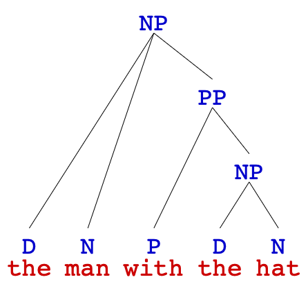
  
 
  - <u>*eats quickly at noon*</u> (<b>VP</b>)contains <u>*quickly*</u> (<b>AdvP</b>) and <u>*at noon*</u> (<b>PP</b>) 
  

  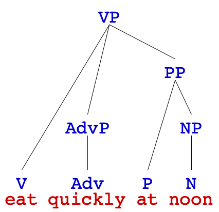
  

]
  
---
background-image: url("../pic/0928/video1.png")
background-size: contain
backround-position: center

---
.pull-left[
## **Constituency Tests**
 
- a **constituency test** applies to a portion of a sentence and identify **whether**
groups of words act together as a unit or not  
- if the test doesn’t apply, we can still use it but using **\* (ungrammatical)** notation to show that the test doesn’t work  
- **four** types of test:
  - <b>replacement/substitution</b> test
  - **movement** test
  - <b>fragment/stand-alone</b> test
  - <b>coordination</b> test  
- **these don't work 100% of the time**, and some tests work better with some sentences
  - hence, you might have to try several
]
.pull-right[
   
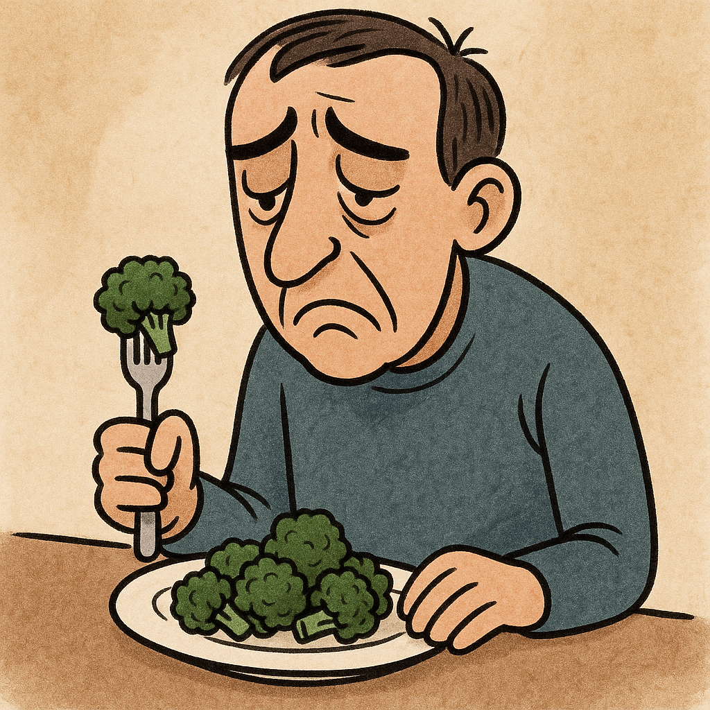
  
### *<b>[The lugubrious man]</b>* is eating *<b>[his bland meal]</b>*.
]

---
## **Constituency Tests : Procedure Passed**
 

1. begin with Sentence A, with a sequence to be tested (usually underlined)
  

Sentence A: <i><u><b>The anonymous girl</b></u> escaped</i>.

  
2. use <b>some test(s)</b> to create a new sentence: Sentence B
  

Sentence B: <i>It is <u><b>the anonymous girl</b></u> who escaped</i>.

  
3. decide if Sentence B is syntactically <b>well-formed</b>

.pull-left[
.pull-left[]
.pull-right[

<b>⬇</b> 

]

if Sentence B is grammatical, then the sequence in Sentence A <b>passed</b> this test
  
the sequence is <b>a constituent</b>

]
.pull-right[
.pull-left[]
.pull-right[

<b>↙</b> 

]

if Sentence B is ungrammatical, then the sequence in Sentence A <b>failed</b> this test
  
the sequence is <b>NOT</b> <b>a constituent</b>

]

---
## **Constituency Tests : Procedure Failed**
 

1. begin with Sentence A, with a sequence to be tested (usually underlined)
  

Sentence A: <i>The <u><b>anonymous girl</b></u> escaped</i>.

  
2. use <b>some test(s)</b> to create a new sentence: Sentence B.
  

Sentence B: * <i>It is <u><b>anonymous girl</b></u> who escaped</i>.

  
3. decide if Sentence B is syntactically <b>well-formed</b>

.pull-left[
.pull-left[

<b>↘</b> 

]
.pull-right[]

if Sentence B is grammatical, then the sequence in Sentence A <b>passed</b> this test
  
the sequence is <b>a constituent</b>

]
.pull-right[
.pull-left[

<b>⬇</b> 

]
.pull-right[]

if Sentence B is ungrammatical, then the sequence in Sentence A <b>failed</b> this test
  
the sequence is <b>NOT</b> <b>a constituent</b>

]

---
## **Replacement (Substitution) Test**
 
### *<b>[The lugubrious man]</b>* is eating *<b>[his bland meal]</b>*.
 
.pull-left[
- **replacement test**: replace a group of words with a SINGLE **pro-form**  
- if it works, they are one constituent   
- while applying replacement tests, it is important to replace the **whole string** under investigation
  - do **NOT** include anything more
  - do **NOT** miss anything
  - do **NOT** paraphrase the sentence
  - apply the test to the **whole** and **only** the string under investigation
]
.pull-right[
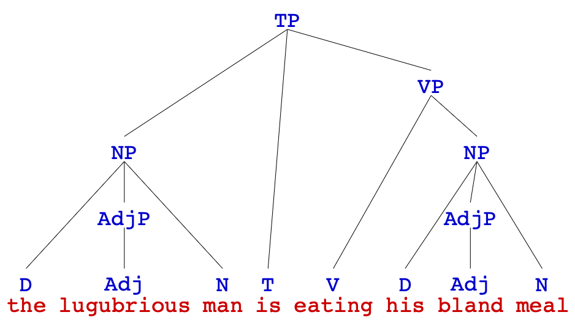   
'*The lugubrious man is eating his bland meal*.'
]

---
## **Replacement (Substitution) Test**
 
### *<b>[The lugubrious man]</b>* is eating *<b>[his bland meal]</b>*.
 
.pull-left[
- **replacement test**: replace a group of words with a SINGLE **pro-form**  
- **pro-from**: <u>pronoun</u> or other generic expression like <u>there</u>, <u>like that</u>, <u>do</u>, <u>do that</u>, <u>that way</u>  
  - a <b>noun-phrase-like</b> constituent can be replaced by a **pronoun** (it, them, ...)  
  - a <b>verb-phrase-like</b> constituent can be replaced by **do/does/did/did** (so/that)  
  - a <b>preposition-phrase-like</b> constituent can be replaced by **here/there**
]
.pull-right[
   
'*The lugubrious man is eating his bland meal*.'
]

---
## **Replacement (Substitution) Test**
 
### *<b>[The lugubrious man]</b>* is eating *<b>[his bland meal]</b>*.
 
.pull-left[
- **replacement test**: replace a group of words with a SINGLE **pro-form**  
- **pro-from**: <u>pronoun</u> or other generic expression like <u>there</u>, <u>like that</u>, <u>do</u>, <u>do that</u>, <u>that way</u>  
- *<u>The lugubrious man</u> is eating his bland meal*. 
  - replacing '<i>the lugubrious man'</i> with '<i>he</i>' 
  - → *<u>He</u> is eating his bland meal.* ✅  
- *The lugubrious man <u>is eating his bland</u> meal*. 
  - a **SINGLE pro-form** cannot be found 
  - → *The lugubrious man <u>???</u> meal.*❌  
]
.pull-right[
   
'*The lugubrious man is eating his bland meal*.'
]

---
## **Replacement (Substitution) Test**
 
### *<b>[The lugubrious man]</b>* is eating *<b>[his bland meal]</b>*.
 
.pull-left[
- **replacement test**: replace a group of words with a SINGLE **pro-form**  
- **pro-from**: <u>pronoun</u> or other generic expression like <u>there</u>, <u>like that</u>, <u>do</u>, <u>do that</u>, <u>that way</u>  
- try the **replacement test** with following cases  
1. *The lugubrious man is eating his <u>bland meal</u>*.
2. *<u>The lugubrious</u> man is eating his bland meal*.
3. *The lugubrious <u>man is eating</u> his bland meal*.
]
.pull-right[
   
'*The lugubrious man is eating his bland meal*.'
]

---
## **Exercise I: Replacement (Substitution) Test**
   
.pull-left[
try to apply the **replacement test** to the underlined string and determine whether it is a **constituent**  
1. *I adopted the dog <u>from Alaska</u>*.  
2. *<u>A tall giraffe</u> walked by*.  
3. *The <u>box of</u> snacks fell off the table*.  
4. *Merlin <u>likes to</u> sing in the shower*.  
5. *Arthur read the book on <u>the table</u>*.
]
.pull-right[
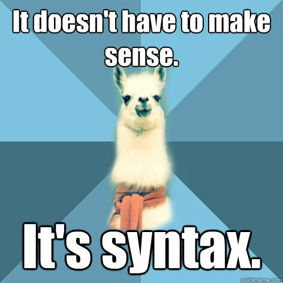
]

---
## **Movement Test**
 
### *<b>[The lugubrious man]</b>* is eating *<b>[his bland meal]</b>*.
 
.pull-left[
- **movement test**: moving a string of words together to a **different part** of the sentence and still meaning the **same thing**  
- there are two types of **movement test**  
- **preposing**: putting the string of words before a <b>is was</b>/<b>are what</b> or
<b>is was</b>/<b>are who</b> at the beginning of the sentence  
- *<u>The lugubrious man</u> is eating the bland meal*. 
  → *<u>The lugubrious man</u>* 
  → *is who</b> is eating the bland meal*.
]
.pull-right[
   
'*The lugubrious man is eating his bland meal*.'
]

---
## **Movement Test**
 
### *<b>[The lugubrious man]</b>* is eating *<b>[his bland meal]</b>*.
 
.pull-left[
- **movement test**: moving a string of words together to a **different part** of the sentence and still meaning the **same thing**  
- there are two types of **movement test**  
- **clefting**: putting the string of words between <b>it was</b>/<b>it is</b> and a <b>that</b>/<b>who</b> at the beginning of the sentence  
- *The lugubrious man is eating <u>the bland meal</u>*. 
→ *It is</b> <u>the bland meal</u>* 
→ *that the lugubrious man is eating*.
]
.pull-right[
   
'*The lugubrious man is eating his bland meal*.'
]

---
## **Movement Test**
 
### *<b>[The lugubrious man]</b>* is eating *<b>[his bland meal]</b>*.
 
.pull-left[
- **movement test**: moving a string of words together to a **different part** of the sentence and still meaning the **same thing**  
- **preposing**: ... <b>is/was/are/were what</b>... 
- **clefting**: <b>it was/is</b> ... <b>that/who</b>  
- try the **movement test** with following cases  
1. *The lugubrious man is eating <u>his bland meal</u>*.
2. *The lugubrious man is <u>eating his bland</u> meal*.
3. *The lugubrious <u>man is eating</u> his bland meal*.
]
.pull-right[
   
'*The lugubrious man is eating his bland meal*.'
]

---
## **Fragment (Stand-Alone) Test**
 
### *<b>[The lugubrious man]</b>* is eating *<b>[his bland meal]</b>*.
 
.pull-left[
- **stand alone test**: come up with a question that can be **answered** by just saying the group of words you want to test **on its own**   
- again, use the entire string under investigation
  - do **NOT** include anything more
  - do **NOT** miss anything  
- *<u>The lugubrious man</u> is eating his bland meal*. 
  → *Who <u>is eating his bland meal</u>?* 
  → *<u>The lugubrious man</u>.*   
- *The lugubrious man is <u>eating his bland</u> meal*. 
  → \* *The lugubrious man is what <u> meal</u>?* 
  → \* *<u>eating his bland.*
]
.pull-right[
   
'*The lugubrious man is eating his bland meal*.'
]

---
## **Fragment (Stand-Alone) Test**
 
### *<b>[The lugubrious man]</b>* is eating *<b>[his bland meal]</b>*.
 
.pull-left[
- **stand alone test**: come up with a question that can be **answered** by just saying the group of words you want to test **on its own**   
- **constituents** can often stand alone and act as the answers or as the content of a question  
- try the **fragment test** with following cases  
1. *The lugubrious man is eating <u>his bland meal</u>*.
2. *<u>The lugubrious</u> man is eating his bland meal*.
3. *The lugubrious <u>man is eating</u> his bland meal*.
]
.pull-right[
   
'*The lugubrious man is eating his bland meal*.'
]

---
## **Coordination Test**
 
### *<b>[The lugubrious man]</b>* is eating *<b>[his bland meal]</b>*.
 
.pull-left[
- **coordination test**: coordinating the tested string with anoter string of the same type  
- a constituent of type **X** can be coordinated with another constituent of the same type
  - coordinating conjunctions: <b>and</b> / <b>or</b>  
- a **noun-phrase-like** string is coordinated with another **noun phrase**
  - the most safe choice would be a <b>pronoun</b> or a <b>common noun</b> (a name)   
]
.pull-right[
   
'*The lugubrious man is eating his bland meal*.'
]
 
- a **prepositional-phrase-like** string is coordinated with another **prepositional phrase**
  - typically with <b>here</b>/<b>there</b>  
  
---
## **Coordination Test**
 
### *<b>[The lugubrious man]</b>* is eating *<b>[his bland meal]</b>*.
 
.pull-left[
- **coordination test**: coordinating the tested string with anoter string of the same type  
- a constituent of type **X** can be coordinated with another constituent of the same type
  - coordinating conjunctions: <b>and</b> / <b>or</b>  
- *<u>The lugubrious man</u> is eating his bland meal*. 
  → *<u>The lugubrious man</u> or</u> <u>Rumpelstilzchen</u> is eating his bland meal</u>*.  
- *The lugubrious man is <u>eating his bland meal</u>*. 
  → *The lugubrious man is <u>eating his bland meal</u> and</u> <u>running</u>*.
]
.pull-right[
   
'*The lugubrious man is eating his bland meal*.'
]

---
## **Coordination Test**
 
### *<b>[The lugubrious man]</b>* is eating *<b>[his bland meal]</b>*.
 
.pull-left[
- **coordination test**: coordinating the tested string with anoter string of the same type  
- a constituent of type **X** can be coordinated with another constituent of the same type
  - coordinating conjunctions: <b>and</b> / <b>or</b>  
- try the **coordination test** with following cases  
1. *The lugubrious man is eating <u>his bland meal</u>*.
2. *The lugubrious <u>man is eating</u> his bland meal*.
3. *The lugubrious man is eating <u>his bland</u> meal*.
]
.pull-right[
   
'*The lugubrious man is eating his bland meal*.'
]

---
## **Exercise II: Constituency Tests**
 
.pull-left[
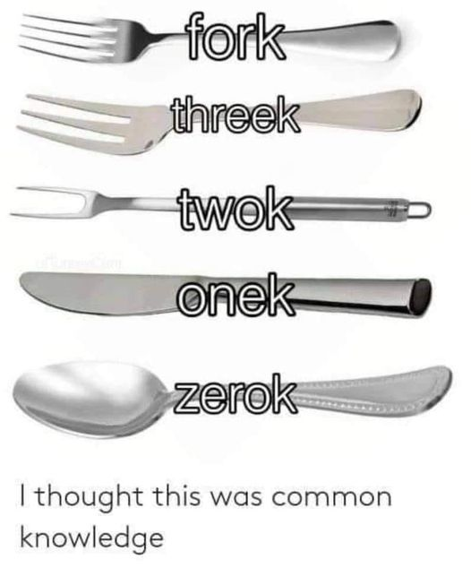   
]
.pull-right[
Use **constituency tests** to determine whether the underlined part is a **constituent** in each sentence:  
1. <u>The tragedy</u> upset the entire family.   
2. They hid <u>in the cave</u>.   
3. The <u>computer was very</u> expensive.   
4. The geese <u>swam across</u> the lake.   
5. Merlin gave <u>a book to his sister</u>.   
6. Arthur read <u>a book about geology</u>.  
7. Morgana ate the <u>nice meal of</u> Arthur.
]

---
## **Careful with Constituency Tests**
 
.pull-left[
- if a given string **passes** a constituency test  
  - → you can assume it is a constituent  
- however, if a string **fails** a constituency test  
  - → you cannot be certain that it is not a constituent   
- sometimes, a test yields an **anomalous** result
  - *The student <u>from Korea</u>  arrived*.
  - **clefting**: *It is <u>from Korea</u>  that the student arrived*.  
- this is why it is best to apply **several** constituency tests and not just
rely on one
]
.pull-left[
 

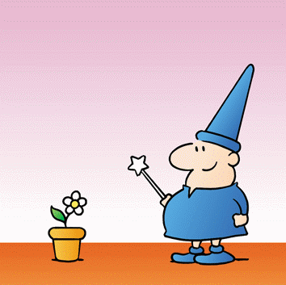

]

---
## **The Whole Picture**
 
.pull-left[

<h3><b>large phrases and sentences</b></h3>
<h3>⬆  
<b>phrases</b>  
⬆  
<b>words</b>  
⬆  
<b>morphemes</b></h3>
 
<a href="https://www.youtube.com/watch?v=Ia7d4slVL6s">(<i>a video on constituent</i>)</a>

]
.pull-right[

<h3><b>large phrases and sentences</b></h3>
<h3>phrase structure rules  
<b>phrases</b>  
phrase structure rules  
<b>words</b>  
morphological rules  
<b>morphemes</white></b></h3>
 
<a href="https://www.youtube.com/watch?v=Ia7d4slVL6s">(<i>a video on constituent</i>)</a>

]

---
class: center, middle
**Homework II** is due this Friday (**Oct 02**)  
<b>reading</b> Chapter 3: Constituency, Trees, and Rules from <i>Andrew Carnie's Syntax textbook</i>  
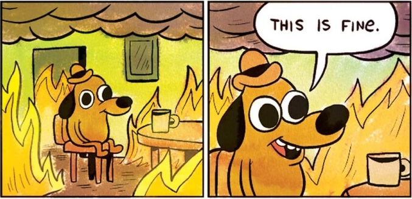
  
Slides created via the R package [**xaringan**](https://github.com/yihui/xaringan).
