class: center, middle
## Please pick up your **name card** from the front

---
## **Previously on 201: Constituent and Its Types**
 
- **constituent**: a group of words that <b>acts together</b> as a **unit**   
- **phrases**: types of constituents, different types are decided by the **part of speech** of the **head**
  
  - <b>noun phrase</b> (<b>NP</b>): *<u>man</u>, the <u>man</u>, the happy <u>man</u>, the <u>man</u> with the hat*  
  - <b>prepositional phrase</b> (<b>PP</b>): *<u>into</u> the forest, <u>by</u> the author, <u>for</u> good luck*  
  - **verb phrase** (<b>VP</b>): *<u>eats</u>, <u>eats</u> pizza, <u>eats</u> quickly, <u>eats</u> pizza quickly at noon*  
  - <b>adjective phrase</b> (<b>AdjP</b>): *<u>happy</u>, <u>ugly</u>*  
  - <b>adverb phrase</b> (<b>AdvP</b>): *<u>quickly</u>, <u>happily</u>*  
- **constituency tests**: to test whether a string of words is a constituent or not  
  - replacement, movement, fragment, coordination

---
class: center, middle
# **I saw the man with a telescope.**
  
### this sentence has **two** possible interpretations  
### what are they?  
### in each interpretation, who is <i>with a telescope</i>  

---
 

<h2><b>I saw the man with a telescope.</b></h2>

 
.pull-left[

<b>Interpretation 1</b> 
I used a telescope and I saw a man.

 

]
.pull-right[

<b>Interpretation 2</b> 
I saw the man who has a telescope.

 

]

---
 

<h2><b>I saw the man with a telescope.</b></h2>

 
.pull-left[

<b>Interpretation 1</b> 
I used a telescope and I saw a man.

 

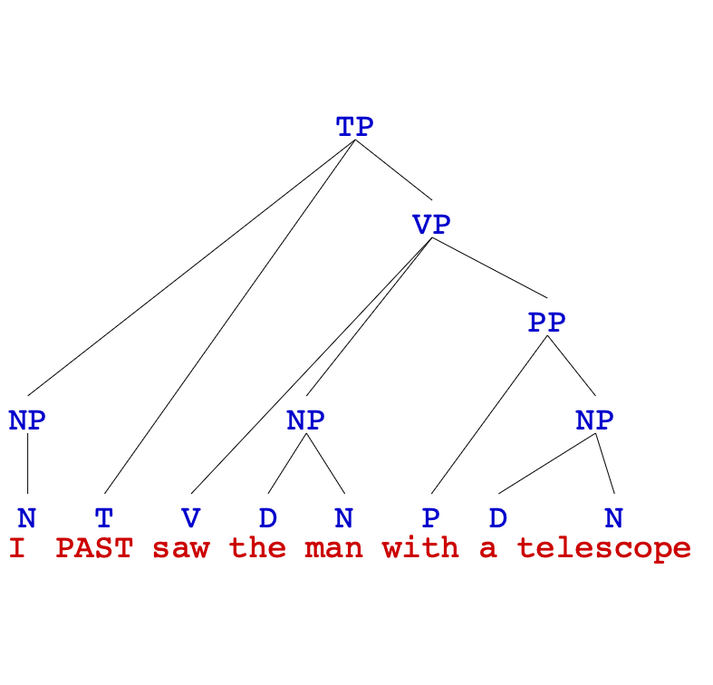

]
.pull-right[

<b>Interpretation 2</b> 
I saw the man who has a telescope.

 

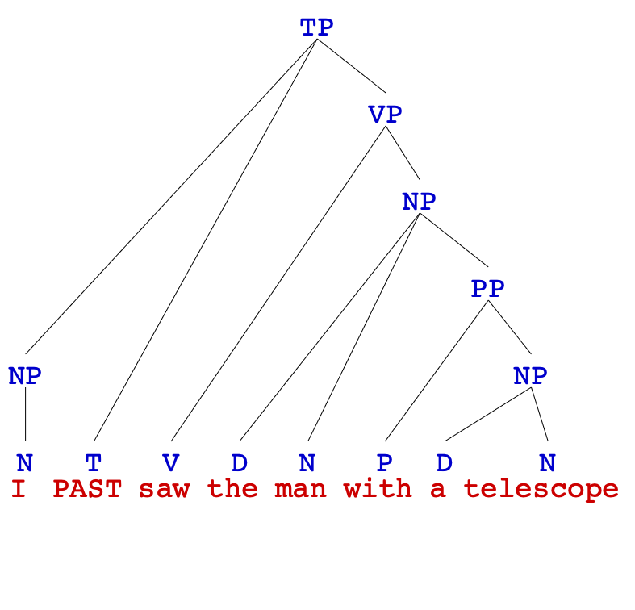

]

---
 

<h2><b>I saw the man with a telescope.</b></h2>

 
.pull-left[

<b>Interpretation 1</b> 
I used a telescope and I saw a man.

 

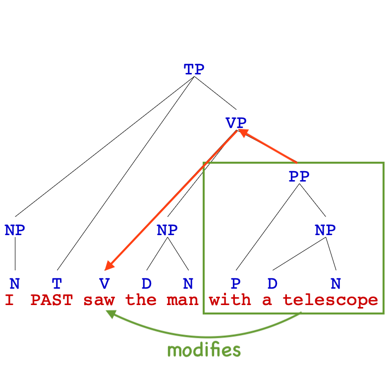

]
.pull-right[

<b>Interpretation 2</b> 
I saw the man who has a telescope.

 

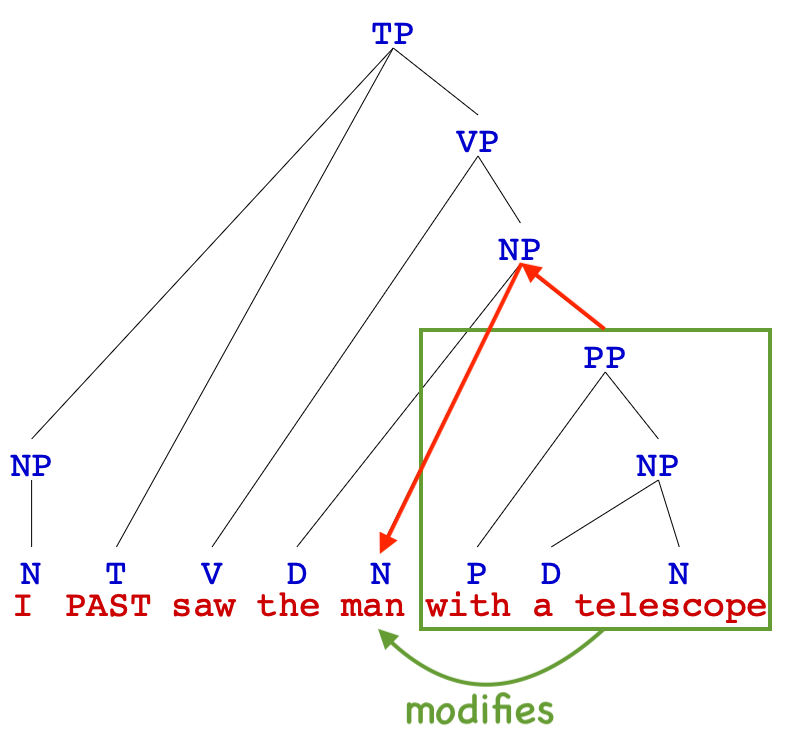

]

---
class: center, middle
# ***I saw the man with a telescope.***
  
### an example of **structural ambiguity**  
### but we did not look at it via **syntax trees** to visualize its two possible structures  
### the syntax trees on the previous page show how there are two ways to interpret what *<u>[with a telescope]</u>* **modifies**  
### the meaning of a sentence ≠ sum of its words, **syntactic structure** also contributes to meaning    
## HOW DO WE DRAW TREES THEN!

---
## **Phrase Structure Rules** (PSRs)
 
- there are (descriptive) rules that indicate **how phrases are built out of smaller units** (which could be words or other phrases)  
  - these rules are called **phrase structure rules**   
  - they indicate the order and position of the smaller units in a phrase   

- we derive these rules by observing what are the possible structures that exist in **natural language**  

.pull-left[
  
<h3><b>NP</b> → (D) (AdjP+) <b>N</b> (PP+)</h3>
]

.pull-right[
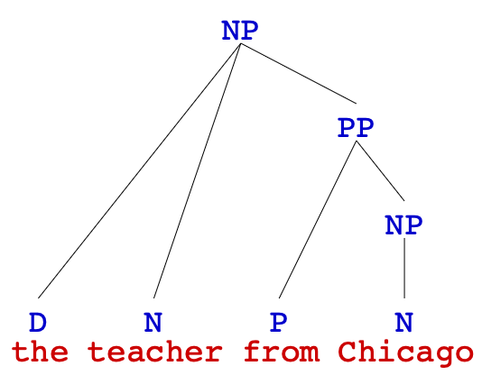
]

---
## **Notational Notes**
 
phrase structure rules indicate the **order** and **position** of the sub-parts
  
.pull-left[
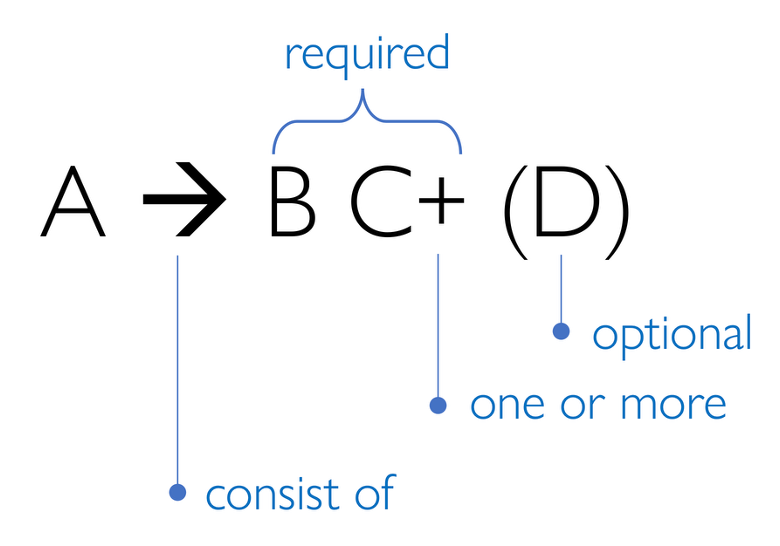
]
.pull-right[
<h3><b>NP</b> → (D) (AdjP+) <b>N</b> (PP+)</h3> 
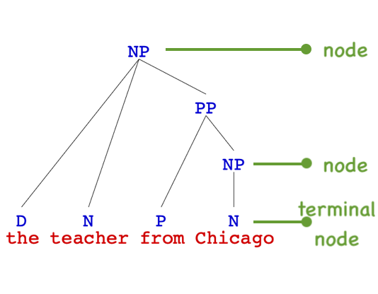
]

---
## **Phrase Structure Rules for English**
 
.pull-left[
- <h3><b>NP</b> → (D) (AdjP+) <b>N</b> (PP+)</h3> 
- <h3><b>PP</b> → <b>P</b> NP</h3> 
- <h3><b>AdjP</b> → (AdvP) <b>Adj</b></h3> 
- <h3><b>AdvP</b> → (AdvP) <b>Adv</b></h3> 
]
.pull-right[
- <h3><b>TP</b> → NP <b>(T)</b> VP</h3> 
- <h3><b>CP</b> → <b>C</b> TP</h3> 
]
- <h3><b>VP</b> → (AdvP+) <b>V</b> (NP) (NP) (AdvP+) (PP+) (AdvP+)</h3>

---
## **Noun Phrases (NP)**
 
.pull-left[
- a noun phrase consists of **a noun** and all the words that **modify** it  
- the simplest NP is a single noun:
  - *Harriet*, *dogs*, *soup*, *snow*  
- an <b>NP</b> can also include any of the following:
  - a <b>determiner</b> 
  <i><b>the</b> hat</i>, <i><b>my</b> shoes</i>, <i><b>this</b> idea</i>, <i><b>which</b> tree</i>  
  - one or more <b>adjective phrases</b> (AdjP) 
  <i><b>blue</b> sky</i>, <i>a <b>great</b> time</i>, <i><b>big red</b> trucks</i>  
  - one or more prepositional phrases (PP) 
  <i>spaghetti <b>with meatballs</b></i>, <i>trees <b>in the yard</b></i>, <i>the tall bridge <b>over the river</b></i>
]
.pull-right[
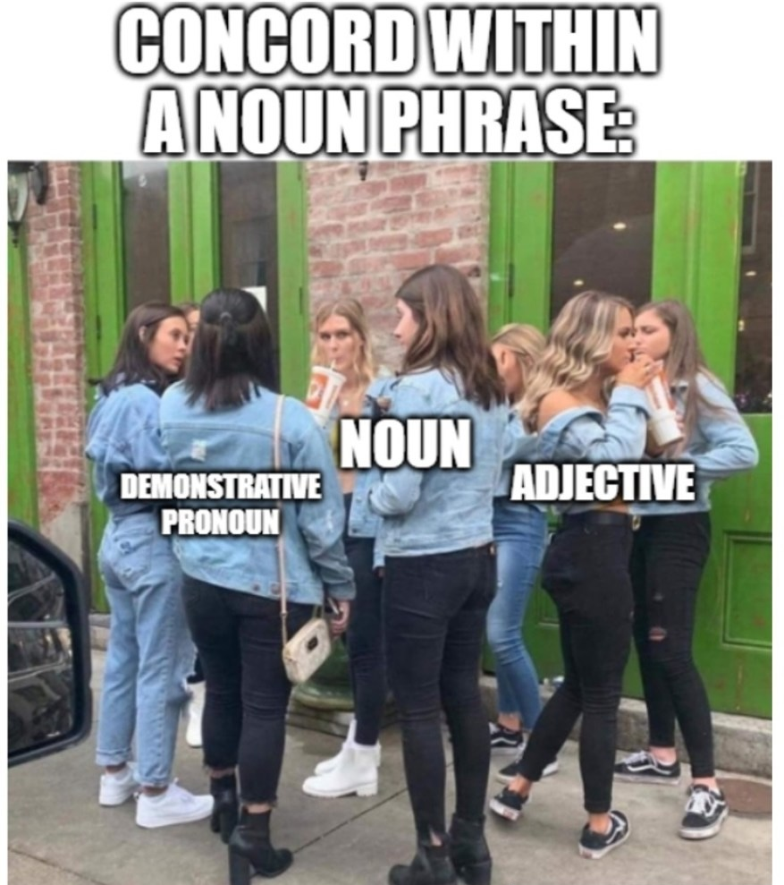
]

- **note**: an adjective will **always** go in a separate AdjP, for reasons we'll discuss soon in a few pages later  

---
## **Phrase Structure Rules: Take NP as an Example**
 
.pull-left[
- **notational notes** once again:  
  - order **matters** – elements always appear in the order given in the rule  
  - parentheses = **optional** element  
  - no parentheses = **obligatory** element  
  - plus sign (+) = one or more  
- so the rule for <b>noun phrases</b> means that a noun phrase consists of (in order):
  - optional determiner
  - one or more optional adjective phrase(s)
  - the <b>noun</b>
  - one or more optional prepositional phrase(s)
]
.pull-right[

<h3><b>NP</b> → (D) (AdjP+) <b>N</b> (PP+)</h3> 

]

---
## **Syntax Trees Drawn by Phrase Structure Rules**
 
1. write the **words** at the bottom
2. label their **parts of speech**
3. figure out how they **combine** into phrases
4. write phrase type above and connect **all** its elements with lines – some phrases contain other phrases
5. tree should reflect an **existing PSR**: phrase type on left of PSR at top elements on right of PSR at bottom
  

<h3><i>the bright sun</i></h3>

 
--
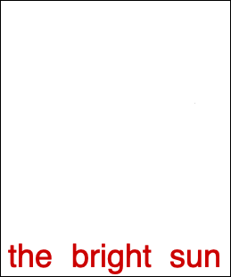
--
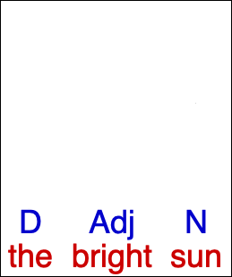
--
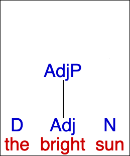
--
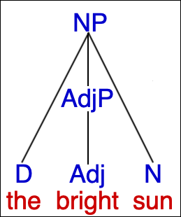

---
## **Adjective Phrase (AdjP), Adverb Phrase (AdvP)**
 
.pull-left[
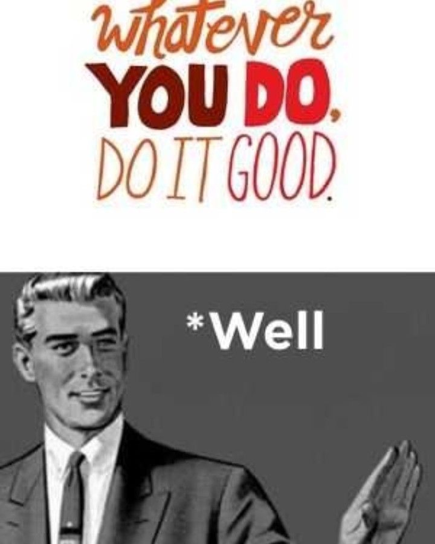
]
.pull-right[
consider the following sentence, and think about whether <i>happy</i> and <i>quickly</i> are constituents?  

<i>The <i>happy</i> dog ran <i>quickly</i></i>.

 
- **constituency tests**:  
  - How was the dog who ran quickly? <i>Happy</i>! (stand alone)
  - How did the happy dog run? <i>Quickly</i>! (stand alone)
  - The happy dog ran like that. (replacing <i>quickly</i>)  
- <b>adjectives</b> and <b>adverbs</b> are their own constituents, so they need to be put into their own phrases: <b>AdjP</b> and <b>AdvP</b>
]

---
## **Adjective Phrases (AdjP)**
 
.pull-left[
- most basic <b>AdjP</b>: one adjective (AdjP → Adj)  
  - it can be inserted into an <b>NP</b> as shown on the right   
- **Modification Rule**
  - *a phrase that modifies a word must be a <b>sibling</b> of that word*
  - make a guess, what is this sibling?  
]
.pull-right[

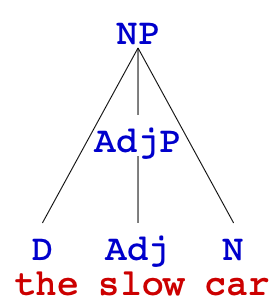

] 

--

.pull-left[
- by making the <b>AdjP</b> for <u><i>slow</i></u> a sibling of the **N** <u><i>car</i></u>, we're showing that *<u><i>slow</i></u>* modifies <u><i>car</i></u>  
- we can verify they are siblings by checking they have the same **parent**: both the <b>AdjP</b> and the **N** <u><i>car</i></u> have <b>NP</b> as parent
]
.pull-right[
]

---
## **Adjective Phrases (AdjP)**
 
.pull-left[
- <b>AdjP</b>s can optionally contain an <b>adverb phrase</b>(<b>AdvP</b>): <u><i>very slow</i></u>  
- PSR for <b>AdjP</b> modified 
  **AdjP → (AdvP) Adj**  
- since the adverb modifies the adjective:
  - the adverb needs to go in its own <b>AdvP</b>
  - that <b>AdvP</b> needs to be a sibling of the adjective
  - that is, they need to be **children** of the same <b>AdjP</b>  
  
- when there are **two** adjectives in one phrase:
  - they each is a separate <b>AdjP</b>
  - since both of them are modifying the **noun**
]
.pull-right[

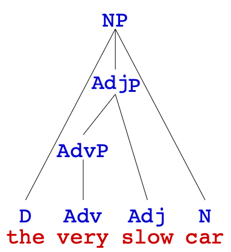
  
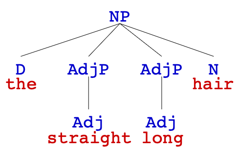

]

---
## **Adverb Phrases (AdvP)**
 
.pull-left[

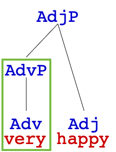
  
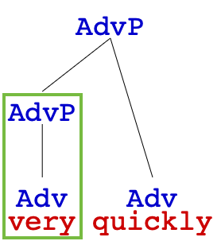

]
.pull-right[
if we check the PSR rules for English <b>adverb phrase</b> (<b>AdvP</b>), we will notice that they are basically the same:  
- <h3><b>AdjP</b> → (AdvP) <b>Adj</b></h3> 
- <h3><b>AdvP</b> → (AdvP) <b>Adv</b></h3>  

- if you have two adverbs in a row, they will be in nested structure
  - the first one **modifies** the second
]

---
## **Prepositional Phrases (PP)**
 
.pull-left[
- the PSR for <b>PP</b> is very straightforward  
- it is always a <b>PP</b> containing the **head** P and an <b>NP</b> 

<h3><b>PP</b> → <b>P</b> NP</h3>

 
- other examples  
  - <i><b>in</b> the park</i>
  - <i><b>by</b> the tree</i>
  - <i><b>with</b> a friend</i>
  - <i><b>under</b> the sky</i>
  - <i><b>for</b> my mom</i>
  - ...
]
.pull-right[

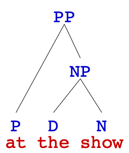
  
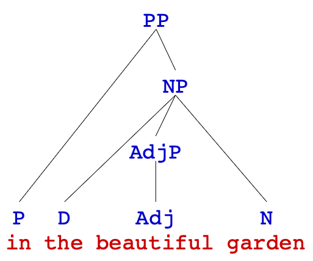

]

---
## **Prepositional Phrases (PP)**
 
.pull-left[  
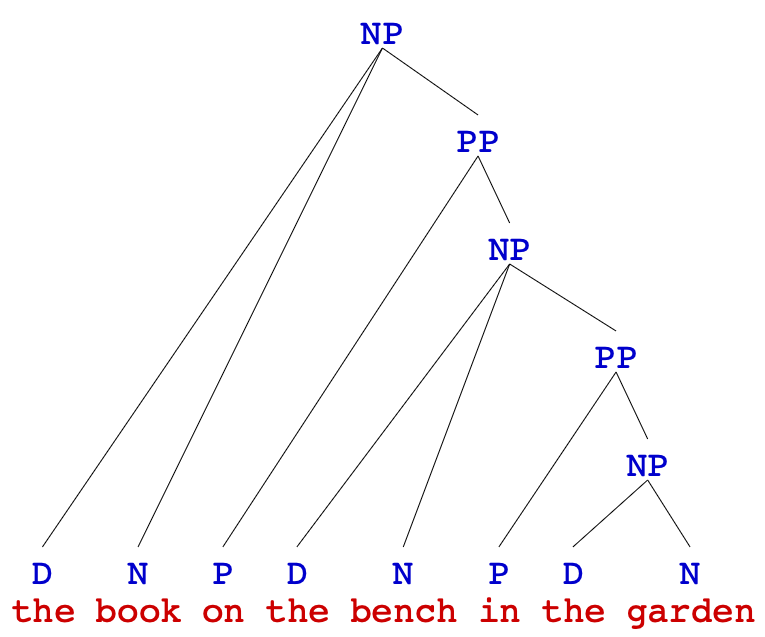
]
.pull-right[
what's **noticeble** if we put these two PSRs together  

<h3><b>PP</b> → <b>P</b> <b>NP</b></h3> 
<h3><b>NP</b> → (D) (AdjP+) <b>N</b> (<b>PP</b>+)</h3>

  

- <b>PP</b> can contain <b>NP</b>, but <b>NP</b> can contain <b>PP</b> too  
- so we can have <b>NP</b> and <b>PP</b> nested to each other, go on and go on forever  
- this is an example of **recursion**, which is an important feature of human language
]

---
## **Prepositional Phrases (PP)**
 
these phrases both contain **two** <b>PP</b>s, but have **different** syntactic structures, why? 
  - recall the **modification rule** – a phrase that modifies a word must be its **sibling**
  
.pull-left[

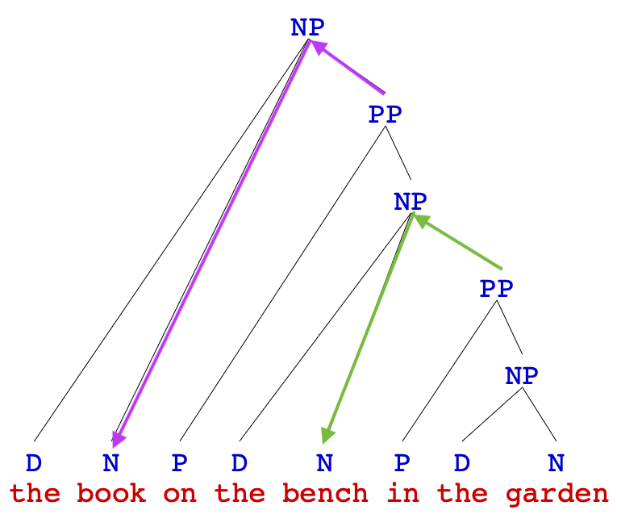
  
<i>the book on the bench in the garden</i>

]
.pull-right[

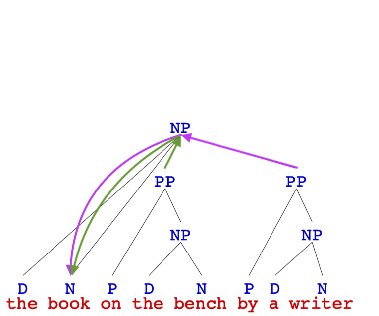
  
<i>the book on the bench by a writer</i>

]

---
## **Prepositional Phrases (PP)**
 
if we have this tree, what does it mean?

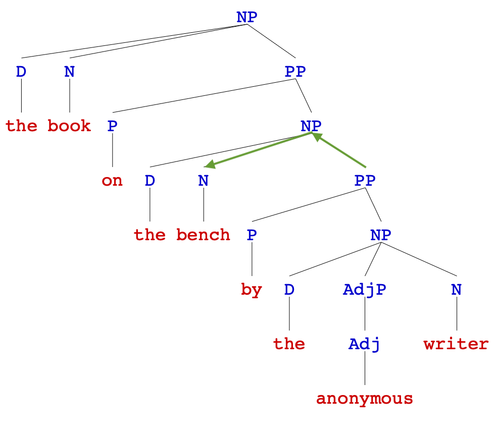
  
<i>the book on the bench by the anonymous writer</i>

---
.pull-left[
## **Exercise I**
### <b>NP</b>, <b>AdjP</b>, <b>AdvP</b>, <b>PP</b>
 
draw a **syntax tree** for the underlined phrases   
a. I ate <u>an apple</u>.  
b. John went <u>into the building</u>.  
c. They're like <u>peas in a pod</u>.  
d. The bakery sells <u>wonderfully fresh bread</u>.  
e. I like to drive <u>really slowly</u>.  
f. Mary helped <u>the man in the car with the flat tire</u>.  
g. I threw a ball to <u>the dog with a collar in the park</u>.
]
.pull-right[
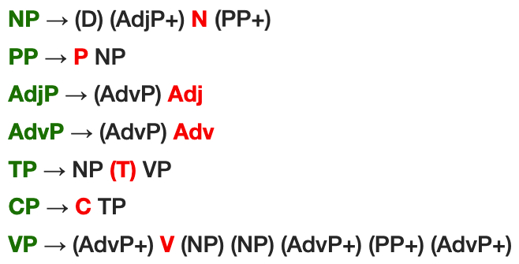
   

  
1. in **f** does <u><i>with the flat tire</i></u> modify 'the man' or 'the car'?
2. what about <i><u>in the park</i></u> in **g**?
]

---
.pull-left[
## **Exercise I**
### <b>NP</b>, <b>AdjP</b>, <b>AdvP</b>, <b>PP</b>
]
.pull-right[
]
  
.pull-left[
.pull-left[

]
.pull-right[
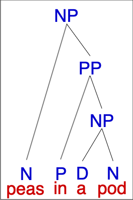
]
]
.pull-right[
.pull-left[

]
.pull-right[

]
]
  
.pull-left[
.pull-left[
b. '*into the building*'
]
.pull-right[
c. '*peas in a pod*'
]
]
.pull-right[
.pull-left[
d. '*wonderfully fresh bread*'
]
.pull-right[
e. '*really slowly*'
]
]
---
.pull-left[
## **Exercise I**
### <b>NP</b>, <b>AdjP</b>, <b>AdvP</b>, <b>PP</b>
 
**f. the man in the car with the flat tire**
  
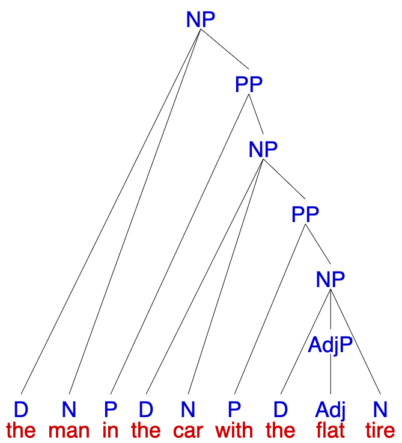
]
.pull-right[

  
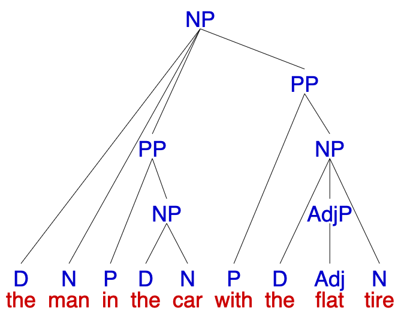
]
  
think about why it is the tree on the **left**, not the one on the **right** (both trees are correct according to PSRs).

---
class: center, middle
**Homework II** is due this Friday (**Oct 02**)  
**Homework III** will be published today (**Sept 30**) which is due next Friday (**Oct 09**)  
<b>continue reading</b> Chapter 3: Constituency, Trees, and Rules from <i>Andrew Carnie's Syntax textbook</i>  

  
Slides created via the R package [**xaringan**](https://github.com/yihui/xaringan).
