class: center, middle
## Please pick up your **name card** from the front

---
## **Previously on 201**
### **Phrase Structure Rules (PSRs) for NP, PP, AdjP and AdvP**
   
- <h3><b>NP</b> → (D) (AdjP+) <b>N</b> (PP+)</h3> 
- <h3><b>PP</b> → <b>P</b> NP</h3> 
- <h3><b>AdjP</b> → (AdvP) <b>Adj</b></h3> 
- <h3><b>AdvP</b> → (AdvP) <b>Adv</b></h3> 

---
.pull-left[
## **Exercise I**
### <b>NP</b>, <b>AdjP</b>, <b>AdvP</b>, <b>PP</b>
 
draw a **syntax tree** for the underlined phrases   
a. I ate <u>an apple</u>.  
b. John went <u>into the building</u>.  
c. They're like <u>peas in a pod</u>.  
d. The bakery sells <u>wonderfully fresh bread</u>.  
e. I like to drive <u>really slowly</u>.  
f. Mary helped <u>the man in the car with the flat tire</u>.  
g. I threw a ball to <u>the dog with a collar in the park</u>.
]
.pull-right[

   
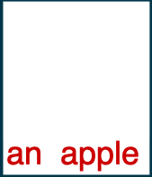
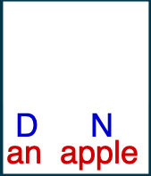
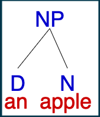
  
1. in **f** does <u><i>with the flat tire</i></u> modify 'the man' or 'the car'?
2. what about <i><u>in the park</i></u> in **g**?
]

---
.pull-left[
## **Exercise I**
### <b>NP</b>, <b>AdjP</b>, <b>AdvP</b>, <b>PP</b>
]
.pull-right[
]
  
.pull-left[
.pull-left[
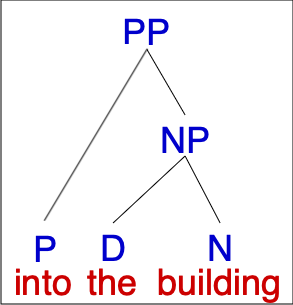
]
.pull-right[

]
]
.pull-right[
.pull-left[
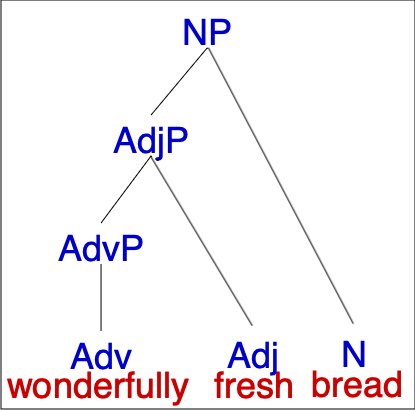
]
.pull-right[
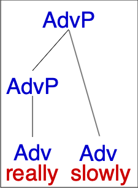
]
]
  
.pull-left[
.pull-left[
b. '*into the building*'
]
.pull-right[
c. '*peas in a pod*'
]
]
.pull-right[
.pull-left[
d. '*wonderfully fresh bread*'
]
.pull-right[
e. '*really slowly*'
]
]
---
.pull-left[
## **Exercise I**
### <b>NP</b>, <b>AdjP</b>, <b>AdvP</b>, <b>PP</b>
 
**f. the man in the car with the flat tire**
  
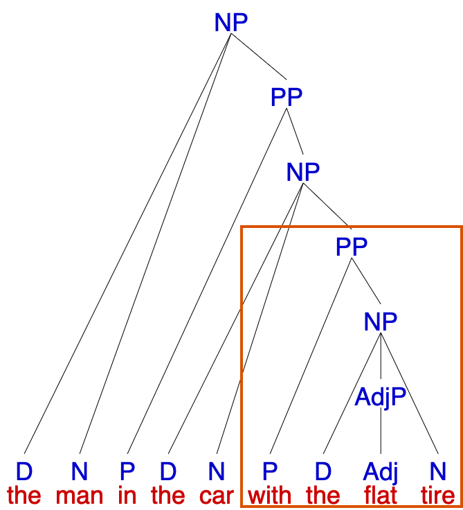
]
.pull-right[

  
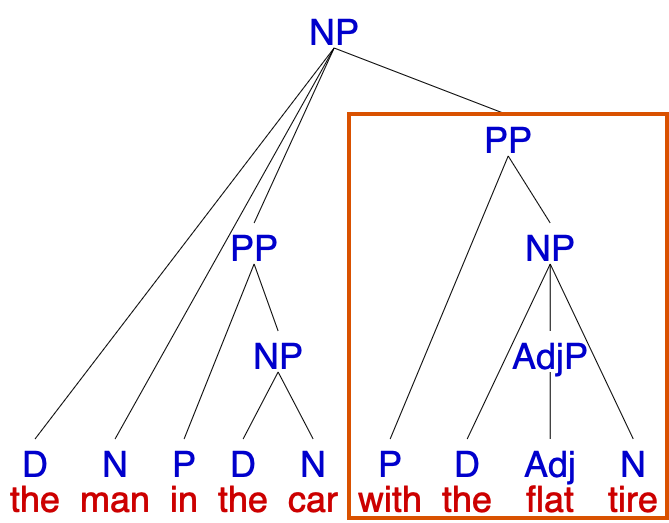
]
  
both trees above are correct according to **PSRs**, but what do they each mean?

---
## **Verb Phrases (VP)**
 
.pull-left[
- a verb phrase (**VP**) consists of **a verb** and everything that **modify** it  
- generally, this includes **everything** in a sentence except the **subject** (the entity that performs the action indicated by the verb)  
- the simplest **VP** is a single verb:
.pull-left[
- *Arthur <u>ate</u>*. 

- *Merlin <u>left</u>*.
    

<h3><b>VP</b>→ V</h3>
]
.pull-right[
**VP** → V 

**VP** → V
]  
]
.pull-right[
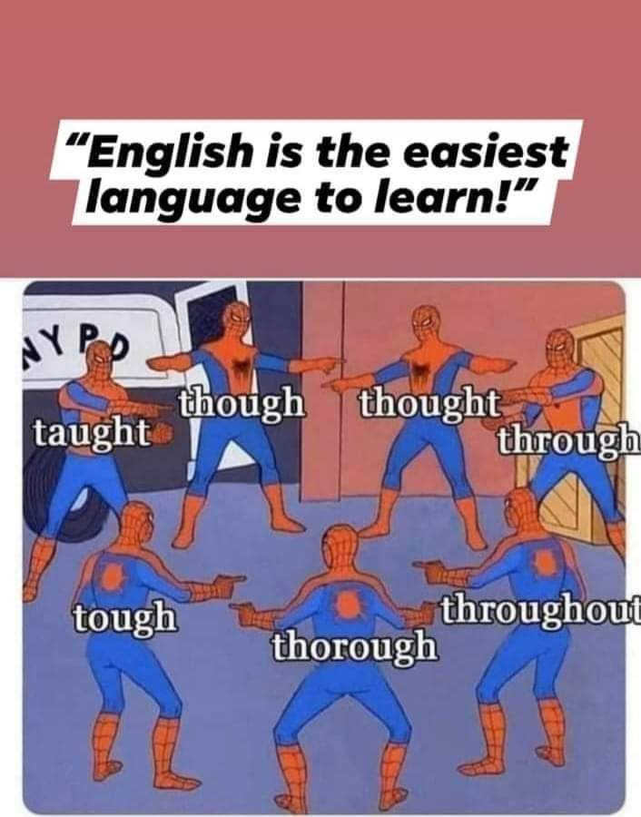
]

---
## **Verb Phrases (VP)**
 
.pull-left[
- besides the verb, **VP**s also contain any **objects** of the verb  
- <b>direct object</b>: person or entity **affected** by the action indicated by the verb 
  <b>direct object</b>s are <b>NP</b>s:
  - <i>Peter <u>baked [a cake]</u></i>.  
  
- <b>indirect object</b>: person or entity that **receives** something or **benefits** from the action 
  <b>indirect object</b> can be <b>PP</b>s or <b>NP</b>s:
  - <i>Peter <u>baked [a cake] [for his mom]</u></i>.
  - <i>Peter <u>baked [his mom] [a cake] </u></i>.
  

<h3><b>VP</b>→ V (NP) (NP/PP)</h3>
]
.pull-right[

]

---
## **Verb Phrases (VP)**
 
.pull-left[
- in addition to objects, a **VP** can contain <b>adjuncts</b>  
- they are **optional** elements that describe the **action** and therefore **modify** the verb  
- adjuncts may be <b>PP</b>s or <b>AdvP</b>s:  
  - <i>The train <u>arrived [at Shanghai]</u></i>. 
  **VP** → V PP  
  - <i>The train <u>arrived [quickly]</u></i>. 
  **VP** → V AdvP  
- a sentence can have multiple <b>adjuncts</b>:  
  - <i>The train <u>arrived [quickly] [at Shanghai]</u></i>. 
]
.pull-right[

]

---
class: center, middle
<h1><b>VP</b>→ <b>(AdvP+)</b> <b>V</b> <b>(NP)</b> <b>(NP)</b> <b>(AdvP+)</b> <b>(PP+)</b> <b>(AdvP+)</b></h1>
   

just remember a few things:  
1. a <b>VP</b> always has a verb <b>head</b> 
2. a <b>VP</b> can contain many <b>optional</b> things like <b>NP</b>, <b>PP</b>, and <b>AdvP</b> arguments and adjuncts, <b>BUT</b>:  
3. a <b>VP</b> does NOT contain the subject of the verb 
4. <b>VP</b>s will NOT directly contain an <b>AdjP</b> (since AdjPs describe nouns, not verbs) 
5. any <b>NP</b>s or <b>PP</b>s will always go after the verb 
6. objects and adjuncts will always be <b>siblings</b> of the verb

---
## **Tense Phrases (TP, Sentence)**
 
.pull-left[
**sentences** are also known as <b>tense phrases</b> (<b>TP</b>, or occasionally S), and it consists of:  
- <b>NP</b> – a required subject  
- <b>T</b> – an optional slot called "tense" that can be filled by:  
  1. modal verbs (*can*, *might*, *should...*)
  2. auxiliary verbs (*is*, *are*, *has*, *will*…)
  3. the infinitive marker *to* as in *to go*, *to see*
  4. PAST and PRESENT if there is no overt tense-marker as above  
- <b>VP</b> – a required verb phrase (sometimes called the predicate)
 
<h3><b>TP</b> → NP</b> <b>(T)</b> VP</b></h3>
]
.pull-right[
 
  
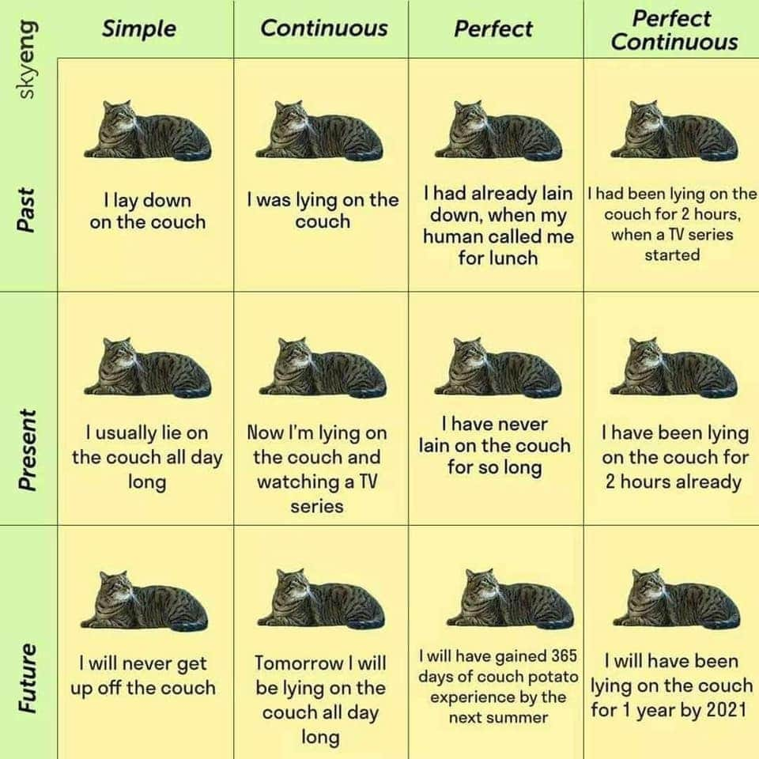
]

---
## **Steps for Drawing Trees**
 
1. write the sentence at the bottom of the page – leave yourself **plenty of room**  
2. label the **part of speech** of each word  
3. sentences have a subject <b>NP</b> and predicate **VP** – try to identify these first, and draw the subject  
4. trees should ALWAYS follow **PSR**s, so try to identify elements that can be part of rules for different phrases  
5. every <b>noun</b>, <b>adjective</b>, <b>adverb</b>, <b>preposition</b> has its own corresponding phrase <b>NP</b>, <b>AdjP</b>, <b>AdvP</b>, <b>PP</b>  
6. smaller trees first, then figure out how they connect to the rest of the tree  
<b>some notes</b>
- VPs can have lots of elements, so figure them out last
- **pay attention to what modifies what** – any phrase that modifies a word should be its **sibling**
- because of the way English is structured, it can often be easier to start at the end and work **backwards**

---
background-image: url("../pic/1005/oatmeal.png")
background-size: 85% auto

.pull-left[
### **<i>Arthur thoughtfully ate a bowl of hot oatmeal for breakfast</i>.**
]
.pull-right[

 
let's do a this tree <b>bottom-to-top</b>together

]

---
background-image: url("../pic/1005/oatmeal0.png")
background-size: 85% auto

.pull-left[
### **<i>Arthur thoughtfully ate a bowl of hot oatmeal for breakfast</i>.**
]
.pull-right[

 
first, write out the <b>words</b> 
and label the parts of speech
  
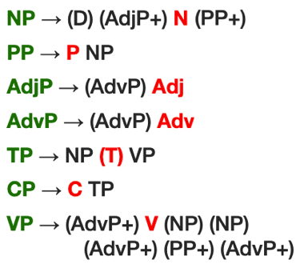

]

---
background-image: url("../pic/1005/oatmeal1.png")
background-size: 85% auto

.pull-left[
### **<i>Arthur thoughtfully ate a bowl of hot oatmeal for breakfast</i>.**
]
.pull-right[

 
first, write out the words 
and label the <b>parts of speech</b>
  

]

---
background-image: url("../pic/1005/oatmeal2.png")
background-size: 85% auto

.pull-left[
### **<i>Arthur thoughtfully ate a bowl of hot oatmeal for breakfast</i>.**
]
.pull-right[

 
find out where <b>T</b> should be  
since it breaks apart <b>NP</b> and <b>VP</b> in the sentence
  
usually we look for the <b>subject</b> and the <b>main verb</b> 
in this case, it is <i>Arthur</i> and <i>ate</i>
  

]

---
background-image: url("../pic/1005/oatmeal3.png")
background-size: 85% auto

.pull-left[
### **<i>Arthur thoughtfully ate a bowl of hot oatmeal for breakfast</i>.**
]
.pull-right[

 
draw a tree for the whole sentence by using 
<b>TP</b> → <b>NP</b> T <b>VP</b> at the top  
identify any **T** and connect it  
if there's no **T**,you might need to think about 
if it is **PRESENT** or **PAST** tense
  

]

---
background-image: url("../pic/1005/oatmeal4.png")
background-size: 85% auto

.pull-left[
### **<i>Arthur thoughtfully ate a bowl of hot oatmeal for breakfast</i>.**
]
.pull-right[

 
identify the subject <b>NP</b> and draw its tree
  

]

---
background-image: url("../pic/1005/oatmeal5.png")
background-size: 85% auto

.pull-left[
### **<i>Arthur thoughtfully ate a bowl of hot oatmeal for breakfast</i>.**
]
.pull-right[

 
everything left over is the <b>VP</b>  
the <b>VP</b> always has a head <b>V</b> 
identify it and connect it to the <b>VP</b>
  

]

---
background-image: url("../pic/1005/oatmeal6.png")
background-size: 85% auto

.pull-left[
### **<i>Arthur thoughtfully ate a bowl of hot oatmeal for breakfast</i>.**
]
.pull-right[

 
check there are any adjectives or adverbs 
that you can make simple <b>AdjP</b>s or <b>AdvP</b>s for?
  

]

---
background-image: url("../pic/1005/oatmeal7.png")
background-size: 85% auto

.pull-left[
### **<i>Arthur thoughtfully ate a bowl of hot oatmeal for breakfast</i>.**
]
.pull-right[

 
what does this <b>AdvP</b> **modify**?  
if A modifies B, A must be a **sibling** of B  
<i><u>thoughtfully</u></i> modifies the verb <i><u>ate</u></i> 
so they're part of the same <b>VP</b>
  

]

---
background-image: url("../pic/1005/oatmeal8.png")
background-size: 85% auto

.pull-left[
### **<i>Arthur thoughtfully ate a bowl of hot oatmeal for breakfast</i>.**
]
.pull-right[

 
can we connect this <b>AdjP</b> 
in the same way to the same <b>VP</b>?
  

]

---
background-image: url("../pic/1005/oatmeal9.png")
background-size: 85% auto

.pull-left[
### **<i>Arthur thoughtfully ate a bowl of hot oatmeal for breakfast</i>.**
]
.pull-right[

 
what does this <b>AdjP</b> **modify**?  
if A modifies B, A must be a **sibling** of B  
<i><u>hot</u></i> modifies the noun <i><u>oatmeal</u></i> 
so they're part of the same <b>NP</b>
  

]

---
background-image: url("../pic/1005/oatmeal10.png")
background-size: 85% auto

.pull-left[
### **<i>Arthur thoughtfully ate a bowl of hot oatmeal for breakfast</i>.**
]
.pull-right[

 
if there are any other nouns  they should also go into an <b>NP</b>
  

]

---
background-image: url("../pic/1005/oatmeal11.png")
background-size: 85% auto

.pull-left[
### **<i>Arthur thoughtfully ate a bowl of hot oatmeal for breakfast</i>.**
 

]
.pull-right[

 
are there any **prepositions** you can draw <b>PP</b>s for?
any <b>PP</b> should contain the **P** and the following <b>NP</b>

]

---
background-image: url("../pic/1005/oatmeal12.png")
background-size: 85% auto

.pull-left[
### **<i>Arthur thoughtfully ate a bowl of hot oatmeal for breakfast</i>.**
 

]
.pull-right[

 
what does the <b>PP</b> <i><u>of hot oatmeal</u></i> **modify**? 
it needs to be a **sibling** of the word it modifies  
recall that an <b>NP</b> 
includes everything that modifies **N** 
so the <b>PP</b> is part of the <b>NP</b>  
we don't end up with separate the <b>NP</b> <i><u>for a bowl</u></i>.

]

---
background-image: url("../pic/1005/oatmeal13.png")
background-size: 85% auto

.pull-left[
### **<i>Arthur thoughtfully ate a bowl of hot oatmeal for breakfast</i>.**
 

]
.pull-right[

 
what does the <b>PP</b> <i><u>for breakfast</u></i> **modify**? 
it needs to be a **sibling** of the word it modifies

]

---
background-image: url("../pic/1005/oatmeal14.png")
background-size: 85% auto

.pull-left[
### **<i>Arthur thoughtfully ate a bowl of hot oatmeal for breakfast</i>.**
 

]
.pull-right[

 
does the verb <i><u>ate</u></u> have any objects?  
or what is **eaten**?  
that something goes directly under the **VP**

]

---
.pull-left[
## **Exercise II**
### <b>VP</b>, <b>TP</b>
 
draw **syntax trees** for the following sentences.
  
a. The robin caught a worm.  
b. The mockingbird was singing.  
c. The sparrow on the windowsill chirped loudly.  
d. The osprey brought its hungry chicks a fish.  
e. The large owl lives in a nest in the barn.  
f. The duck quickly led her ducklings across the street.  
]
.pull-right[

]

---
## **Exercise II**
### <b>VP</b>, <b>TP</b>
  
.pull-left[
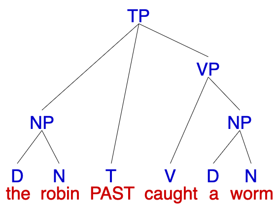
]
.pull-right[
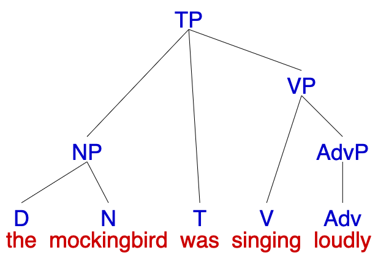
]
  
.pull-left[
a. '*The robin caught a worm*.'
]
.pull-right[
b. '*The mockingbird was singing loudly*.'
]

---
## **Exercise II**
### <b>VP</b>, <b>TP</b>
  
.pull-left[
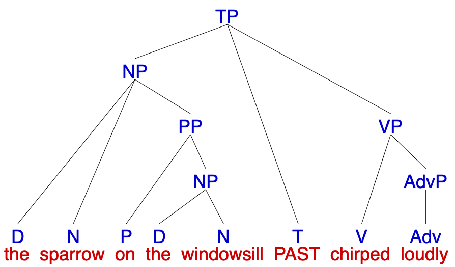
]
.pull-right[
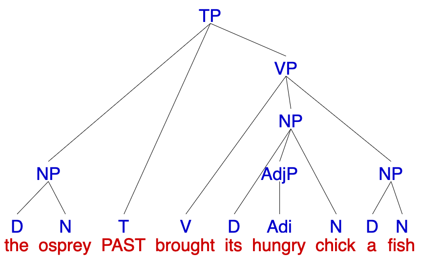
]
  
.pull-left[
c. '*The sparrow on the windowsill chirped loudly*.'
]
.pull-right[
d. '*The osprey brought its hungry chicks a fish*.'
]

---
## **Exercise II**
### <b>VP</b>, <b>TP</b>
  
.pull-left[
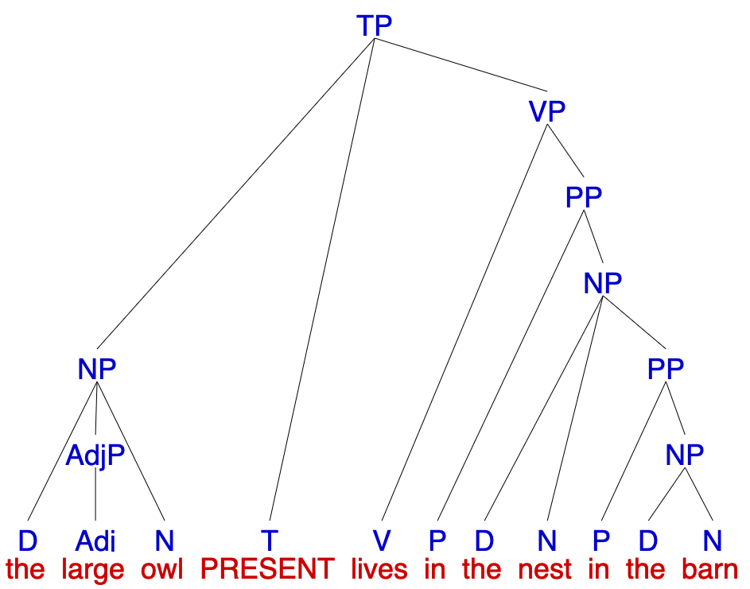
]
.pull-right[
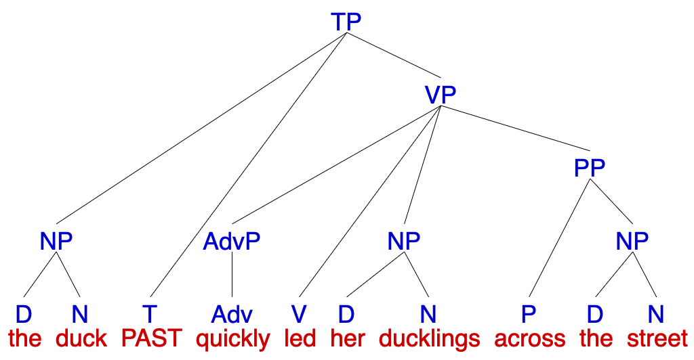
]
  
.pull-left[
e. '*The large owl lives in a nest in the barn*.'
]
.pull-right[
f. '*The duck quickly led her ducklings across the street*.'
]

---
class: center, middle
**Assignment III** is due this Sunday (**Oct 11**) at **11:59 pm**  
<b>continue reading</b> Chapter 3: Constituency, Trees, and Rules from <i>Andrew Carnie's Syntax textbook</i>  
start preparing for the **MIDTERM**, materials uploaded to the canvas    

  
Slides created via the R package [**xaringan**](https://github.com/yihui/xaringan).
