class: center, middle
## Please pick up your **name card** from the front
  
## **office hours**: Mondays, 2:00-3:00 pm 
## Basement, Room 003, **Linguistics Building**

---
## **Assignment II**
  
<h3><b>that </b></h3>
 
<i>that person</i> (determiner, D) 
<i>I know that you are right</i>. (complementiser, C)
    
<h3><b>the spy saw the agent with the binoculars on the roof</b></h3> 
<h3><b>the spy saw the agent with the binoculars on the roof</b></h3>  

 
---
class: center, middle
## **START REVIEWING** for the **Midterm**
  
## **Oct 14**, class time in the same classroom
  
## you are allowed to have a cheat sheet 
## but you have to make your own
  
You may bring to the exam **one sheet of paper with any (printed or handwritten) notes you choose** -- 8.5 × 11 in. (standard US letter paper size) or smaller, front and back -- that you may consult during the exam, but otherwise it is a closed-book, closed-notes exam
 
 
---
## **Previously on 201**
### **Phrase Structure Rules (PSRs) for VP, TP**
  
- <h3><b>VP</b> → (AdvP+) <b>V</b> (NP) (NP) (AdvP+) (PP+) (AdvP+)</h3> 
- <h3><b>TP</b> → NP <b>(T) VP</b></h3>  
- <h3><b><i>Arthur thoughtfully ate a bowl of hot oatmeal for breakfast.</i></b></h3>  
- <h3><b>steps of drawing trees for simple sentences</b></h3>

---
## **Steps for Drawing Trees**
 
1. write the sentence at the bottom of the page – leave yourself **plenty of room**  
2. label the **part of speech** of each word  
3. sentences have a subject <b>NP</b> and predicate **VP** – try to identify these first, and draw the subject  
4. trees should ALWAYS follow **PSR**s, so try to identify elements that can be part of rules for different phrases  
5. every <b>noun</b>, <b>adjective</b>, <b>adverb</b>, <b>preposition</b> has its own corresponding phrase <b>NP</b>, <b>AdjP</b>, <b>AdvP</b>, <b>PP</b>  
6. smaller trees first, then figure out how they connect to the rest of the tree  
<b>some notes</b>
- VPs can have lots of elements, so figure them out last
- **pay attention to what modifies what** – any phrase that modifies a word should be its **sibling**
- because of the way English is structured, it can often be easier to start at the end and work **backwards**

---
class: center, middle
## **John said Mary went to the store quickly.**

---
## **Simple and Complex Sentences**
 
.pull-left[
- so far we've been studying **simple sentences: sentences** with **one** subject <b>NP</b> and one predicate <b>VP</b>  
- now we're going to talk about **complex sentences** : sentencesthat have another sentence (clause) **embedded** inside of them  
  - *She said [that <b>she went to China</b>]*.  
  - *I bought an umbrella [because<b> it was raining</b>]*.  
  - *That's the movie [<b>I saw</b>]*.  
  - *The book [that <b>I read</b>] was very interesting*.
]
.pull-right[

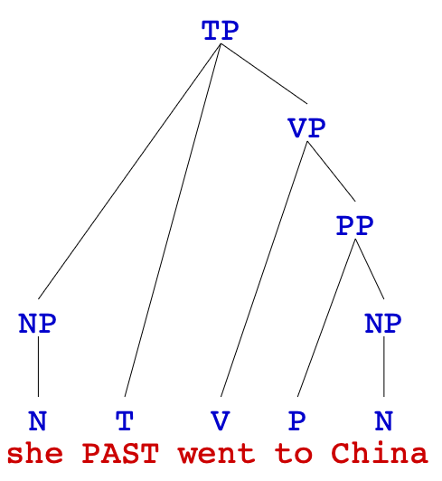  
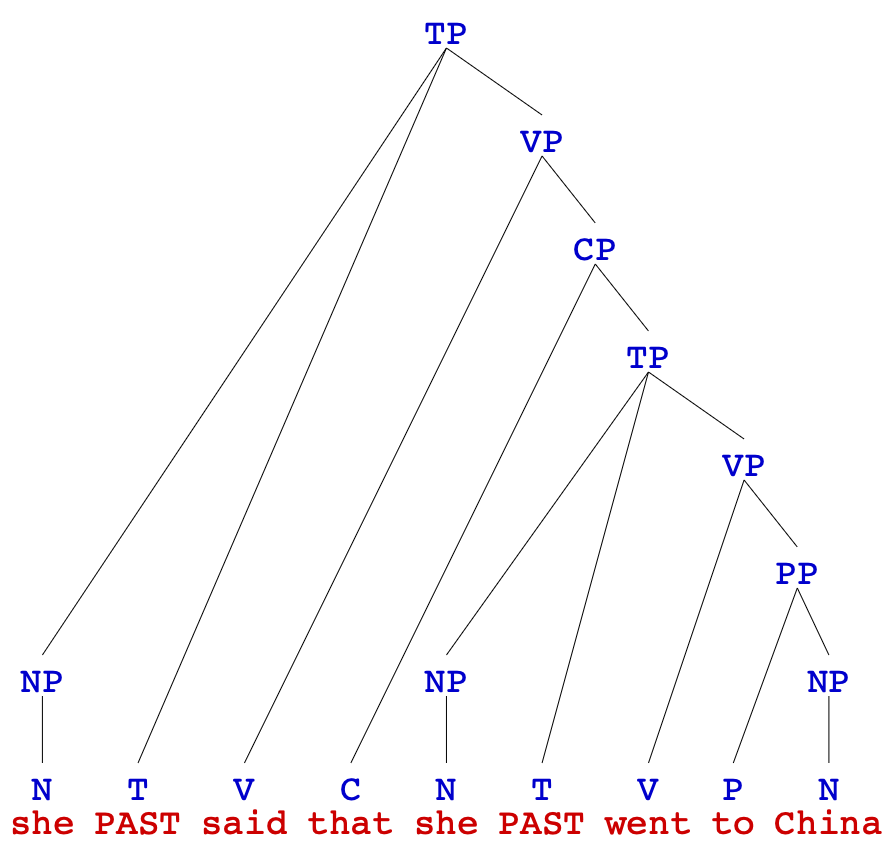

]

---
## **Complementiser Phrases (CP)**
 
.pull-left[
consider the following sentence:   
  - <i>Tina thinks <u>that her brother has finished his homework</u></i>. 

is the underlined string a constituent?  
]
.pull-right[]

--

.pull-left[
- **movement test** 
  <i><u>That her brother has finished his homework</u></i> 
  <b>is what</b> Tina thinks.   
- **fragment test** 
  What does Tina think? 
  <i><u>That her brother has finished his homework</u></i>.  
  
<b>CP</b>s are sentences preceded by a **complementiser** 
- <h3><b>CP</b> → <b>C</b> TP</h3>]

.pull-right[
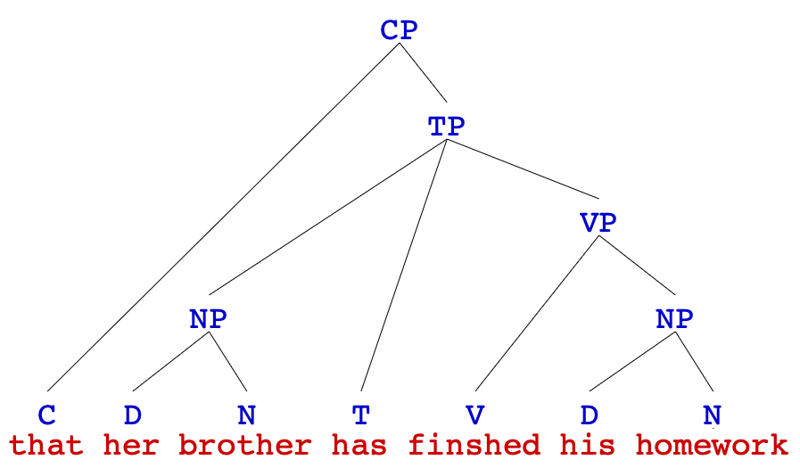
  
*'that her brother has finished his homework'*
]

---
.pull-left[
## **Complex Sentences**
  
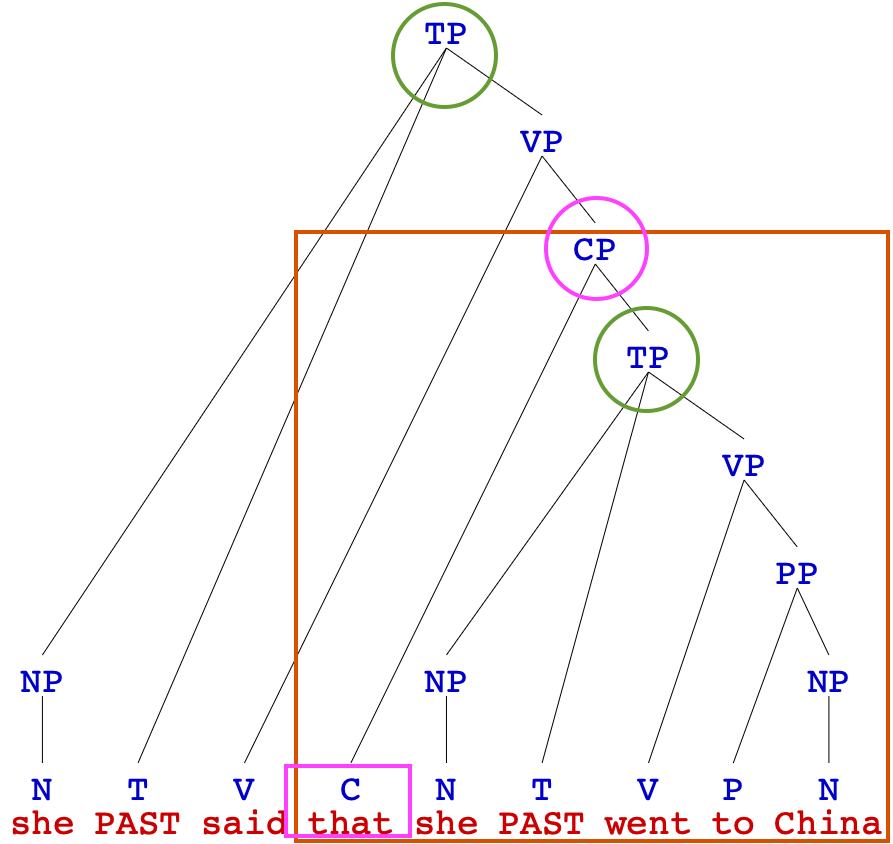
]
.pull-right[
  
- A **complementiser** can connect two <b>TP</b>s together  
- **two parts** of a complex sentence:  
- <b>dependent clause</b> (aka subordinate clause, embedded clause, embedded sentence) – the sentence that has been **inserted** into the larger sentence  
  - *She said [that <b> she went to China</b>]*.  
- <b>main clause</b> (aka independent clause, main sentence) – the **full** sentence, technically **including the dependent clause**, since the dependent clause is inside of the main clause  
  - *<b>She said [that she went to China]</b>*.
]

---
## **Complementisers**
 
- dependent clauses are usually linked to main clauses with a special type of word called a **complementiser** or **subordinating conjunction** (relative pronouns are a subtype):  
  - *that*, *which*, *because*, *if*, *so*, *since*, *which*, *who*, *although*, *where*...  
  - *She said [CP <b>that</b> she went to China ] *.  
  - *I bought an umbrella [CP  <b>because</b> it was raining ]*.  
  - *Please tell me [CP  <b>if</b> you're going to the store ]*.  
- sometimes the complementiser is **omitted** (often in English, that can be variably omitted):  
  - *She said [CP  <b>(that)</b> she went to China ]*.  
  - *The book [CP  <b>(that)</b> I read] is about dinosaurs*.  
  - *Ben thought [CP  <b>(that)</b> he was going to be late]*.

---
## **Structure of Dependent Clauses**
 
.pull-left[
- dependent clauses are **embedded sentences**, so we will also take them as a <b>TP</b>   
- dependent clause <b>TP</b>s are then inserted into a larger constituent called the **complementizer phrase** or <b>CP</b>: <b>CP</b> → **(C)** <b>TP</b>
  - C (complementizer), is optional  
- <b>CP</b> is then inserted into the **main clause**  
- **note** that some dependent clauses don NOT have an explicit subject NP   
  - *He wants [TP <b>Ø</b> to go to Machu Picchu ]*.  
  - *I know the author [CP who [TP <b>Ø</b> wrote this book ] ]*.
]
.pull-right[

  
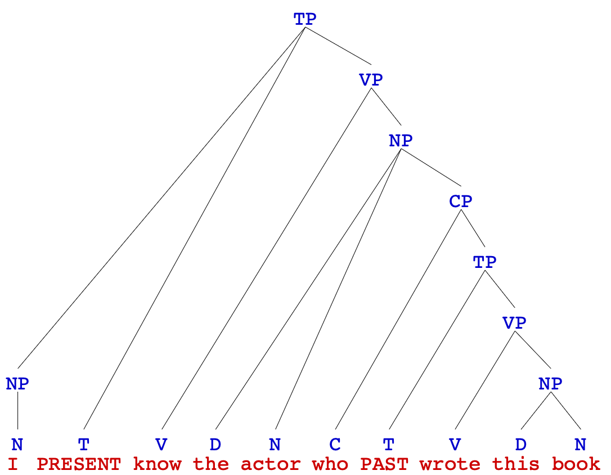

]

---
## **CPs inside VPs**
 
.pull-left[

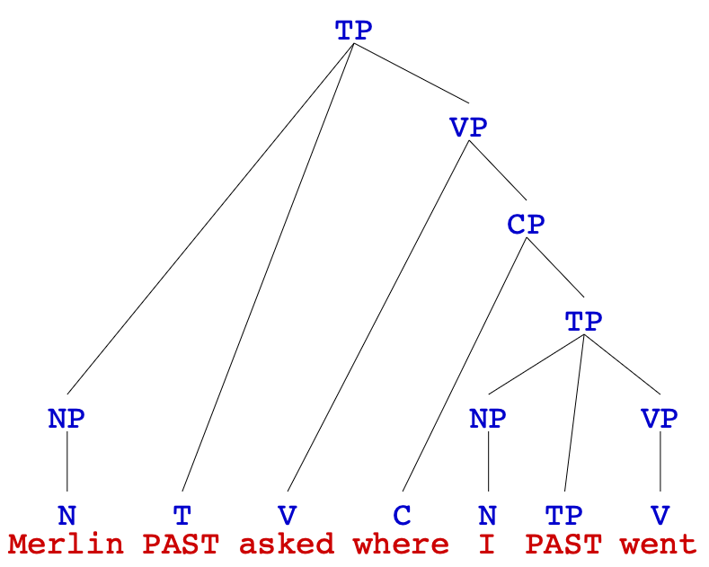
  
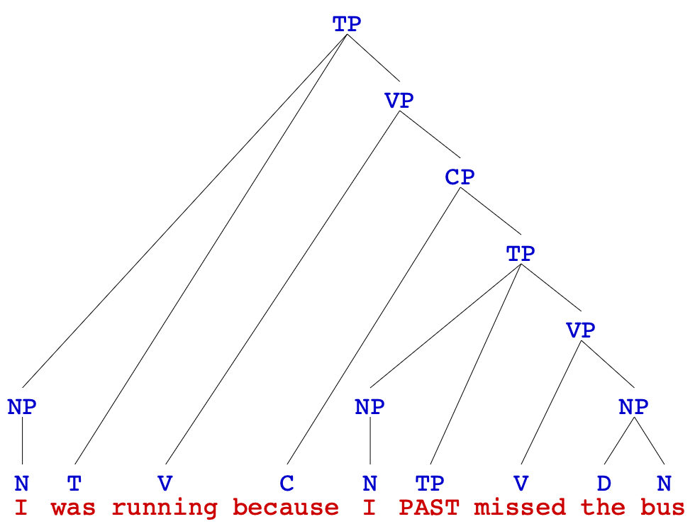

]
.pull-right[
- four roles <b>CP</b> can play in a sentence:   
1. take the role of an <b>NP</b>, acting as the **object**   
  - *Merlin [VP asked [NP a question ] ]*.
  - → *Merlin [VP asked [CP where I went ] ]*.  
2. take the role of <b>AdvP</b>, acting as an **adjunct**  
  - *I was [VP running [AdvP quickly ] ]*.
  - → *I was [VP running [CP because I missed the bus ] ]*.  
  
- since these <b>CP</b>s go inside **VP**s, let's modify our **VP** rule to account for these two cases: 
  - **VP** → (AdvP+) **V** (NP) **({**<b>NP</b>, <b>CP</b>**})** (AdvP+) (PP+) (AdvP+) <b>(CP+)</b>
]

---
## **CPs inside NPs**
 
.pull-left[

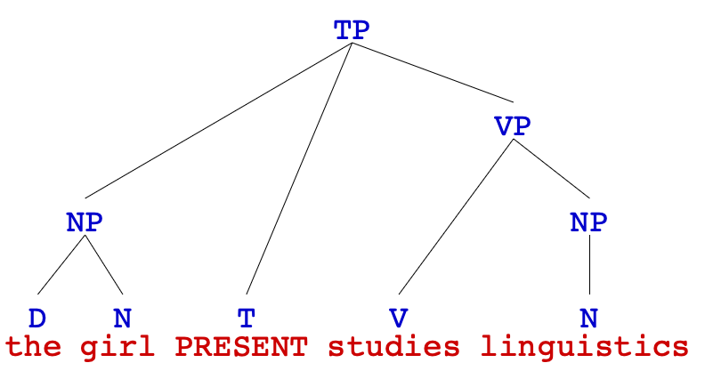
  
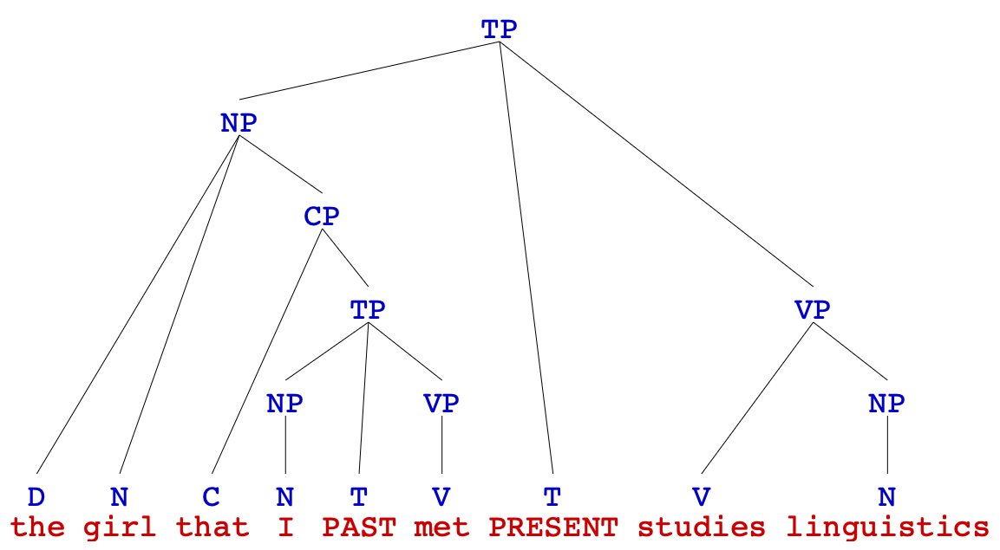

]
.pull-right[
- four roles <b>CP</b> can play in a sentence:   
- act **like** an <b>AdjP</b>, modifying a noun and going inside an <b>NP</b>  
  - *[NP The girl ] studies linguistics*.
  - *[NP The girl [CP that I met ] ] studies linguistics*.  
- these can go inside an <b>NP</b> anywhere in the sentence:  
  - *[NP The book [CP I read ] ] is about geology*.
  - *She bought [NP the book [CP I read ] ]*.  
- since these <b>CP</b>s go inside <b>NP</b>s, let's modify our <b>NP</b> rule:
  - <b>NP</b> → (D) (AdjP+) **N** (PP+) <b>(CP+)</b>
]

---
## **CPs as the Subject**
    
.pull-left[
  
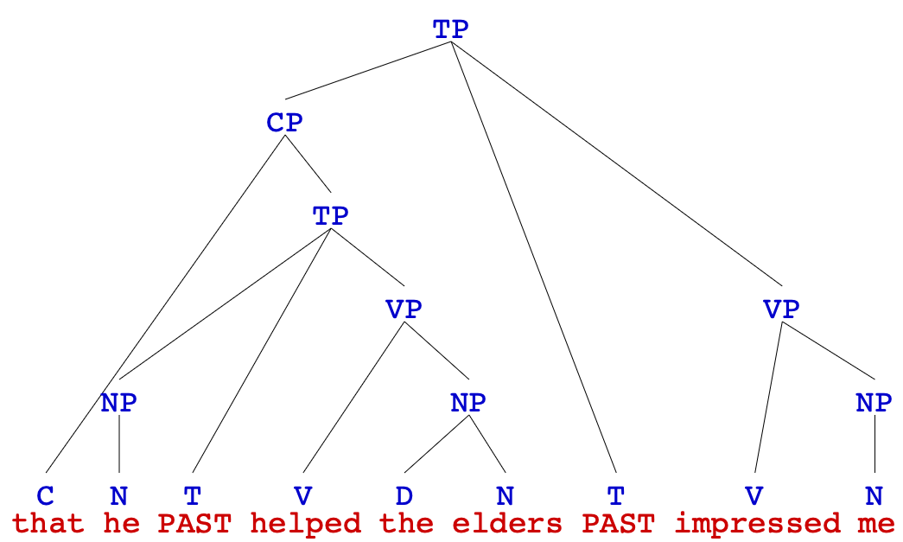
]
.pull-right[
- four roles <b>CP</b> can play in a sentence:   
- act as **the subject**, going into a <b>TP</b>  
  - *[TP [NP That story ] impressed me ]*.
  - *[TP [CP That he helped the elders ] impressed me ]*.  
- since these <b>CP</b>s go inside <b>TP</b>ss, let's modify our <b>TP</b>s rule:
  - <b>TP</b>s → **{**<b>NP</b>, <b>CP</b>**}** **(T)** VP
]

---
## **Modified Phrase Structure Rules for English**
 
.pull-left[
- <h3><b>NP</b> → (D) (AdjP+) <b>N</b> (PP+) (CP+)</h3> 
- <h3><b>PP</b> → <b>P</b> NP</h3> 
- <h3><b>AdjP</b> → (AdvP) <b>Adj</b></h3> 
- <h3><b>AdvP</b> → (AdvP) <b>Adv</b></h3> 
]
.pull-right[
- <h3><b>TP</b> → **{**NP, CP**}** <b>(T)</b> VP</h3> 
- <h3><b>CP</b> → <b>(C)</b> TP</h3> 
]
- <h3><b>VP</b> → (AdvP+) <b>V</b> (NP) ({NP, CP}) (AdvP+) (PP+) (AdvP+) (CP+)</h3>

---
## **Drawing Complex Sentences**
 
- if a sentence has **two main verbs** joined by a **complementizer**, it's **complex**  
- this doesn't include sentences with two main verbs joined by a **coordinating
conjunction** like <i><u>and</u></i>, <i><u>or</u></i>, <i><u>but</u></i>  

<i>I read a book **and** I took a walk</i>.

  
- then identify which of these verbs is in the **main** clause, and which is in the **subordinate** clause  
  - the **subordinate** clause is the one that <b>starts with a complementiser</b>
  - but be aware that the complementiser that is sometimes **omitted**
  - draw the tree for the subordinate clause first  
- draw the tree for the **main** clause without the subordinate clause, then figure out <b>how the two are connected</b>  
  - does the subordinate clause modify a noun (goes in to <b>NP</b>)
  - is it part of the main clause's VP (goes in to **VP**)
  - is is the subject (goes into <b>TP</b>)
  

---
.pull-left[
## **Exercise III**
### complex sentences
 
draw **syntax trees** for the following sentences.
   
a. John said that he likes pizza.  
b. The dog I saw can run fast.  
c. I will take an umbrella if it rains.  
d. I saw a deer that was grazing in the park.  
e. I am studying because I am taking a test tomorrow.  
f. That Merlin randomly did his part of work totally ruined the whole plan..
]
.pull-right[
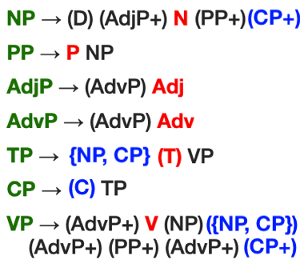
]

---
## **Exercise III**
### complex sentences
  
.pull-left[
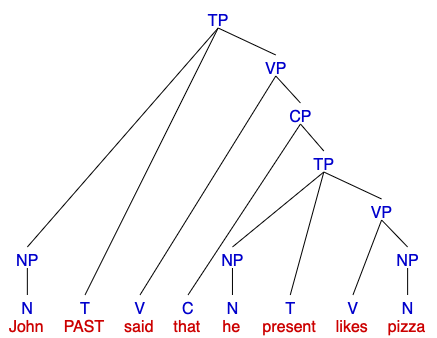  
]
.pull-right[
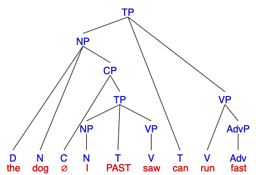  
]

.pull-left[
a. '*John said that he likes pizza*.'
]
.pull-right[
b. '*The dog I saw can run fast*.'
]

---
.pull-left[
## **Exercise III**
### complex sentences
     
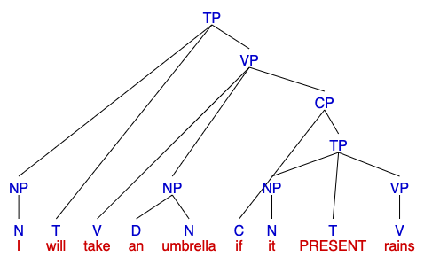  
]
.pull-right[
     
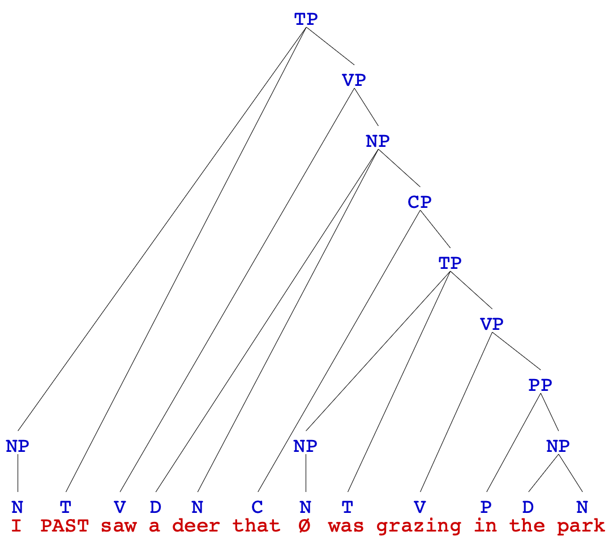  
]

.pull-left[
c. '*I will take an umbrella if it rains*.'
]
.pull-right[
d. '*I saw a deer that was grazing in the park*.'

]

---
## **Exercise III**
### complex sentences
 

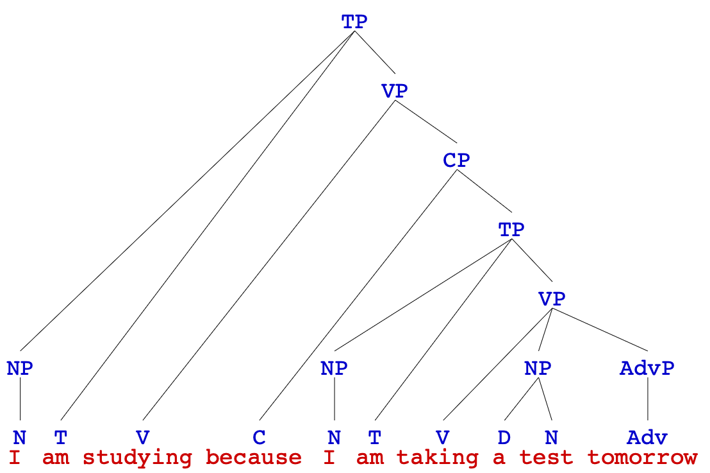  
e. '<i>I am studying because I am taking a test tomorrow</i>.'

---
## **Exercise III**
### complex sentences
 

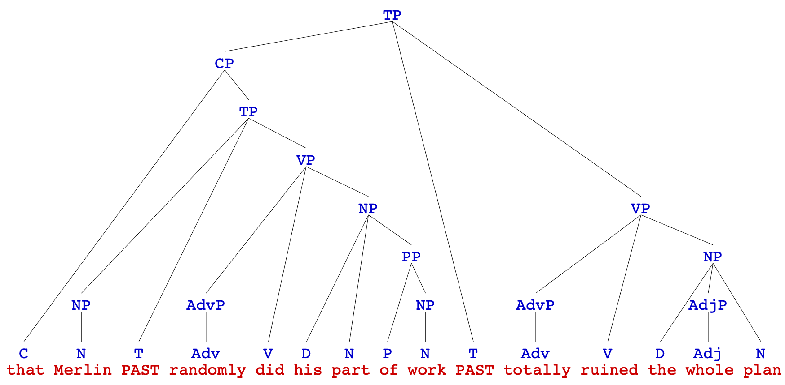  
f. '<i>That Merlin randomly did his part of work totally ruined the whole plan</i>.'
]

---
.pull-left[
### **Cross-linguistic Comparison**
 
state at least **three differences** between English and the following languages, using just the sentence(s) given, 
**ignore** lexical differences (i.e., the different vocabulary)  
]
.pull-right[

]
.pull-left[
### ***Thai***
 

<table style="width:100%; table-layout:auto; border-collapse:collapse;">
  <tr>
    <td style="white-space:nowrap;">(a)</td>
    <td style="white-space:nowrap;">dèg</td>
    <td style="white-space:nowrap;">khon</td>
    <td style="white-space:nowrap;">níi</td>
    <td style="white-space:nowrap;">kamlang</td>
    <td style="white-space:nowrap;">kin</td>
  </tr>
  <tr>
    <td style="white-space:nowrap;"></td>
    <td style="white-space:nowrap;">boy</td>
    <td style="white-space:nowrap;">CL</td>
    <td style="white-space:nowrap;">this</td>
    <td style="white-space:nowrap;">PROG</td>
    <td style="white-space:nowrap;">eat</td>
  </tr>
  <tr>
    <td style="white-space:nowrap;"></td>
    <td colspan="5" style="text-align:left; padding-bottom:20px;">
    '<i>This boy is eating</i>.'
    </td>
  </tr>
  <tr>  
    <td style="white-space:nowrap;"></td>
  </tr>
  <tr>
    <td style="white-space:nowrap;">(b)</td>
    <td style="white-space:nowrap;">mǎa</td>
    <td style="white-space:nowrap;">tua</td>
    <td style="white-space:nowrap;">nán</td>
    <td style="white-space:nowrap;">kin</td>
    <td style="white-space:nowrap;">khâaw</td>
  </tr>
  <tr>
    <td style="white-space:nowrap;"></td>
    <td style="white-space:nowrap;">dog</td>
    <td style="white-space:nowrap;">CL</td>
    <td style="white-space:nowrap;">that</td>
    <td style="white-space:nowrap;">eat</td>
    <td style="white-space:nowrap;">rice</td>
  </tr>
  <tr>
    <td style="white-space:nowrap;"></td>
    <td colspan="5" style="text-align:left; padding-bottom:20px;">
    '<i>That dog ate rice</i>.'
    </td>
  </tr>
</table>

CL = classifier
]

--

.pull-right[
### **Thai vs English**
 

1. Thai has **classifiers** (no English equivalent)  
2. demonstratives (**this / that**) follow the noun in Thai but precede it in English  
3. the **progressive** is expressed by a **separate** word in Thai and the verb does not change form
]

---
.pull-left[
### **Cross-linguistic Comparison**
 
state at least **three differences** between English and the following languages, using just the sentence(s) given, 
**ignore** lexical differences (i.e., the different vocabulary)  
]
.pull-right[

]

### ***French***
 

<table style="width:100%; table-layout:auto; border-collapse:collapse;">
  <tr>
    <td style="white-space:nowrap;">(a)</td>
    <td style="white-space:nowrap;">cet</td>
    <td style="white-space:nowrap;">homme</td>
    <td style="white-space:nowrap;">intelligent</td>
    <td style="white-space:nowrap;">comprendra</td>
    <td style="white-space:nowrap;">la</td>
    <td style="white-space:nowrap;">question</td>
  </tr>
  <tr>
    <td style="white-space:nowrap;"></td>
    <td style="white-space:nowrap;">this</td>
    <td style="white-space:nowrap;">man</td>
    <td style="white-space:nowrap;">intelligent</td>
    <td style="white-space:nowrap;">will understand</td>
    <td style="white-space:nowrap;">the</td>
    <td style="white-space:nowrap;">question</td>
  </tr>
  <tr>
    <td style="white-space:nowrap;"></td>
    <td colspan="6" style="text-align:left; padding-bottom:20px;">
    '<i>This intelligent man will understand the question</i>.'</td>
  </tr>
  <tr>
    <td style="white-space:nowrap;"></td>
  </tr>
  <tr>
    <td style="white-space:nowrap;">(b)</td>
    <td style="white-space:nowrap;">ces</td>
    <td style="white-space:nowrap;">hommes</td>
    <td style="white-space:nowrap;">intelligents</td>
    <td style="white-space:nowrap;">comprendront</td>
    <td style="white-space:nowrap;">les</td>
    <td style="white-space:nowrap;">questions</td>
  </tr>
  <tr>
    <td style="white-space:nowrap;"></td>
    <td style="white-space:nowrap;">these</td>
    <td style="white-space:nowrap;">men</td>
    <td style="white-space:nowrap;">intelligent.PL</td>
    <td style="white-space:nowrap;">will understand.PL</td>
    <td style="white-space:nowrap;">the.PL</td>
    <td style="white-space:nowrap;">questions.PL</td>
  </tr>
  <tr>
    <td style="white-space:nowrap;"></td>
    <td colspan="6" style="text-align:left; padding-bottom:20px;">
    '<i>These intelligent men will understand the questions</i>.'</td>
  </tr>
</table>
 
PL = plural

---
.pull-left[
### **Cross-linguistic Comparison**
 
state at least **three differences** between English and the following languages, using just the sentence(s) given, 
**ignore** lexical differences (i.e., the different vocabulary)  
]
.pull-right[

]

### ***Greek***
 

<table style="width:100%; table-layout:auto; border-collapse:collapse;">
<tr>
<td style="white-space:nowrap;">(a)</td>
<td style="white-space:nowrap;">ego</td>
<td colspan="2" style="white-space:nowrap;">edos-a</td>
<td colspan="2" style="white-space:nowrap;">s-to</td>
<td colspan="2" style="white-space:nowrap;">skyl-o</td>
<td colspan="2" style="white-space:nowrap;">en-a</td>
<td colspan="2" style="white-space:nowrap;">kokkal-o</td>
</tr>
<tr>
<td style="white-space:nowrap;"></td>
<td style="white-space:nowrap;">ego</td>
<td style="white-space:nowrap;">edos-</td>
<td style="white-space:nowrap;">a</td>
<td style="white-space:nowrap;">s-</td>
<td style="white-space:nowrap;">to</td>
<td style="white-space:nowrap;">skyl-</td>
<td style="white-space:nowrap;">o</td>
<td style="white-space:nowrap;">en-</td>
<td style="white-space:nowrap;">a</td>
<td style="white-space:nowrap;">kokkal-</td>
<td style="white-space:nowrap;">o</td>
</tr>
<tr>
<td style="white-space:nowrap;"></td>
<td style="white-space:nowrap;">I</td>
<td style="white-space:nowrap;">give-</td>
<td style="white-space:nowrap;">PST.1SG</td>
<td style="white-space:nowrap;">to</td>
<td style="white-space:nowrap;">the</td>
<td style="white-space:nowrap;">dog-</td>
<td style="white-space:nowrap;">OBJ.SG</td>
<td style="white-space:nowrap;">one-</td>
<td style="white-space:nowrap;">SG.NEUT</td>
<td style="white-space:nowrap;">bone-</td>
<td style="white-space:nowrap;">SG.NEUT</td>
</tr>
<tr>
  <td style="white-space:nowrap;"></td>
  <td colspan="11" style="white-space:nowrap;">
  <i>I gave a bone to the dog</i>.</td>
</tr>
</table>
 
OBJ = object marker 
NEUT = neuter noun (in contrast with feminine and masculine)

---
.pull-left[
### **Cross-linguistic Comparison**
 
state at least **three differences** between English and the following languages, using just the sentence(s) given, 
**ignore** lexical differences (i.e., the different vocabulary)  
]
.pull-right[

]

### ***Japanese***
 

<table style="width:100%; table-layout:auto; border-collapse:collapse;">
  <tr>
    <td style="white-space:nowrap;">(a)</td>
    <td style="white-space:nowrap;">watashi</td>
    <td style="white-space:nowrap;">ga</td>
    <td style="white-space:nowrap;">sakana</td>
    <td style="white-space:nowrap;">o</td>
    <td style="white-space:nowrap;">tabete</td>
    <td style="white-space:nowrap;">iru</td>
  </tr>
  <tr>
    <td style="white-space:nowrap;"></td>
    <td style="white-space:nowrap;">I</td>
    <td style="white-space:nowrap;">SUBJ</td>
    <td style="white-space:nowrap;">fish</td>
    <td style="white-space:nowrap;">OBJ</td>
    <td style="white-space:nowrap;">eat.PROG</td>
    <td style="white-space:nowrap;">am</td>
  </tr>
  <tr>
    <td style="white-space:nowrap;"></td>
    <td colspan="6" style="text-align:left; padding-bottom:20px;">
    '<i>I am eating fish</i>.'</td>
  </tr>
  <tr>
    <td style="white-space:nowrap;"></td>
  </tr>
</table>
  
SUBJ = subject marker 
OBJ = object marker

---
.pull-left[
### **Cross-linguistic Comparison**
 
state at least **three differences** between English and the following languages, using just the sentence(s) given, 
**ignore** lexical differences (i.e., the different vocabulary)  
]
.pull-right[

]

### ***Swahili***
 

<table style="width:100%; table-layout:auto; border-collapse:collapse;">
  <tr>
    <td style="white-space:nowrap;">(a)</td>
    <td colspan="2" style="white-space:nowrap;">mtoto</td>
    <td colspan="3" style="white-space:nowrap;">alivunja</td>
    <td colspan="2" style="white-space:nowrap;">kikombe</td>
  </tr>
  <tr>
    <td style="white-space:nowrap;"></td>
    <td style="white-space:nowrap;">m-</td>
    <td style="white-space:nowrap;">toto</td>
    <td style="white-space:nowrap;">a-</td>
    <td style="white-space:nowrap;">li-</td>
    <td style="white-space:nowrap;">vunja</td>
    <td style="white-space:nowrap;">ki-</td>
    <td style="white-space:nowrap;">kombe</td>
  </tr>
  <tr>
    <td style="white-space:nowrap;"></td>
    <td style="white-space:nowrap;">NOUN CLASS</td>
    <td style="white-space:nowrap;">child</td>
    <td style="white-space:nowrap;">he</td>
    <td style="white-space:nowrap;">PST</td>
    <td style="white-space:nowrap;">break</td>
    <td style="white-space:nowrap;">NOUN CLASS</td>
    <td style="white-space:nowrap;">cup</td>
  </tr>
  <tr>
    <td style="white-space:nowrap;"></td>
    <td colspan="7" style="text-align:left; padding-bottom:20px;">
    '<i>The child broke the cup</i>.'</td>
  </tr>
  <tr>
    <td style="white-space:nowrap;"></td>
  </tr>
  <tr>
    <td style="white-space:nowrap;">(b)</td>
    <td colspan="2" style="white-space:nowrap;">watoto</td>
    <td colspan="3" style="white-space:nowrap;">wanavunja</td>
    <td colspan="2" style="white-space:nowrap;">vikombe</td>
  </tr>
  <tr>
    <td style="white-space:nowrap;"></td>
    <td style="white-space:nowrap;">wa-</td>
    <td style="white-space:nowrap;">toto</td>
    <td style="white-space:nowrap;">wa-</td>
    <td style="white-space:nowrap;">na-</td>
    <td style="white-space:nowrap;">vunja</td>
    <td style="white-space:nowrap;">vi-</td>
    <td style="white-space:nowrap;">kombe</td>
  </tr>
  <tr>
    <td style="white-space:nowrap;"></td>
    <td style="white-space:nowrap;">NOUN CLASS</td>
    <td style="white-space:nowrap;">child</td>
    <td style="white-space:nowrap;">they</td>
    <td style="white-space:nowrap;">PRES</td>
    <td style="white-space:nowrap;">break</td>
    <td style="white-space:nowrap;">NOUN CLASS</td>
    <td style="white-space:nowrap;">cup</td>
  </tr>
  <tr>
    <td style="white-space:nowrap;"></td>
    <td colspan="7" style="text-align:left; padding-bottom:20px;">
    '<i>The children break the cups</i>.'</td>
  </tr>
</table>

---
.pull-left[
### **Cross-linguistic Comparison**
 
state at least **three differences** between English and the following languages, using just the sentence(s) given, 
**ignore** lexical differences (i.e., the different vocabulary)  
]
.pull-right[

]

### ***Korean***
 

<table style="width:100%; table-layout:auto; border-collapse:collapse;">
  <tr>
    <td style="white-space:nowrap;">(a)</td>
    <td style="white-space:nowrap;">kɨ</td>
    <td colspan="2" style="white-space:nowrap;">sonyɔn-iee</td>
    <td colspan="2" style="white-space:nowrap;">wɨyu-lɨl</td>
    <td colspan="3" style="white-space:nowrap;">masi-ass-ta</td>
  </tr>
  <tr>
    <td style="white-space:nowrap;"></td>
    <td style="white-space:nowrap;">kɨ</td>
    <td style="white-space:nowrap;">sonyɔn-</td>
    <td style="white-space:nowrap;">iee</td>
    <td style="white-space:nowrap;">wɨyu-</td>
    <td style="white-space:nowrap;">lɨl</td>
    <td style="white-space:nowrap;">masi-</td>
    <td style="white-space:nowrap;">ass-</td>
    <td style="white-space:nowrap;">ta</td>
  </tr>
  <tr>
    <td style="white-space:nowrap;"></td>
    <td style="white-space:nowrap;">the</td>
    <td style="white-space:nowrap;">boy</td>
    <td style="white-space:nowrap;">SUBJ</td>
    <td style="white-space:nowrap;">milk</td>
    <td style="white-space:nowrap;">OBJ</td>
    <td style="white-space:nowrap;">drink</td>
    <td style="white-space:nowrap;">PST</td>
    <td style="white-space:nowrap;">ASSRT</td>
  </tr>
  <tr>
    <td style="white-space:nowrap;"></td>
    <td colspan="8" style="text-align:left; padding-bottom:20px;">
    '<i>The child broke the cup</i>.'</td>
  </tr>
  <tr>
    <td style="white-space:nowrap;"></td>
  </tr>
  <tr>
    <td style="white-space:nowrap;">(b)</td>
    <td colspan="2" style="white-space:nowrap;">kɨ-nɨn</td>
    <td colspan="2" style="white-space:nowrap;">muɔs-ɨl</td>
    <td colspan="3" style="white-space:nowrap;">mɔk-ass-nɨnya</td>
  </tr>
  <tr>
    <td style="white-space:nowrap;"></td>
    <td style="white-space:nowrap;">kɨ</td>
    <td style="white-space:nowrap;">nɨn</td>
    <td style="white-space:nowrap;">muɔs-</td>
    <td style="white-space:nowrap;">ɨl</td>
    <td style="white-space:nowrap;">mɔk-</td>
    <td style="white-space:nowrap;">ass-</td>
    <td style="white-space:nowrap;">nɨnya</td>
  </tr>
  <tr>
    <td style="white-space:nowrap;"></td>
    <td style="white-space:nowrap;">he</td>
    <td style="white-space:nowrap;">SUBJ</td>
    <td style="white-space:nowrap;">what</td>
    <td style="white-space:nowrap;">OBJ</td>
    <td style="white-space:nowrap;">eat</td>
    <td style="white-space:nowrap;">past</td>
    <td style="white-space:nowrap;">QUES</td>
  </tr>
  <tr>
    <td style="white-space:nowrap;"></td>
    <td colspan="8" style="text-align:left; padding-bottom:20px;">
    '<i>The children break the cups</i>.'</td>
  </tr>
</table>
ASSRT = assertion, QUES = question

---
.pull-left[
### **Cross-linguistic Comparison**
 
state at least **three differences** between English and the following languages, using just the sentence(s) given, 
**ignore** lexical differences (i.e., the different vocabulary)  
]
.pull-right[

]

### ***Tagalog***
 

<table style="width:100%; table-layout:auto; border-collapse:collapse;">
  <tr>
    <td style="white-space:nowrap;">(a)</td>
    <td style="white-space:nowrap;">Nakita</td>
    <td style="white-space:nowrap;">ni</td>
    <td colspan="2" style="white-space:nowrap;">Pedro-ng</td>
    <td style="white-space:nowrap;">puno</td>
    <td style="white-space:nowrap;">na</td>
    <td style="white-space:nowrap;">ang</td>
    <td style="white-space:nowrap;">bus</td>
  </tr>
    <tr>
    <td style="white-space:nowrap;"></td>
    <td style="white-space:nowrap;">Nakita</td>
    <td style="white-space:nowrap;">ni</td>
    <td style="white-space:nowrap;">Pedro</td>
    <td style="white-space:nowrap;">-ng</td>
    <td style="white-space:nowrap;">puno</td>
    <td style="white-space:nowrap;">na</td>
    <td style="white-space:nowrap;">ang</td>
    <td style="white-space:nowrap;">bus</td>
  </tr>
  <tr>
    <td style="white-space:nowrap;"></td>
    <td style="white-space:nowrap;">saw</td>
    <td style="white-space:nowrap;">ART</td>
    <td style="white-space:nowrap;">Pedro</td>
    <td style="white-space:nowrap;">that</td>
    <td style="white-space:nowrap;">full</td>
    <td style="white-space:nowrap;">already</td>
    <td style="white-space:nowrap;">TOP</td>
    <td style="white-space:nowrap;">bus</td>
  </tr>
  <tr>
    <td style="white-space:nowrap;"></td>
    <td colspan="8" style="text-align:left; padding-bottom:20px;">
    '<i>Pedro saw that the bus was already full</i>.'</td>
  </tr>
</table>
 
ART = article 
TOP = topic marker

---
class: center, middle
**Assignment III** is due this Sunday (**Oct 11**) at **11:59 pm**  
<b>start preparing</b> for the **MIDTERM**</i>  
the **MIDTERM** is on **Oct 14** at class time  

  
Slides created via the R package [**xaringan**](https://github.com/yihui/xaringan).
