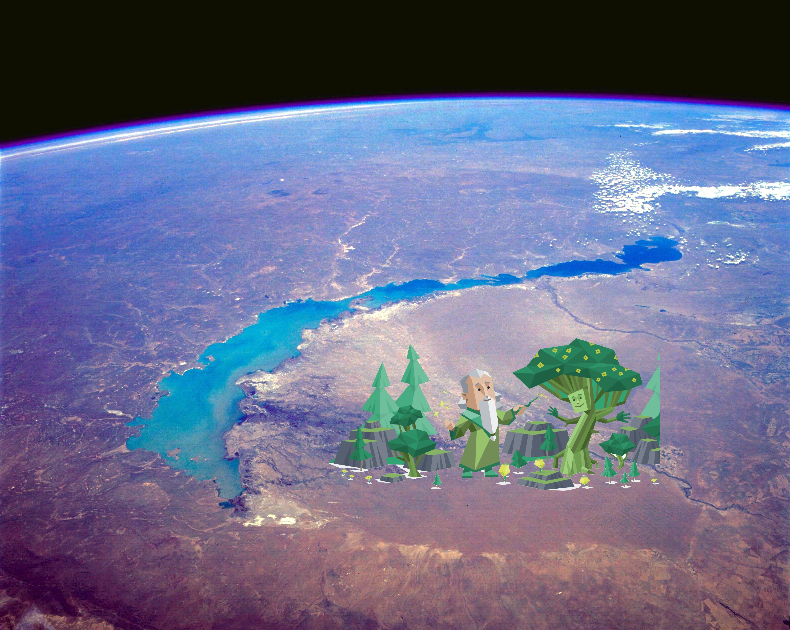
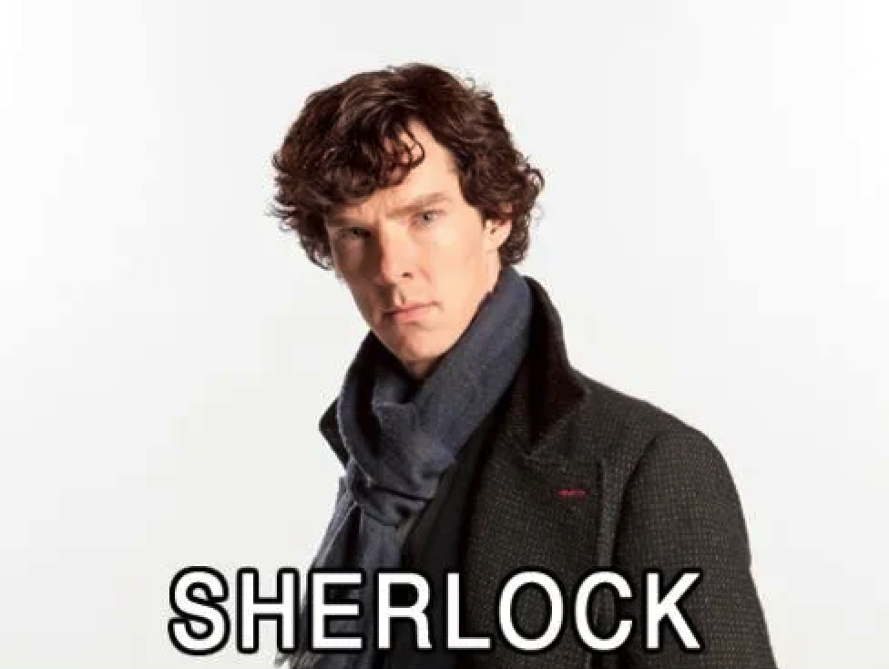
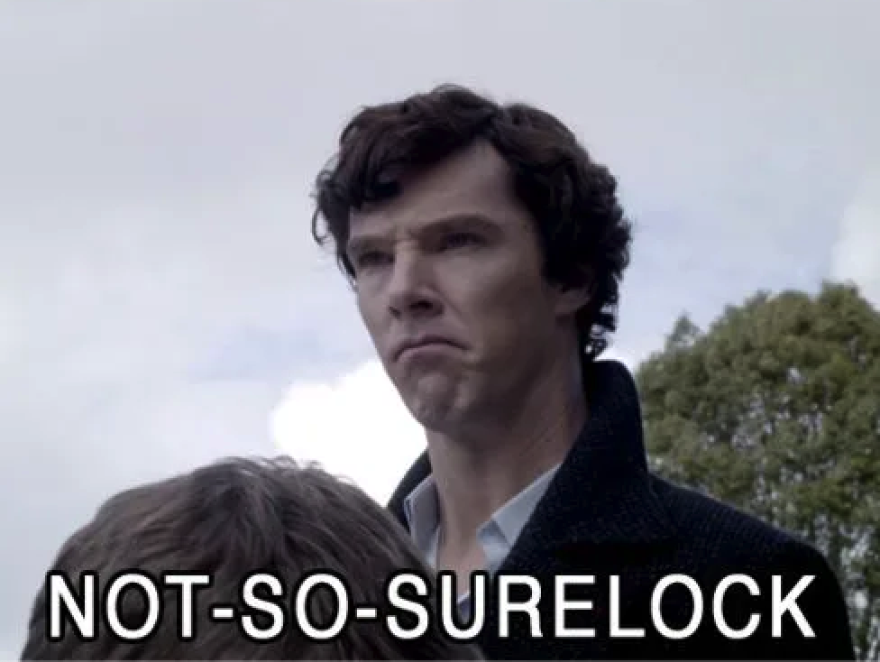

## **About Me**
 
.pull-left[
### Merlin Balkhash [bɑɬ.qʰɑʃ]
(named after the greatest sorcerer ever)
  
### 4th Year PhD student
(so there is no need to call me Prof.)
### Phonology
### Mathematical Linguistics
 
### musical
### INFJ
]
.pull-right[
 

  
*Lake Balkhash, space view*
]
---
## You Are All Sherlock Holmes Now
 
based on what I am going to **read**, and what you already got from **my accent**, guess <u>where I am from</u> 
when you make a guess, you can ask me to re-read a sentence if you need 
please only focus on the **sound**  
.pull-left[
  

]

.pull-right[
<i>
Good morning, everyone. My name is Merlin, and I’m delighted to welcome you to our course.  
In this class we shall explore how language works, from the smallest sounds to the most fascinating structures. 
You may notice that I pronounce certain words rather differently from what you usually hear. 
For instance, I say bath with a long vowel, not short, and schedule with a ‘sh’ sound rather than a ‘sk’.
 
You’ll also hear me articulate the ‘r’ at the ends of words far less.
</i>
]
  

--

You are able to mimic an accent if you know the <b>phonology</b>, which is the pattern of sounds 
sometimes, <b>social factors</b> also matter, sadly, we will not cover it in this class

---
class: center, middle
# MERLIN
  
# muhhhhhh.lin

---
## **Now Its Your Turn**
 
1. talk to your neighbours and form a group naturally   
2. write your **First Name**.**Last Name** (**Preferred Name**) and (**Preferred Pronouns**) on the name tag   
3. one by one, introduce yourself to the group, tell others:   
  - your name and your preferred name
  - your major  
4. when introducing, write down the way you pronounce your name though **it might be spelt in another way**   
5. **one representative** from each group write down name pronunciation of everyone in the group on the board    

**NOTE**: BE **CREATIVE**!

---
class: center, middle

Slides created via the R package [**xaringan**](https://github.com/yihui/xaringan).
