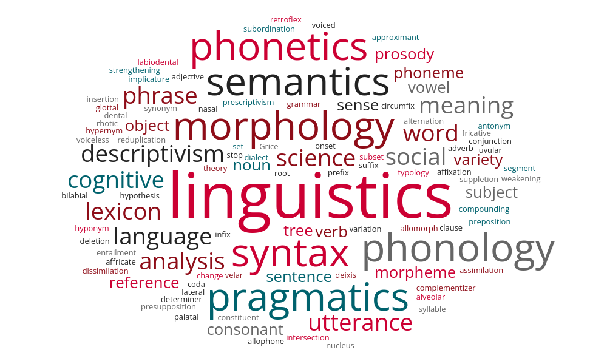

```{r setup, include=FALSE}
knitr::opts_chunk$set(echo = TRUE)
```

<style>
a {
  color: red;
  text-decoration: none;
}
a:hover {
  color: grey;
  text-decoration: underline;
}
</style><br><br>

<table style="width:100%; border-collapse:collapse;">
  <tr>
    <td style="width:65%; vertical-align:middle; padding:1em;">
      <h1>Introduction to Linguistic Theories</h1><br>
      <h4 style="color:grey; margin:0;">Spring, 2026</h4><br>
      <h4 style="color:grey; margin:0;">01:615:201:01</h4><br>
      <h5 style="margin:0;">Linguistics Department, Rutgers University</h5>
    </td>
    <td style="width:35%; text-align:center; vertical-align:middle; padding:1em;">
      
    </td>
  </tr>
</table>

---

This is an R Markdown document serving as the directory. You can find links to the slides and more information of the course *Introduction to Linguistic Theories* (Spring, 2026). May you enjoy taking the course.
<br><br>

### [Syllabus](syllabus.pdf) (clickable)<br><br>

___
### Schedule

<style>
.schedule-tabs {
  display:flex;
  flex-wrap:wrap;
  gap:0.45rem;
  margin:0.4rem 0 1.1rem 0;
  padding:0;
}

.schedule-tab {
  appearance:none;
  border:none;
  background:transparent;
  color:#666666;
  font: inherit;
  font-size:1em;
  font-weight:600;
  line-height:inherit;
  padding:0.2rem 0.15rem 0.45rem 0.15rem;
  margin-right:1.1rem;
  border-bottom:2px solid transparent;
  cursor:pointer;
  transition:color 0.22s ease, border-color 0.22s ease;
}

.schedule-tab:hover {
  color:#cc0033;
}

.schedule-tab.active {
  color:#cc0033;
  border-bottom:2px solid #cc0033;
}

.schedule-panel {
  display:none;
  opacity:0;
  transform:translateY(6px);
  transition:opacity 0.28s ease, transform 0.28s ease;
}

.schedule-panel.active {
  display:block;
  opacity:1;
  transform:translateY(0);
}
</style>

<div class="schedule-tabs">
  <button class="schedule-tab" data-module="introduction" onclick="showScheduleModule(event, 'introduction')">Introduction</button>
  <button class="schedule-tab" data-module="morphology" onclick="showScheduleModule(event, 'morphology')">Morphology</button>
  <button class="schedule-tab" data-module="syntax" onclick="showScheduleModule(event, 'syntax')">Syntax</button>
  <button class="schedule-tab" data-module="midterm" onclick="showScheduleModule(event, 'midterm')">Midterm</button>
  <button class="schedule-tab" data-module="semantics" onclick="showScheduleModule(event, 'semantics')">Semantics</button>
  <button class="schedule-tab" data-module="pragmatics" onclick="showScheduleModule(event, 'pragmatics')">Pragmatics</button>
  <button class="schedule-tab" data-module="phonetics" onclick="showScheduleModule(event, 'phonetics')">Phonetics</button>
  <button class="schedule-tab" data-module="phonology" onclick="showScheduleModule(event, 'phonology')">Phonology</button>
  <button class="schedule-tab" data-module="final" onclick="showScheduleModule(event, 'final')">Final</button>
</div>

<div id="schedule-intro-message" class="schedule-panel active">
  <p style="margin:0.4em 0 0.9em 0; font-size:1em;">Click on the banner above for the specific content.</p>
</div>

<div id="schedule-introduction" class="schedule-panel">
<table style="width:100%; border-collapse:collapse; font-size:1.2em;">
  <tr>
    <td style="width:2%; text-align:center; vertical-align:top;"></td>
    <td style="width:3%; text-align:left; vertical-align:top;"><b>Week</b></td>
    <td style="width:15%; text-align:center; vertical-align:top;"><b>Date</b></td>
    <td style="width:30%; text-align:left; vertical-align:top;"><b>Topic</b></td>
    <td style="width:48%; text-align:left; vertical-align:top;"><b>Notes</b></td>
    <td style="width:2%; text-align:center; vertical-align:top;"></td>
  </tr>
  <tr>
    <td style="width:2%; text-align:center; vertical-align:top;"><span style="color:white">-</span></td>
  </tr>
  <tr>
    <td style="width:2%; text-align:center; vertical-align:top;"></td>
    <td style="width:3%; text-align:left; vertical-align:top;">01</td>
    <td style="width:10%; text-align:center; vertical-align:top;">Jan 22</td>
    <td style="width:35%; text-align:left; vertical-align:top;">[Introduction](https://merlinudinov.github.io/spring2026ling201/20260122)</td>
    <td style="width:48%; text-align:left; vertical-align:top;"></td>
    <td style="width:2%; text-align:center; vertical-align:top;"></td>
  </tr>
  <tr>
    <td style="width:2%; text-align:center; vertical-align:top;"></td>
    <td style="width:3%; text-align:left; vertical-align:top;">02</td>
    <td style="width:10%; text-align:center; vertical-align:top;">Jan 26</td>
    <td style="width:35%; text-align:left; vertical-align:top;">[Linguistics as a Science](https://merlinudinov.github.io/spring2026ling201/20260126)</td>
    <td style="width:48%; text-align:left; vertical-align:top;"><b><u>Reading</u></b>: <i>Thinking like a Linguist</i></td>
    <td style="width:2%; text-align:center; vertical-align:top;"></td>
  </tr>
</table>
</div>

<div id="schedule-morphology" class="schedule-panel">
<table style="width:100%; border-collapse:collapse; font-size:1.2em;">
  <tr>
    <td style="width:2%; text-align:center; vertical-align:top;"></td>
    <td style="width:3%; text-align:left; vertical-align:top;"><b>Week</b></td>
    <td style="width:15%; text-align:center; vertical-align:top;"><b>Date</b></td>
    <td style="width:30%; text-align:left; vertical-align:top;"><b>Topic</b></td>
    <td style="width:48%; text-align:left; vertical-align:top;"><b>Notes</b></td>
    <td style="width:2%; text-align:center; vertical-align:top;"></td>
  </tr>
  <tr>
    <td style="width:2%; text-align:center; vertical-align:top;"><span style="color:white">-</span></td>
  </tr>
  <tr>
    <td style="width:2%; text-align:center; vertical-align:top;"></td>
    <td style="width:3%; text-align:left; vertical-align:top;">02</td>
    <td style="width:10%; text-align:center; vertical-align:top;">Jan 29</td>
    <td style="width:35%; text-align:left; vertical-align:top;">[Morphology I](https://merlinudinov.github.io/spring2026ling201/20260129)</td>
    <td style="width:48%; text-align:left; vertical-align:top;"><b><u>Reading</u></b>: Sections 4.0, 4.1 and 4.2 of Chapter 4: Morphology from <i>Language Files</i></td>
    <td style="width:2%; text-align:center; vertical-align:top;"></td>
  </tr>
  <tr>
    <td style="width:2%; text-align:center; vertical-align:top;"></td>
    <td style="width:3%; text-align:left; vertical-align:top;">03</td>
    <td style="width:10%; text-align:center; vertical-align:top;">Feb 02</td>
    <td style="width:35%; text-align:left; vertical-align:top;">[Morphology II](https://merlinudinov.github.io/spring2026ling201/20260202)</td>
    <td style="width:48%; text-align:left; vertical-align:top;"></td>
    <td style="width:2%; text-align:center; vertical-align:top;"></td>
  </tr>
  <tr>
    <td style="width:2%; text-align:center; vertical-align:top;"></td>
    <td style="width:3%; text-align:left; vertical-align:top;"></td>
    <td style="width:10%; text-align:center; vertical-align:top;">Feb 05</td>
    <td style="width:35%; text-align:left; vertical-align:top;">[Morphology III](https://merlinudinov.github.io/spring2026ling201/20260205)</td>
    <td style="width:48%; text-align:left; vertical-align:top;"><b><u>Reading</u></b>: Sections 4.3, 4.4 and 4.5 of Chapter 4: Morphology from <i>Language Files</i></td>
    <td style="width:2%; text-align:center; vertical-align:top;"></td>
  </tr>
  <tr>
    <td style="width:2%; text-align:center; vertical-align:top;"></td>
    <td style="width:3%; text-align:left; vertical-align:top;">04</td>
    <td style="width:10%; text-align:center; vertical-align:top;">Feb 09</td>
    <td style="width:35%; text-align:left; vertical-align:top;">[Morphology IV](https://merlinudinov.github.io/spring2026ling201/20260209)</td>
    <td style="width:48%; text-align:left; vertical-align:top;"></td>
    <td style="width:2%; text-align:center; vertical-align:top;"></td>
  </tr>
</table>
</div>

<div id="schedule-syntax" class="schedule-panel">
<table style="width:100%; border-collapse:collapse; font-size:1.2em;">
  <tr>
    <td style="width:2%; text-align:center; vertical-align:top;"></td>
    <td style="width:3%; text-align:left; vertical-align:top;"><b>Week</b></td>
    <td style="width:15%; text-align:center; vertical-align:top;"><b>Date</b></td>
    <td style="width:30%; text-align:left; vertical-align:top;"><b>Topic</b></td>
    <td style="width:48%; text-align:left; vertical-align:top;"><b>Notes</b></td>
    <td style="width:2%; text-align:center; vertical-align:top;"></td>
  </tr>
  <tr>
    <td style="width:2%; text-align:center; vertical-align:top;"><span style="color:white">-</span></td>
  </tr>
  <tr>
    <td style="width:2%; text-align:center; vertical-align:top;"></td>
    <td style="width:3%; text-align:left; vertical-align:top;">04</td>
    <td style="width:10%; text-align:center; vertical-align:top;">Feb 12</td>
    <td style="width:35%; text-align:left; vertical-align:top;">[Syntax I](https://merlinudinov.github.io/spring2026ling201/20260212)</td>
    <td style="width:48%; text-align:left; vertical-align:top;"><b><u>Reading</u></b>: Chapter 2: Parts of Speech from <i>Andrew Carnie's Syntax textbook</i><br><b><u>Homework I: Morphology</u></b> due on Feb 15<br>[[pdf](./homework/hw1.pdf)]&nbsp; [[docx](./homework/hw1.docx)]&nbsp;&nbsp;&nbsp;&nbsp;&nbsp;&nbsp;&nbsp;&nbsp;[[key](./homework/hw1key.pdf)]</td>
    <td style="width:2%; text-align:center; vertical-align:top;"></td>
  </tr>
  <tr>
    <td style="width:2%; text-align:center; vertical-align:top;"></td>
    <td style="width:3%; text-align:left; vertical-align:top;">05</td>
    <td style="width:10%; text-align:center; vertical-align:top;">Feb 16</td>
    <td style="width:35%; text-align:left; vertical-align:top;">[Syntax II](https://merlinudinov.github.io/spring2026ling201/20260216)</td>
    <td style="width:48%; text-align:left; vertical-align:top;"></td>
    <td style="width:2%; text-align:center; vertical-align:top;"></td>
  </tr>
  <tr>
    <td style="width:2%; text-align:center; vertical-align:top;"></td>
    <td style="width:3%; text-align:left; vertical-align:top;"></td>
    <td style="width:10%; text-align:center; vertical-align:top;">Feb 19</td>
    <td style="width:35%; text-align:left; vertical-align:top;">[Syntax III](https://merlinudinov.github.io/spring2026ling201/20260219)</td>
    <td style="width:48%; text-align:left; vertical-align:top;"><b><u>Reading</u></b>: Chapter 3: Constituency, Trees, and Rules from <i>Andrew Carnie's Syntax textbook</i> <br><b><u>Homework II: Syntax (1)</u></b> due on Feb 22<br>[[pdf](./homework/hw2.pdf)]&nbsp; [[docx](./homework/hw2.docx)]&nbsp;&nbsp;&nbsp;&nbsp;&nbsp;&nbsp;&nbsp;&nbsp;[[key](./homework/hw2key.pdf)] or<br>[[pdf_alt](./homework/hw2a.pdf)] [[docx_alt](./homework/hw2a.docx)]</td>
    <td style="width:2%; text-align:center; vertical-align:top;"></td>
  </tr>
  <tr>
    <td style="width:2%; text-align:center; vertical-align:top;"></td>
    <td style="width:3%; text-align:left; vertical-align:top;">06</td>
    <td style="width:10%; text-align:center; vertical-align:top;">Feb 23</td>
    <td style="width:35%; text-align:left; vertical-align:top;">[Syntax IV](https://merlinudinov.github.io/spring2026ling201/20260223)</td>
    <td style="width:48%; text-align:left; vertical-align:top;"></td>
    <td style="width:2%; text-align:center; vertical-align:top;"></td>
  </tr>
  <tr>
    <td style="width:2%; text-align:center; vertical-align:top;"></td>
    <td style="width:3%; text-align:left; vertical-align:top;"></td>
    <td style="width:10%; text-align:center; vertical-align:top;">Feb 26</td>
    <td style="width:35%; text-align:left; vertical-align:top;">[Syntax V](https://merlinudinov.github.io/spring2026ling201/20260226)</td>
    <td style="width:48%; text-align:left; vertical-align:top;"><b><u>Homework III: Syntax (2)</u></b> due on Mar 03<br>[[pdf](./homework/hw3.pdf)]&nbsp; [[docx](./homework/hw3.docx)]&nbsp;&nbsp;&nbsp;&nbsp;&nbsp;&nbsp;&nbsp;&nbsp;[[key](./homework/hw3key.pdf)]</td>
    <td style="width:2%; text-align:center; vertical-align:top;"></td>
  </tr>
</table>
</div>

<div id="schedule-midterm" class="schedule-panel">
<table style="width:100%; border-collapse:collapse; font-size:1.2em;">
  <tr>
    <td style="width:2%; text-align:center; vertical-align:top;"></td>
    <td style="width:3%; text-align:left; vertical-align:top;"><b>Week</b></td>
    <td style="width:15%; text-align:center; vertical-align:top;"><b>Date</b></td>
    <td style="width:30%; text-align:left; vertical-align:top;"><b>Topic</b></td>
    <td style="width:48%; text-align:left; vertical-align:top;"><b>Notes</b></td>
    <td style="width:2%; text-align:center; vertical-align:top;"></td>
  </tr>
  <tr>
    <td style="width:2%; text-align:center; vertical-align:top;"><span style="color:white">-</span></td>
  </tr>
  <tr>
    <td style="width:2%; text-align:center; vertical-align:top;"></td>
    <td style="width:3%; text-align:left; vertical-align:top;">07</td>
    <td style="width:10%; text-align:center; vertical-align:top;">Mar 02</td>
    <td style="width:35%; text-align:left; vertical-align:top;">[Midterm Review](https://merlinudinov.github.io/spring2026ling201/20260302)</td>
    <td style="width:48%; text-align:left; vertical-align:top;">[[Midterm Information](./midterm/info.png)]<br>
    [[Midterm Review List](./midterm/reviewlist.docx)]<br>
    [[Midterm Review](./midterm/review.pdf)]&nbsp;[[Midterm Review Key](./midterm/reviewkey.pdf)]<br>
    [[Midterm Work Sheet](./midterm/worksheet.docx)]&nbsp;[[Midterm Work Sheet Key](./midterm/worksheetkey.docx)]<br>
    [[Ambiguous Sentence Practice](./midterm/ambiguity.pdf)]</td>
    <td style="width:2%; text-align:center; vertical-align:top;"></td>
  </tr>
  <tr>
    <td style="width:2%; text-align:center; vertical-align:top;"><span style="color:white">-</span></td>
  </tr>
  <tr>
    <td style="width:2%; text-align:center; vertical-align:top;"></td>
    <td style="width:3%; text-align:left; vertical-align:top;"></td>
    <td style="width:10%; text-align:center; vertical-align:top;">Mar 05</td>
    <td style="width:35%; text-align:left; vertical-align:top;"><b>Midterm Exam [[timer](https://mathsstarters.net/examtimer)]</b></td>
    <td style="width:48%; text-align:left; vertical-align:top;"><b>Date</b>: Mar 05<br><b>Time</b>: 10:20 - 11:40 am<br><b>Venue</b>: [HH-B6](https://webapps.rutgers.edu/dcs/classrooms/HH-B6)</td>
    <td style="width:2%; text-align:center; vertical-align:top;"></td>
  </tr>
</table>
</div>

<div id="schedule-semantics" class="schedule-panel">
<table style="width:100%; border-collapse:collapse; font-size:1.2em;">
  <tr>
    <td style="width:2%; text-align:center; vertical-align:top;"></td>
    <td style="width:3%; text-align:left; vertical-align:top;"><b>Week</b></td>
    <td style="width:15%; text-align:center; vertical-align:top;"><b>Date</b></td>
    <td style="width:30%; text-align:left; vertical-align:top;"><b>Topic</b></td>
    <td style="width:48%; text-align:left; vertical-align:top;"><b>Notes</b></td>
    <td style="width:2%; text-align:center; vertical-align:top;"></td>
  </tr>
  <tr>
    <td style="width:2%; text-align:center; vertical-align:top;"><span style="color:white">-</span></td>
  </tr>
  <tr>
    <td style="width:2%; text-align:center; vertical-align:top;"></td>
    <td style="width:3%; text-align:left; vertical-align:top;">08</td>
    <td style="width:10%; text-align:center; vertical-align:top;">Mar 09</td>
    <td style="width:35%; text-align:left; vertical-align:top;">[Semantics I](https://merlinudinov.github.io/spring2026ling201/20260309)</td>
    <td style="width:48%; text-align:left; vertical-align:top;"><b><u>Reading</u></b>: chapter Semantics I: Compositionality from <i>Victoria Fromkin et al.'s An Introduction to Language</i></td>
    <td style="width:2%; text-align:center; vertical-align:top;"></td>
  </tr>
  <tr>
    <td style="width:2%; text-align:center; vertical-align:top;"></td>
    <td style="width:3%; text-align:left; vertical-align:top;"></td>
    <td style="width:10%; text-align:center; vertical-align:top;">Mar 12</td>
    <td style="width:35%; text-align:left; vertical-align:top;">[Semantics II](https://merlinudinov.github.io/spring2026ling201/20260312)</td>
    <td style="width:48%; text-align:left; vertical-align:top;"><b><u>Homework IV: Semantics (1)</u></b> due on Mar 15<br>[[pdf](./homework/hw4.pdf)]&nbsp; [[docx](./homework/hw4.docx)]&nbsp;&nbsp;&nbsp;&nbsp;&nbsp;&nbsp;&nbsp;&nbsp;[[key](./homework/hw4key.pdf)]</td>
    <td style="width:2%; text-align:center; vertical-align:top;"></td>
  </tr>
  <tr>
    <td colspan="6" style="text-align:center; padding:0.9em 0;"><b>Spring Recess</b></td>
  </tr>
  <tr>
    <td style="width:2%; text-align:center; vertical-align:top;"></td>
    <td style="width:3%; text-align:left; vertical-align:top;">10</td>
    <td style="width:10%; text-align:center; vertical-align:top;">Mar 23</td>
    <td style="width:35%; text-align:left; vertical-align:top;">[Semantics III](https://merlinudinov.github.io/spring2026ling201/20260323)</td>
    <td style="width:48%; text-align:left; vertical-align:top;"></td>
    <td style="width:2%; text-align:center; vertical-align:top;"></td>
  </tr>
  <tr>
    <td style="width:2%; text-align:center; vertical-align:top;"></td>
    <td style="width:3%; text-align:left; vertical-align:top;"></td>
    <td style="width:10%; text-align:center; vertical-align:top;">Mar 26</td>
    <td style="width:35%; text-align:left; vertical-align:top;">[Semantics IV](https://merlinudinov.github.io/spring2026ling201/20260326)</td>
    <td style="width:48%; text-align:left; vertical-align:top;"><b><u>Homework V: Semantics (2)</u></b> due on Mar 29<br>[[pdf](./homework/hw5.pdf)]&nbsp; [[docx](./homework/hw5.docx)]&nbsp;&nbsp;&nbsp;&nbsp;&nbsp;&nbsp;&nbsp;&nbsp;[[key](./homework/hw5key.pdf)]</td>
    <td style="width:2%; text-align:center; vertical-align:top;"></td>
  </tr>
</table>
</div>

<div id="schedule-pragmatics" class="schedule-panel">
<table style="width:100%; border-collapse:collapse; font-size:1.2em;">
  <tr>
    <td style="width:2%; text-align:center; vertical-align:top;"></td>
    <td style="width:3%; text-align:left; vertical-align:top;"><b>Week</b></td>
    <td style="width:15%; text-align:center; vertical-align:top;"><b>Date</b></td>
    <td style="width:30%; text-align:left; vertical-align:top;"><b>Topic</b></td>
    <td style="width:48%; text-align:left; vertical-align:top;"><b>Notes</b></td>
    <td style="width:2%; text-align:center; vertical-align:top;"></td>
  </tr>
  <tr>
    <td style="width:2%; text-align:center; vertical-align:top;"><span style="color:white">-</span></td>
  </tr>
  <tr>
    <td style="width:2%; text-align:center; vertical-align:top;"></td>
    <td style="width:3%; text-align:left; vertical-align:top;">11</td>
    <td style="width:10%; text-align:center; vertical-align:top;">Mar 30</td>
    <td style="width:35%; text-align:left; vertical-align:top;">[Pragmatics I](https://merlinudinov.github.io/spring2026ling201/20260330)</td>
    <td style="width:48%; text-align:left; vertical-align:top;"><b><u>Reading</u></b>: Chapter 8: Pragmatics of Griffiths & Cummins' (2017) <i>An Introduction to English Semantics and Pragmatics</i></td>
    <td style="width:2%; text-align:center; vertical-align:top;"></td>
  </tr>
  <tr>
    <td style="width:2%; text-align:center; vertical-align:top;"></td>
    <td style="width:3%; text-align:left; vertical-align:top;"></td>
    <td style="width:10%; text-align:center; vertical-align:top;">Apr 02</td>
    <td style="width:35%; text-align:left; vertical-align:top;">[Pragmatics II](https://merlinudinov.github.io/spring2026ling201/20260402)</td>
    <td style="width:48%; text-align:left; vertical-align:top;"><b><u>Homework VI: Pragmatics</u></b> due on Apr 05<br>[[pdf](./homework/hw6.pdf)]&nbsp; [[docx](./homework/hw6.docx)]&nbsp;&nbsp;&nbsp;&nbsp;&nbsp;&nbsp;&nbsp;&nbsp;[[key](./homework/hw6key.pdf)]</td>
    <td style="width:2%; text-align:center; vertical-align:top;"></td>
  </tr>
</table>
</div>

<div id="schedule-phonetics" class="schedule-panel">
<table style="width:100%; border-collapse:collapse; font-size:1.2em;">
  <tr>
    <td style="width:2%; text-align:center; vertical-align:top;"></td>
    <td style="width:3%; text-align:left; vertical-align:top;"><b>Week</b></td>
    <td style="width:15%; text-align:center; vertical-align:top;"><b>Date</b></td>
    <td style="width:30%; text-align:left; vertical-align:top;"><b>Topic</b></td>
    <td style="width:48%; text-align:left; vertical-align:top;"><b>Notes</b></td>
    <td style="width:2%; text-align:center; vertical-align:top;"></td>
  </tr>
  <tr>
    <td style="width:2%; text-align:center; vertical-align:top;"><span style="color:white">-</span></td>
  </tr>
  <tr>
    <td style="width:2%; text-align:center; vertical-align:top;"></td>
    <td style="width:3%; text-align:left; vertical-align:top;">12</td>
    <td style="width:10%; text-align:center; vertical-align:top;">Apr 06</td>
    <td style="width:35%; text-align:left; vertical-align:top;">[Phonetics I](https://merlinudinov.github.io/spring2026ling201/20260406)</td>
    <td style="width:48%; text-align:left; vertical-align:top;"><b><u>Reading</u></b>: Michael Dobrovolsky's chapter Phonetics from <i>O'Grady et al.'s Contemporary Linguistics: An Introduction</i><br>[[clickable IPA chart](https://www.ipachart.com)]<br>[[International Phonetic Alphabet, 2020](./20260406/IPA.pdf)]</td>
    <td style="width:2%; text-align:center; vertical-align:top;"></td>
  </tr>
  <tr>
    <td style="width:2%; text-align:center; vertical-align:top;"></td>
    <td style="width:3%; text-align:left; vertical-align:top;"></td>
    <td style="width:10%; text-align:center; vertical-align:top;">Apr 09</td>
    <td style="width:35%; text-align:left; vertical-align:top;">[Phonetics II](https://merlinudinov.github.io/spring2026ling201/20260409)</td>
    <td style="width:48%; text-align:left; vertical-align:top;"></td>
    <td style="width:2%; text-align:center; vertical-align:top;"></td>
  </tr>
  <tr>
    <td style="width:2%; text-align:center; vertical-align:top;"></td>
    <td style="width:3%; text-align:left; vertical-align:top;">13</td>
    <td style="width:10%; text-align:center; vertical-align:top;">Apr 13</td>
    <td style="width:35%; text-align:left; vertical-align:top;">[Phonetics III](https://merlinudinov.github.io/spring2026ling201/20260413)</td>
    <td style="width:48%; text-align:left; vertical-align:top;"><b><u>Homework VII: Phonetics</u></b> due on Apr 19<br>[[pdf](./homework/hw7.pdf)]&nbsp; [[docx](./homework/hw7.docx)]&nbsp;&nbsp;&nbsp;&nbsp;&nbsp;&nbsp;&nbsp;&nbsp;[[key](./homework/hw7key.pdf)]</td>
    <td style="width:2%; text-align:center; vertical-align:top;"></td>
  </tr>
</table>
</div>

<div id="schedule-phonology" class="schedule-panel">
<table style="width:100%; border-collapse:collapse; font-size:1.2em;">
  <tr>
    <td style="width:2%; text-align:center; vertical-align:top;"></td>
    <td style="width:3%; text-align:left; vertical-align:top;"><b>Week</b></td>
    <td style="width:15%; text-align:center; vertical-align:top;"><b>Date</b></td>
    <td style="width:30%; text-align:left; vertical-align:top;"><b>Topic</b></td>
    <td style="width:48%; text-align:left; vertical-align:top;"><b>Notes</b></td>
    <td style="width:2%; text-align:center; vertical-align:top;"></td>
  </tr>
  <tr>
    <td style="width:2%; text-align:center; vertical-align:top;"><span style="color:white">-</span></td>
  </tr>
  <tr>
    <td style="width:2%; text-align:center; vertical-align:top;"></td>
    <td style="width:3%; text-align:left; vertical-align:top;">13</td>
    <td style="width:10%; text-align:center; vertical-align:top;">Apr 16</td>
    <td style="width:35%; text-align:left; vertical-align:top;">[Phonology I](https://merlinudinov.github.io/spring2026ling201/20260416)</td>
    <td style="width:48%; text-align:left; vertical-align:top;"><b><u>Reading</u></b>: Michael Dobrovolsky's chapter Phonology from <i>O'Grady et al.'s Contemporary Linguistics: An Introduction</i><br>[[clickable IPA chart](https://www.ipachart.com)]<br>[[International Phonetic Alphabet, 2020](./20260413/IPA.pdf)]</td>
    <td style="width:2%; text-align:center; vertical-align:top;"></td>
  </tr>
  <tr>
    <td style="width:2%; text-align:center; vertical-align:top;"></td>
    <td style="width:3%; text-align:left; vertical-align:top;">14</td>
    <td style="width:10%; text-align:center; vertical-align:top;">Apr 20</td>
    <td style="width:35%; text-align:left; vertical-align:top;">[Phonology II](https://merlinudinov.github.io/spring2026ling201/20260420)</td>
    <td style="width:48%; text-align:left; vertical-align:top;"></td>
    <td style="width:2%; text-align:center; vertical-align:top;"></td>
  </tr>
  <tr>
    <td style="width:2%; text-align:center; vertical-align:top;"></td>
    <td style="width:3%; text-align:left; vertical-align:top;"></td>
    <td style="width:10%; text-align:center; vertical-align:top;">Apr 23</td>
    <td style="width:35%; text-align:left; vertical-align:top;">[Phonology III](https://merlinudinov.github.io/spring2026ling201/20260423)</td>
    <td style="width:48%; text-align:left; vertical-align:top;"></td>
    <td style="width:2%; text-align:center; vertical-align:top;"></td>
  </tr>
  <tr>
    <td style="width:2%; text-align:center; vertical-align:top;"></td>
    <td style="width:3%; text-align:left; vertical-align:top;">15</td>
    <td style="width:10%; text-align:center; vertical-align:top;">Apr 27</td>
    <td style="width:35%; text-align:left; vertical-align:top;">[Phonology IV](https://merlinudinov.github.io/spring2026ling201/20260427)</td>
    <td style="width:48%; text-align:left; vertical-align:top;"><b><u>Homework VIII: Phonology</u></b> due on May 03<br>[[pdf](./homework/hw8.pdf)]&nbsp; [[docx](./homework/hw8.docx)]&nbsp;&nbsp;&nbsp;&nbsp;&nbsp;&nbsp;&nbsp;&nbsp;[[key](./homework/hw8key.pdf)]</td>
    <td style="width:2%; text-align:center; vertical-align:top;"></td>
  </tr>
  </tr>
</table>
</div>

<div id="schedule-final" class="schedule-panel">
<table style="width:100%; border-collapse:collapse; font-size:1.2em;">
  <tr>
    <td style="width:2%; text-align:center; vertical-align:top;"></td>
    <td style="width:3%; text-align:left; vertical-align:top;"><b>Week</b></td>
    <td style="width:15%; text-align:center; vertical-align:top;"><b>Date</b></td>
    <td style="width:30%; text-align:left; vertical-align:top;"><b>Topic</b></td>
    <td style="width:48%; text-align:left; vertical-align:top;"><b>Notes</b></td>
    <td style="width:2%; text-align:center; vertical-align:top;"></td>
  </tr>
  <tr>
    <td style="width:2%; text-align:center; vertical-align:top;"><span style="color:white">-</span></td>
  </tr>
    <tr>
    <td style="width:2%; text-align:center; vertical-align:top;"></td>
    <td style="width:3%; text-align:left; vertical-align:top;">15</td>
    <td style="width:10%; text-align:center; vertical-align:top;">Apr 30</td>
    <td style="width:35%; text-align:left; vertical-align:top;">[Wrap-up](https://merlinudinov.github.io/spring2026ling201/20260430)</td>
    <td style="width:48%; text-align:left; vertical-align:top;">[[Final Information](./final/info.png)]<br>
    [[Final Review List](./final/reviewlist.docx)]<br>
    [[Final Review](./final/review.pdf)]&nbsp;[[Final Review Key](./final/reviewkey.pdf)]<br>
    [[Final Work Sheet](./final/worksheet.docx)]&nbsp;[[Final Work Sheet Key](./final/worksheetkey.docx)]<br>
    [[Study Guide from Professor Bui](./final/bui.docx)]</td>
    <td style="width:2%; text-align:center; vertical-align:top;"></td>
  <tr>
    <td style="width:2%; text-align:center; vertical-align:top;"></td>
    <td style="width:3%; text-align:left; vertical-align:top;">16</td>
    <td style="width:10%; text-align:center; vertical-align:top;">May 04</td>
    <td style="width:35%; text-align:left; vertical-align:top;">Q&A session</td>
    <td style="width:48%; text-align:left; vertical-align:top;"></td>
    <td style="width:2%; text-align:center; vertical-align:top;"></td>
  </tr>
  <tr>
    <td style="width:2%; text-align:center; vertical-align:top;"><span style="color:white">-</span></td>
  </tr>
  <tr>
    <td style="width:2%; text-align:center; vertical-align:top;"></td>
    <td style="width:3%; text-align:left; vertical-align:top;">17</td>
    <td style="width:10%; text-align:center; vertical-align:top;">May 11</td>
    <td style="width:35%; text-align:left; vertical-align:top;"><b>Final Exam [[timer](https://mathsstarters.net/examtimer)]</b></td>
    <td style="width:48%; text-align:left; vertical-align:top;"><b>Date</b>: May 11<br><b>Time</b>: 08:00 - 11:00 am<br><b>Venue</b>: [HH-B6](https://webapps.rutgers.edu/dcs/classrooms/HH-B6)</td>
    <td style="width:2%; text-align:center; vertical-align:top;"></td>
  </tr>
</table>
</div>

<script>
function showScheduleModule(event, moduleName) {
  document.querySelectorAll('.schedule-tab').forEach(function(tab) {
    tab.classList.remove('active');
  });

  document.querySelectorAll('.schedule-panel').forEach(function(panel) {
    panel.classList.remove('active');
  });

  if (event && event.currentTarget) {
    event.currentTarget.classList.add('active');
  }

  var panel = document.getElementById('schedule-' + moduleName);
  if (panel) {
    panel.classList.add('active');
  }
}
</script>
